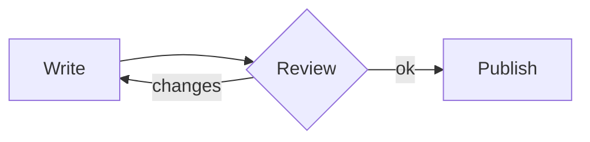
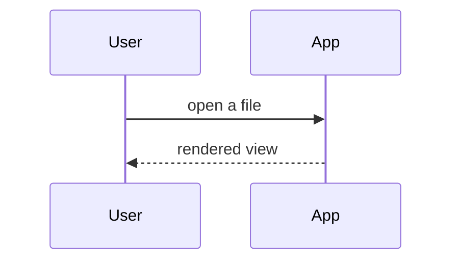

# Diagrams and formulas

Mermaid draws diagrams, KaTeX typesets maths — both render live in Reading, Split and Live view. Back to [[00 Welcome]].

## Flowchart



## Sequence diagram



## Inline formula

```markdown
The area of a circle is $A = \pi r^2$.
```

The area of a circle is $A = \pi r^2$.

## Block formula

```markdown
$$
\sum_{i=1}^{n} i = \frac{n(n+1)}{2}
$$
```

$$
\sum_{i=1}^{n} i = \frac{n(n+1)}{2}
$$

Attachments are next: [[10 Attachments]].
