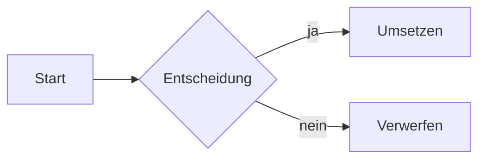
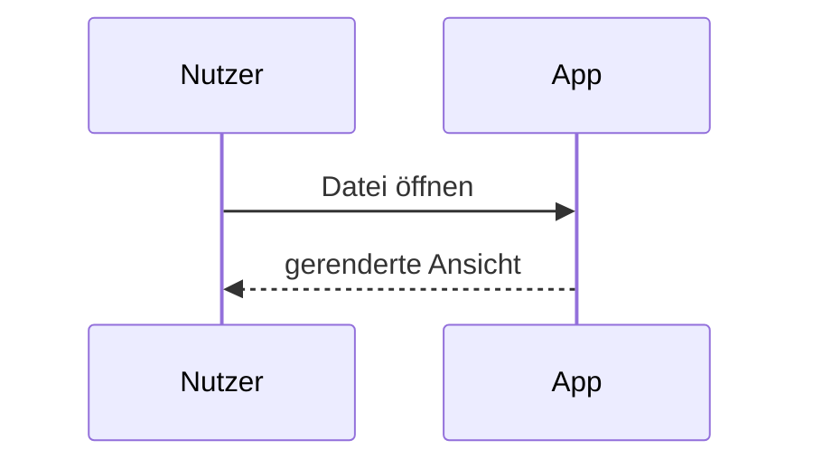
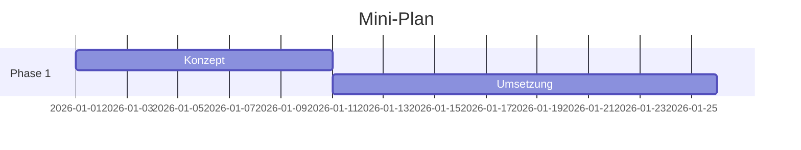
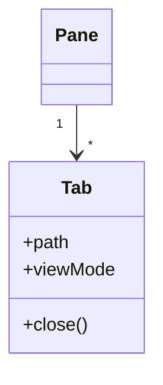

# Mathematik und Diagramme

Formeln setzt KaTeX, Diagramme rendert Mermaid, Code-Blöcke erhalten Syntax-Highlighting — alles in Lese-Ansicht, geteilter Ansicht und Live-Modus.

## KaTeX inline

Formeln zwischen einfachen Dollar-Zeichen rendern im Fließtext. Eine Heuristik schützt Dollar-Beträge: `$100` im Satz bleibt Text, nur echte Formel-Paare werden gesetzt.

```markdown
Die Lösung ist $x = \frac{-b \pm \sqrt{b^2-4ac}}{2a}$ nach der Mitternachtsformel.
```

Die Lösung ist $x = \frac{-b \pm \sqrt{b^2-4ac}}{2a}$ nach der Mitternachtsformel.

## KaTeX als Block

Doppelte Dollar-Zeichen setzen eine abgesetzte, zentrierte Formel.

```markdown
$$
\sum_{i=1}^{n} i = \frac{n(n+1)}{2}
$$
```

$$
\sum_{i=1}^{n} i = \frac{n(n+1)}{2}
$$

## Mermaid

Code-Blöcke mit dem Sprach-Tag `mermaid` rendern als SVG-Diagramm und folgen dem Theme. Die gängigen Typen:

### Flowchart

````markdown

````


### Sequence



### Gantt



### Class



## Code-Blöcke mit Syntax-Highlighting

Ein Sprach-Tag hinter den öffnenden Backticks aktiviert die Farbpalette (folgt dem Theme):

````markdown
```javascript
function greet(name) {
  return `Hallo, ${name}!`;
}
```
````

```javascript
function greet(name) {
  return `Hallo, ${name}!`;
}
```

Der Copy-Button rechts oben am Block kopiert den Inhalt in die Zwischenablage — auch hier im Handbuch.
