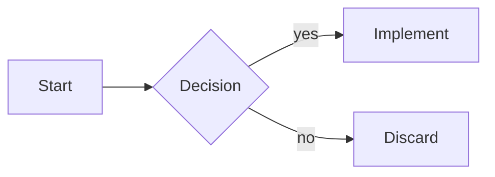
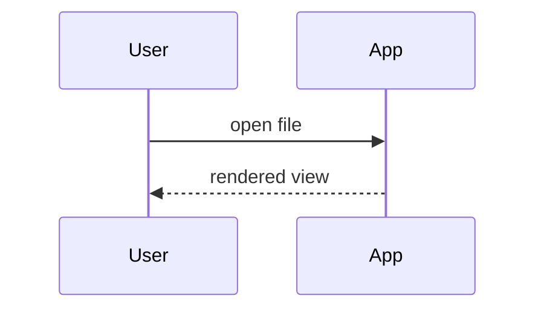
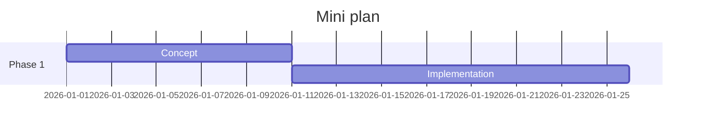
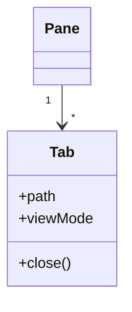

# Math and diagrams

KaTeX typesets formulas, Mermaid renders diagrams, code blocks get syntax highlighting — in Reading view, split view and Live mode alike.

## KaTeX inline

Formulas between single dollar signs render within running text. A heuristic protects dollar amounts: `$100` in a sentence stays text, only real formula pairs are typeset.

```markdown
The solution is $x = \frac{-b \pm \sqrt{b^2-4ac}}{2a}$ by the quadratic formula.
```

The solution is $x = \frac{-b \pm \sqrt{b^2-4ac}}{2a}$ by the quadratic formula.

## KaTeX as a block

Double dollar signs typeset a standalone, centred formula.

```markdown
$$
\sum_{i=1}^{n} i = \frac{n(n+1)}{2}
$$
```

$$
\sum_{i=1}^{n} i = \frac{n(n+1)}{2}
$$

## Mermaid

Code blocks with the `mermaid` language tag render as SVG diagrams and follow the theme. The common types:

### Flowchart

````markdown

````


### Sequence



### Gantt



### Class



## Code blocks with syntax highlighting

A language tag after the opening backticks enables the colour palette (follows the theme):

````markdown
```javascript
function greet(name) {
  return `Hello, ${name}!`;
}
```
````

```javascript
function greet(name) {
  return `Hello, ${name}!`;
}
```

The copy button at the top right of the block copies the content to the clipboard — here in the manual too.

## Export

- **PDF export**: diagrams are printed as rendered vector graphics, redrawn in light colors for print; formulas and code highlighting appear as in the preview.
- **Portable Markdown**: the export leaves the `mermaid` block untouched as source text. Reopened in this program it is drawn again; other Markdown programs show it as a code block unless they draw Mermaid themselves. KaTeX formulas and code blocks with a language tag are ordinary Markdown syntax and remain unaffected.
