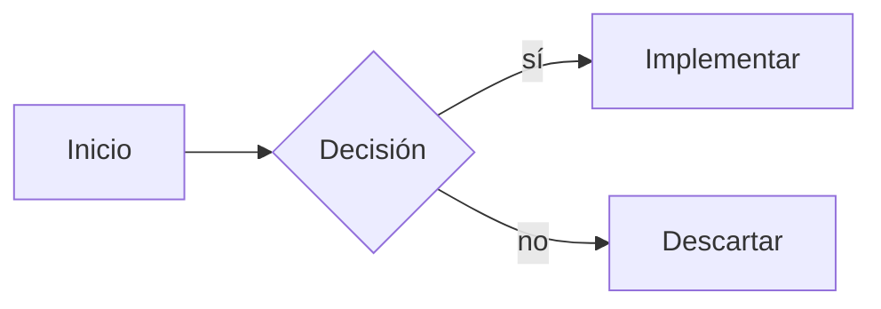
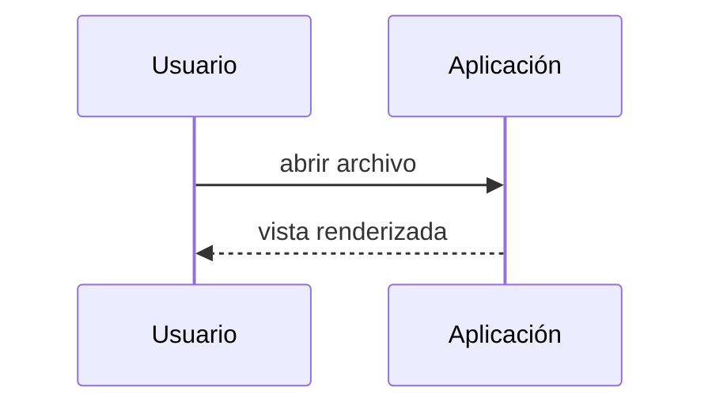
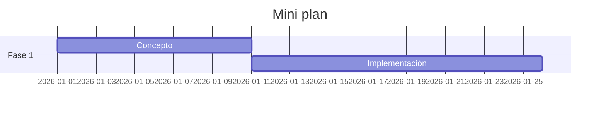
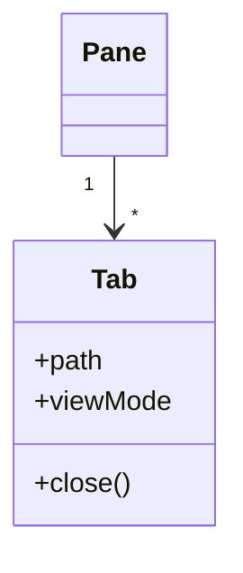

# Matemáticas y diagramas

KaTeX compone las fórmulas, Mermaid renderiza los diagramas, los bloques de código reciben resaltado de sintaxis — en la vista Lectura, la vista dividida y el modo En vivo.

## KaTeX en línea

Las fórmulas entre signos de dólar simples se renderizan en el texto corriente. Una heurística protege los importes en dólares: `$100` en una frase queda como texto, solo los pares de fórmulas reales se componen.

```markdown
La solución es $x = \frac{-b \pm \sqrt{b^2-4ac}}{2a}$ según la fórmula cuadrática.
```

La solución es $x = \frac{-b \pm \sqrt{b^2-4ac}}{2a}$ según la fórmula cuadrática.

## KaTeX como bloque

Los signos de dólar dobles componen una fórmula aislada y centrada.

```markdown
$$
\sum_{i=1}^{n} i = \frac{n(n+1)}{2}
$$
```

$$
\sum_{i=1}^{n} i = \frac{n(n+1)}{2}
$$

## Mermaid

Los bloques de código con la etiqueta `mermaid` se renderizan como diagramas SVG y siguen el tema. Los tipos habituales:

### Flowchart

````markdown

````


### Sequence



### Gantt



### Class



## Bloques de código con resaltado de sintaxis

Una etiqueta de idioma tras los acentos graves de apertura activa la paleta de colores (sigue el tema):

````markdown
```javascript
function greet(name) {
  return `¡Hola, ${name}!`;
}
```
````

```javascript
function greet(name) {
  return `¡Hola, ${name}!`;
}
```

El botón de copia arriba a la derecha del bloque copia el contenido al portapapeles — también aquí en el manual.
