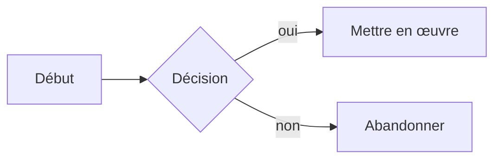
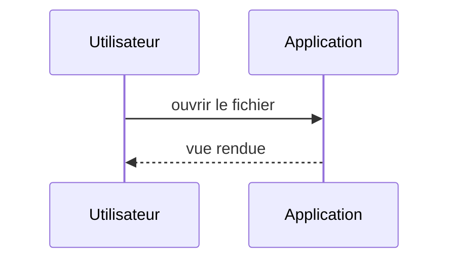
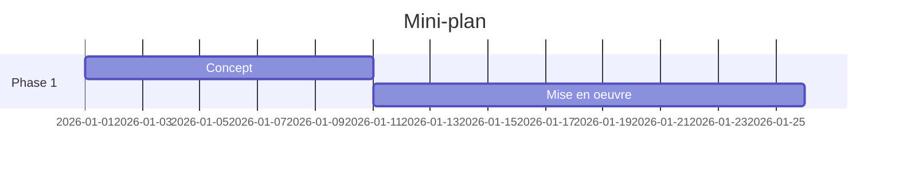
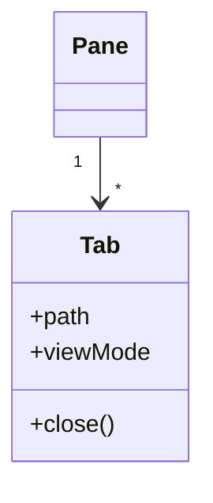

# Mathématiques et diagrammes

KaTeX compose les formules, Mermaid rend les diagrammes, les blocs de code reçoivent la coloration syntaxique — en vue Lecture, en vue scindée et en mode Direct.

## KaTeX en ligne

Les formules entre signes dollar simples se rendent dans le texte courant. Une heuristique protège les montants en dollars : `$100` dans une phrase reste du texte, seules les vraies paires de formules sont composées.

```markdown
La solution est $x = \frac{-b \pm \sqrt{b^2-4ac}}{2a}$ selon la formule quadratique.
```

La solution est $x = \frac{-b \pm \sqrt{b^2-4ac}}{2a}$ selon la formule quadratique.

## KaTeX en bloc

Les doubles signes dollar composent une formule isolée et centrée.

```markdown
$$
\sum_{i=1}^{n} i = \frac{n(n+1)}{2}
$$
```

$$
\sum_{i=1}^{n} i = \frac{n(n+1)}{2}
$$

## Mermaid

Les blocs de code avec la balise de langue `mermaid` se rendent en diagrammes SVG et suivent le thème. Les types courants :

### Flowchart

````markdown

````


### Sequence



### Gantt



### Class



## Blocs de code avec coloration syntaxique

Une balise de langue après les accents graves ouvrants active la palette de couleurs (suit le thème) :

````markdown
```javascript
function greet(name) {
  return `Bonjour, ${name} !`;
}
```
````

```javascript
function greet(name) {
  return `Bonjour, ${name} !`;
}
```

Le bouton de copie en haut à droite du bloc copie le contenu dans le presse-papiers — ici aussi dans le manuel.

## Export

- **Export PDF** : les diagrammes sont imprimés comme graphiques vectoriels rendus, redessinés en clair pour l'impression ; les formules et la coloration du code apparaissent comme dans l'aperçu.
- **Markdown portable** : l'export laisse le bloc `mermaid` inchangé comme texte source. Rouvert dans ce programme, il est redessiné ; les autres programmes Markdown l'affichent comme bloc de code, à moins qu'ils ne dessinent Mermaid eux-mêmes. Les formules KaTeX et les blocs de code avec balise de langue relèvent de la syntaxe Markdown ordinaire et ne sont pas concernés.
