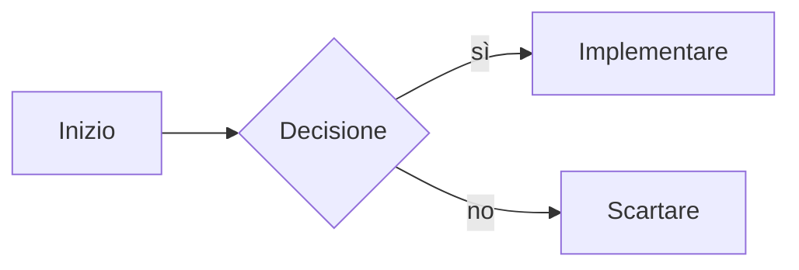
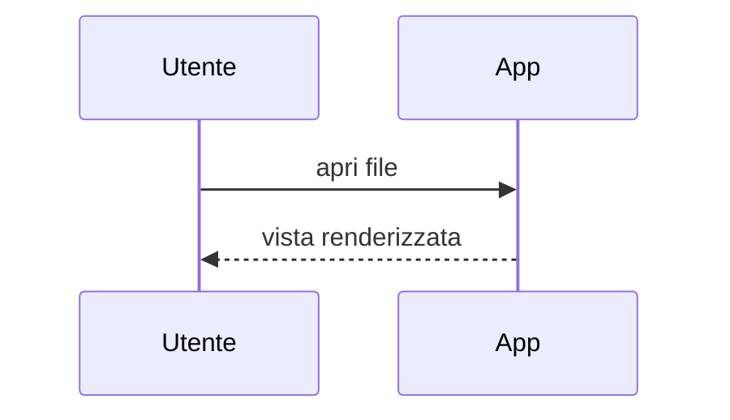
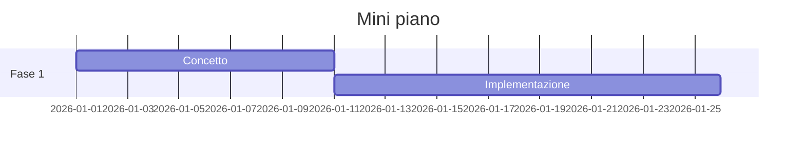
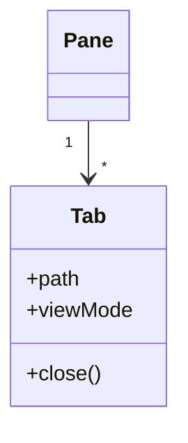

# Matematica e diagrammi

KaTeX compone le formule, Mermaid renderizza i diagrammi, i blocchi di codice ricevono l'evidenziazione della sintassi — nella vista Lettura, nella vista divisa e nella modalità Live.

## KaTeX in linea

Le formule tra segni di dollaro singoli si renderizzano nel testo corrente. Un'euristica protegge gli importi in dollari: `$100` in una frase resta testo, solo le vere coppie di formule vengono composte.

```markdown
La soluzione è $x = \frac{-b \pm \sqrt{b^2-4ac}}{2a}$ secondo la formula quadratica.
```

La soluzione è $x = \frac{-b \pm \sqrt{b^2-4ac}}{2a}$ secondo la formula quadratica.

## KaTeX come blocco

I doppi segni di dollaro compongono una formula isolata e centrata.

```markdown
$$
\sum_{i=1}^{n} i = \frac{n(n+1)}{2}
$$
```

$$
\sum_{i=1}^{n} i = \frac{n(n+1)}{2}
$$

## Mermaid

I blocchi di codice con il tag di lingua `mermaid` si renderizzano come diagrammi SVG e seguono il tema. I tipi comuni:

### Flowchart

````markdown

````


### Sequence



### Gantt



### Class



## Blocchi di codice con evidenziazione della sintassi

Un tag di lingua dopo gli accenti gravi di apertura attiva la palette di colori (segue il tema):

````markdown
```javascript
function greet(name) {
  return `Ciao, ${name}!`;
}
```
````

```javascript
function greet(name) {
  return `Ciao, ${name}!`;
}
```

Il pulsante di copia in alto a destra del blocco copia il contenuto negli appunti — anche qui nel manuale.
