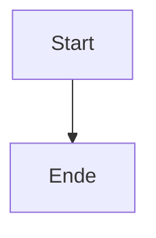
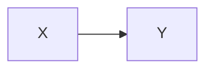

# Diagramme im portablen Export

Ein Ablauf:



Und noch einer:



Ein Diagramm mit fehlerhaftem Quelltext:

```mermaid
kaputtdiagramm
  A --> B
```

Ein fremder Code-Block, der unberuehrt bleibt:

```js
const a = 1;
```

Schluss.
