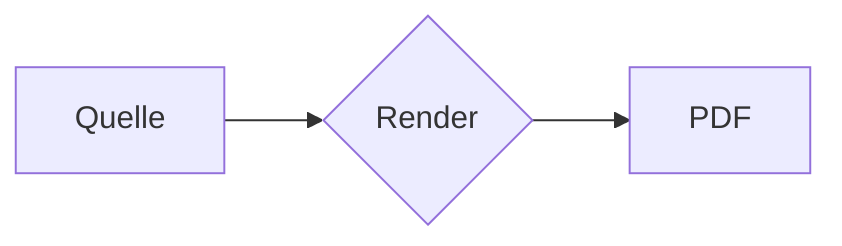

# PDF-Export-Fixture

Diese Datei ist das E2E-Fixture fuer den PDF-Export (4T-000303): mehrseitig,
mit KaTeX, Mermaid, Perspective Table, Callout und langem Code-Block.

## Formeln

Inline-Mathematik wie $E = mc^2$ und ein Display-Block:

$$
\int_0^\infty e^{-x^2}\,dx = \frac{\sqrt{\pi}}{2}
$$

## Diagramm



## Tabelle

```perspective-table
| Spalte A | Spalte B | Status |
|---|---|---|
| Alpha | 1 | ok |
| Beta | 2 | warn |
| Gamma | 3 | error |
```

> [!note]
> Ein Callout-Block fuer die Umbruch-Regeln.

## Langer Code-Block

```javascript
function beispiel(n) {
  let summe = 0;
  for (let i = 0; i < n; i++) {
    summe += i * i;
  }
  return summe;
}

// Fuellzeile 01 fuer den Umbruch-Test
console.log(beispiel(1));
// Fuellzeile 02 fuer den Umbruch-Test
console.log(beispiel(2));
// Fuellzeile 03 fuer den Umbruch-Test
console.log(beispiel(3));
// Fuellzeile 04 fuer den Umbruch-Test
console.log(beispiel(4));
// Fuellzeile 05 fuer den Umbruch-Test
console.log(beispiel(5));
// Fuellzeile 06 fuer den Umbruch-Test
console.log(beispiel(6));
// Fuellzeile 07 fuer den Umbruch-Test
console.log(beispiel(7));
// Fuellzeile 08 fuer den Umbruch-Test
console.log(beispiel(8));
// Fuellzeile 09 fuer den Umbruch-Test
console.log(beispiel(9));
// Fuellzeile 10 fuer den Umbruch-Test
console.log(beispiel(10));
// Fuellzeile 11 fuer den Umbruch-Test
console.log(beispiel(11));
// Fuellzeile 12 fuer den Umbruch-Test
console.log(beispiel(12));
// Fuellzeile 13 fuer den Umbruch-Test
console.log(beispiel(13));
// Fuellzeile 14 fuer den Umbruch-Test
console.log(beispiel(14));
// Fuellzeile 15 fuer den Umbruch-Test
console.log(beispiel(15));
// Fuellzeile 16 fuer den Umbruch-Test
console.log(beispiel(16));
// Fuellzeile 17 fuer den Umbruch-Test
console.log(beispiel(17));
// Fuellzeile 18 fuer den Umbruch-Test
console.log(beispiel(18));
// Fuellzeile 19 fuer den Umbruch-Test
console.log(beispiel(19));
// Fuellzeile 20 fuer den Umbruch-Test
console.log(beispiel(20));
```

## Abschnitt 01

Dieser Absatz existiert nur, damit das Dokument sicher ueber mehrere Seiten laeuft. Er enthaelt genug Text, um im A4-Hochformat mit normalem Rand Zeilen zu fuellen, und wiederholt sich mit laufender Nummer, damit der Inhalt eindeutig bleibt. Abschnitt Nummer 01 von vierzig.

## Abschnitt 02

Dieser Absatz existiert nur, damit das Dokument sicher ueber mehrere Seiten laeuft. Er enthaelt genug Text, um im A4-Hochformat mit normalem Rand Zeilen zu fuellen, und wiederholt sich mit laufender Nummer, damit der Inhalt eindeutig bleibt. Abschnitt Nummer 02 von vierzig.

## Abschnitt 03

Dieser Absatz existiert nur, damit das Dokument sicher ueber mehrere Seiten laeuft. Er enthaelt genug Text, um im A4-Hochformat mit normalem Rand Zeilen zu fuellen, und wiederholt sich mit laufender Nummer, damit der Inhalt eindeutig bleibt. Abschnitt Nummer 03 von vierzig.

## Abschnitt 04

Dieser Absatz existiert nur, damit das Dokument sicher ueber mehrere Seiten laeuft. Er enthaelt genug Text, um im A4-Hochformat mit normalem Rand Zeilen zu fuellen, und wiederholt sich mit laufender Nummer, damit der Inhalt eindeutig bleibt. Abschnitt Nummer 04 von vierzig.

## Abschnitt 05

Dieser Absatz existiert nur, damit das Dokument sicher ueber mehrere Seiten laeuft. Er enthaelt genug Text, um im A4-Hochformat mit normalem Rand Zeilen zu fuellen, und wiederholt sich mit laufender Nummer, damit der Inhalt eindeutig bleibt. Abschnitt Nummer 05 von vierzig.

## Abschnitt 06

Dieser Absatz existiert nur, damit das Dokument sicher ueber mehrere Seiten laeuft. Er enthaelt genug Text, um im A4-Hochformat mit normalem Rand Zeilen zu fuellen, und wiederholt sich mit laufender Nummer, damit der Inhalt eindeutig bleibt. Abschnitt Nummer 06 von vierzig.

## Abschnitt 07

Dieser Absatz existiert nur, damit das Dokument sicher ueber mehrere Seiten laeuft. Er enthaelt genug Text, um im A4-Hochformat mit normalem Rand Zeilen zu fuellen, und wiederholt sich mit laufender Nummer, damit der Inhalt eindeutig bleibt. Abschnitt Nummer 07 von vierzig.

## Abschnitt 08

Dieser Absatz existiert nur, damit das Dokument sicher ueber mehrere Seiten laeuft. Er enthaelt genug Text, um im A4-Hochformat mit normalem Rand Zeilen zu fuellen, und wiederholt sich mit laufender Nummer, damit der Inhalt eindeutig bleibt. Abschnitt Nummer 08 von vierzig.

## Abschnitt 09

Dieser Absatz existiert nur, damit das Dokument sicher ueber mehrere Seiten laeuft. Er enthaelt genug Text, um im A4-Hochformat mit normalem Rand Zeilen zu fuellen, und wiederholt sich mit laufender Nummer, damit der Inhalt eindeutig bleibt. Abschnitt Nummer 09 von vierzig.

## Abschnitt 10

Dieser Absatz existiert nur, damit das Dokument sicher ueber mehrere Seiten laeuft. Er enthaelt genug Text, um im A4-Hochformat mit normalem Rand Zeilen zu fuellen, und wiederholt sich mit laufender Nummer, damit der Inhalt eindeutig bleibt. Abschnitt Nummer 10 von vierzig.

## Abschnitt 11

Dieser Absatz existiert nur, damit das Dokument sicher ueber mehrere Seiten laeuft. Er enthaelt genug Text, um im A4-Hochformat mit normalem Rand Zeilen zu fuellen, und wiederholt sich mit laufender Nummer, damit der Inhalt eindeutig bleibt. Abschnitt Nummer 11 von vierzig.

## Abschnitt 12

Dieser Absatz existiert nur, damit das Dokument sicher ueber mehrere Seiten laeuft. Er enthaelt genug Text, um im A4-Hochformat mit normalem Rand Zeilen zu fuellen, und wiederholt sich mit laufender Nummer, damit der Inhalt eindeutig bleibt. Abschnitt Nummer 12 von vierzig.

## Abschnitt 13

Dieser Absatz existiert nur, damit das Dokument sicher ueber mehrere Seiten laeuft. Er enthaelt genug Text, um im A4-Hochformat mit normalem Rand Zeilen zu fuellen, und wiederholt sich mit laufender Nummer, damit der Inhalt eindeutig bleibt. Abschnitt Nummer 13 von vierzig.

## Abschnitt 14

Dieser Absatz existiert nur, damit das Dokument sicher ueber mehrere Seiten laeuft. Er enthaelt genug Text, um im A4-Hochformat mit normalem Rand Zeilen zu fuellen, und wiederholt sich mit laufender Nummer, damit der Inhalt eindeutig bleibt. Abschnitt Nummer 14 von vierzig.

## Abschnitt 15

Dieser Absatz existiert nur, damit das Dokument sicher ueber mehrere Seiten laeuft. Er enthaelt genug Text, um im A4-Hochformat mit normalem Rand Zeilen zu fuellen, und wiederholt sich mit laufender Nummer, damit der Inhalt eindeutig bleibt. Abschnitt Nummer 15 von vierzig.

## Abschnitt 16

Dieser Absatz existiert nur, damit das Dokument sicher ueber mehrere Seiten laeuft. Er enthaelt genug Text, um im A4-Hochformat mit normalem Rand Zeilen zu fuellen, und wiederholt sich mit laufender Nummer, damit der Inhalt eindeutig bleibt. Abschnitt Nummer 16 von vierzig.

## Abschnitt 17

Dieser Absatz existiert nur, damit das Dokument sicher ueber mehrere Seiten laeuft. Er enthaelt genug Text, um im A4-Hochformat mit normalem Rand Zeilen zu fuellen, und wiederholt sich mit laufender Nummer, damit der Inhalt eindeutig bleibt. Abschnitt Nummer 17 von vierzig.

## Abschnitt 18

Dieser Absatz existiert nur, damit das Dokument sicher ueber mehrere Seiten laeuft. Er enthaelt genug Text, um im A4-Hochformat mit normalem Rand Zeilen zu fuellen, und wiederholt sich mit laufender Nummer, damit der Inhalt eindeutig bleibt. Abschnitt Nummer 18 von vierzig.

## Abschnitt 19

Dieser Absatz existiert nur, damit das Dokument sicher ueber mehrere Seiten laeuft. Er enthaelt genug Text, um im A4-Hochformat mit normalem Rand Zeilen zu fuellen, und wiederholt sich mit laufender Nummer, damit der Inhalt eindeutig bleibt. Abschnitt Nummer 19 von vierzig.

## Abschnitt 20

Dieser Absatz existiert nur, damit das Dokument sicher ueber mehrere Seiten laeuft. Er enthaelt genug Text, um im A4-Hochformat mit normalem Rand Zeilen zu fuellen, und wiederholt sich mit laufender Nummer, damit der Inhalt eindeutig bleibt. Abschnitt Nummer 20 von vierzig.

## Abschnitt 21

Dieser Absatz existiert nur, damit das Dokument sicher ueber mehrere Seiten laeuft. Er enthaelt genug Text, um im A4-Hochformat mit normalem Rand Zeilen zu fuellen, und wiederholt sich mit laufender Nummer, damit der Inhalt eindeutig bleibt. Abschnitt Nummer 21 von vierzig.

## Abschnitt 22

Dieser Absatz existiert nur, damit das Dokument sicher ueber mehrere Seiten laeuft. Er enthaelt genug Text, um im A4-Hochformat mit normalem Rand Zeilen zu fuellen, und wiederholt sich mit laufender Nummer, damit der Inhalt eindeutig bleibt. Abschnitt Nummer 22 von vierzig.

## Abschnitt 23

Dieser Absatz existiert nur, damit das Dokument sicher ueber mehrere Seiten laeuft. Er enthaelt genug Text, um im A4-Hochformat mit normalem Rand Zeilen zu fuellen, und wiederholt sich mit laufender Nummer, damit der Inhalt eindeutig bleibt. Abschnitt Nummer 23 von vierzig.

## Abschnitt 24

Dieser Absatz existiert nur, damit das Dokument sicher ueber mehrere Seiten laeuft. Er enthaelt genug Text, um im A4-Hochformat mit normalem Rand Zeilen zu fuellen, und wiederholt sich mit laufender Nummer, damit der Inhalt eindeutig bleibt. Abschnitt Nummer 24 von vierzig.

## Abschnitt 25

Dieser Absatz existiert nur, damit das Dokument sicher ueber mehrere Seiten laeuft. Er enthaelt genug Text, um im A4-Hochformat mit normalem Rand Zeilen zu fuellen, und wiederholt sich mit laufender Nummer, damit der Inhalt eindeutig bleibt. Abschnitt Nummer 25 von vierzig.

## Abschnitt 26

Dieser Absatz existiert nur, damit das Dokument sicher ueber mehrere Seiten laeuft. Er enthaelt genug Text, um im A4-Hochformat mit normalem Rand Zeilen zu fuellen, und wiederholt sich mit laufender Nummer, damit der Inhalt eindeutig bleibt. Abschnitt Nummer 26 von vierzig.

## Abschnitt 27

Dieser Absatz existiert nur, damit das Dokument sicher ueber mehrere Seiten laeuft. Er enthaelt genug Text, um im A4-Hochformat mit normalem Rand Zeilen zu fuellen, und wiederholt sich mit laufender Nummer, damit der Inhalt eindeutig bleibt. Abschnitt Nummer 27 von vierzig.

## Abschnitt 28

Dieser Absatz existiert nur, damit das Dokument sicher ueber mehrere Seiten laeuft. Er enthaelt genug Text, um im A4-Hochformat mit normalem Rand Zeilen zu fuellen, und wiederholt sich mit laufender Nummer, damit der Inhalt eindeutig bleibt. Abschnitt Nummer 28 von vierzig.

## Abschnitt 29

Dieser Absatz existiert nur, damit das Dokument sicher ueber mehrere Seiten laeuft. Er enthaelt genug Text, um im A4-Hochformat mit normalem Rand Zeilen zu fuellen, und wiederholt sich mit laufender Nummer, damit der Inhalt eindeutig bleibt. Abschnitt Nummer 29 von vierzig.

## Abschnitt 30

Dieser Absatz existiert nur, damit das Dokument sicher ueber mehrere Seiten laeuft. Er enthaelt genug Text, um im A4-Hochformat mit normalem Rand Zeilen zu fuellen, und wiederholt sich mit laufender Nummer, damit der Inhalt eindeutig bleibt. Abschnitt Nummer 30 von vierzig.

## Abschnitt 31

Dieser Absatz existiert nur, damit das Dokument sicher ueber mehrere Seiten laeuft. Er enthaelt genug Text, um im A4-Hochformat mit normalem Rand Zeilen zu fuellen, und wiederholt sich mit laufender Nummer, damit der Inhalt eindeutig bleibt. Abschnitt Nummer 31 von vierzig.

## Abschnitt 32

Dieser Absatz existiert nur, damit das Dokument sicher ueber mehrere Seiten laeuft. Er enthaelt genug Text, um im A4-Hochformat mit normalem Rand Zeilen zu fuellen, und wiederholt sich mit laufender Nummer, damit der Inhalt eindeutig bleibt. Abschnitt Nummer 32 von vierzig.

## Abschnitt 33

Dieser Absatz existiert nur, damit das Dokument sicher ueber mehrere Seiten laeuft. Er enthaelt genug Text, um im A4-Hochformat mit normalem Rand Zeilen zu fuellen, und wiederholt sich mit laufender Nummer, damit der Inhalt eindeutig bleibt. Abschnitt Nummer 33 von vierzig.

## Abschnitt 34

Dieser Absatz existiert nur, damit das Dokument sicher ueber mehrere Seiten laeuft. Er enthaelt genug Text, um im A4-Hochformat mit normalem Rand Zeilen zu fuellen, und wiederholt sich mit laufender Nummer, damit der Inhalt eindeutig bleibt. Abschnitt Nummer 34 von vierzig.

## Abschnitt 35

Dieser Absatz existiert nur, damit das Dokument sicher ueber mehrere Seiten laeuft. Er enthaelt genug Text, um im A4-Hochformat mit normalem Rand Zeilen zu fuellen, und wiederholt sich mit laufender Nummer, damit der Inhalt eindeutig bleibt. Abschnitt Nummer 35 von vierzig.

## Abschnitt 36

Dieser Absatz existiert nur, damit das Dokument sicher ueber mehrere Seiten laeuft. Er enthaelt genug Text, um im A4-Hochformat mit normalem Rand Zeilen zu fuellen, und wiederholt sich mit laufender Nummer, damit der Inhalt eindeutig bleibt. Abschnitt Nummer 36 von vierzig.

## Abschnitt 37

Dieser Absatz existiert nur, damit das Dokument sicher ueber mehrere Seiten laeuft. Er enthaelt genug Text, um im A4-Hochformat mit normalem Rand Zeilen zu fuellen, und wiederholt sich mit laufender Nummer, damit der Inhalt eindeutig bleibt. Abschnitt Nummer 37 von vierzig.

## Abschnitt 38

Dieser Absatz existiert nur, damit das Dokument sicher ueber mehrere Seiten laeuft. Er enthaelt genug Text, um im A4-Hochformat mit normalem Rand Zeilen zu fuellen, und wiederholt sich mit laufender Nummer, damit der Inhalt eindeutig bleibt. Abschnitt Nummer 38 von vierzig.

## Abschnitt 39

Dieser Absatz existiert nur, damit das Dokument sicher ueber mehrere Seiten laeuft. Er enthaelt genug Text, um im A4-Hochformat mit normalem Rand Zeilen zu fuellen, und wiederholt sich mit laufender Nummer, damit der Inhalt eindeutig bleibt. Abschnitt Nummer 39 von vierzig.

## Abschnitt 40

Dieser Absatz existiert nur, damit das Dokument sicher ueber mehrere Seiten laeuft. Er enthaelt genug Text, um im A4-Hochformat mit normalem Rand Zeilen zu fuellen, und wiederholt sich mit laufender Nummer, damit der Inhalt eindeutig bleibt. Abschnitt Nummer 40 von vierzig.
