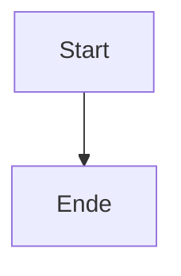

# Perf-Fixture 4T-000180

Grosse Mess-Fixture: Headings, Tabellen, Mermaid, Callouts, Listen, Code.

## Abschnitt 1

Absatz mit **Fett**, *kursiv*, `Code`, ==Mark== und einem [Link](https://example.org) sowie etwas Fliesstext zur Fuellung der Zeile Nummer 1.

## Abschnitt 2

Absatz mit **Fett**, *kursiv*, `Code`, ==Mark== und einem [Link](https://example.org) sowie etwas Fliesstext zur Fuellung der Zeile Nummer 2.

## Abschnitt 3

Absatz mit **Fett**, *kursiv*, `Code`, ==Mark== und einem [Link](https://example.org) sowie etwas Fliesstext zur Fuellung der Zeile Nummer 3.

## Abschnitt 4

Absatz mit **Fett**, *kursiv*, `Code`, ==Mark== und einem [Link](https://example.org) sowie etwas Fliesstext zur Fuellung der Zeile Nummer 4.

## Abschnitt 5

Absatz mit **Fett**, *kursiv*, `Code`, ==Mark== und einem [Link](https://example.org) sowie etwas Fliesstext zur Fuellung der Zeile Nummer 5.

## Abschnitt 6

Absatz mit **Fett**, *kursiv*, `Code`, ==Mark== und einem [Link](https://example.org) sowie etwas Fliesstext zur Fuellung der Zeile Nummer 6.

## Abschnitt 7

Absatz mit **Fett**, *kursiv*, `Code`, ==Mark== und einem [Link](https://example.org) sowie etwas Fliesstext zur Fuellung der Zeile Nummer 7.

### Tabelle 7

| Spalte A | Spalte B | Spalte C |
|---|---|---|
| Wert 0 | Zahl 0 | Text 0 |
| Wert 1 | Zahl 7 | Text 1 |
| Wert 2 | Zahl 14 | Text 2 |
| Wert 3 | Zahl 21 | Text 3 |
| Wert 4 | Zahl 28 | Text 4 |

## Abschnitt 8

Absatz mit **Fett**, *kursiv*, `Code`, ==Mark== und einem [Link](https://example.org) sowie etwas Fliesstext zur Fuellung der Zeile Nummer 8.

## Abschnitt 9

Absatz mit **Fett**, *kursiv*, `Code`, ==Mark== und einem [Link](https://example.org) sowie etwas Fliesstext zur Fuellung der Zeile Nummer 9.

## Abschnitt 10

Absatz mit **Fett**, *kursiv*, `Code`, ==Mark== und einem [Link](https://example.org) sowie etwas Fliesstext zur Fuellung der Zeile Nummer 10.

## Abschnitt 11

Absatz mit **Fett**, *kursiv*, `Code`, ==Mark== und einem [Link](https://example.org) sowie etwas Fliesstext zur Fuellung der Zeile Nummer 11.

- Listenpunkt eins
  - Verschachtelt zwei
    - Verschachtelt drei
- Listenpunkt vier

## Abschnitt 12

Absatz mit **Fett**, *kursiv*, `Code`, ==Mark== und einem [Link](https://example.org) sowie etwas Fliesstext zur Fuellung der Zeile Nummer 12.

## Abschnitt 13

Absatz mit **Fett**, *kursiv*, `Code`, ==Mark== und einem [Link](https://example.org) sowie etwas Fliesstext zur Fuellung der Zeile Nummer 13.

> [!info] Callout 13
> Inhalt des Callouts mit etwas Text.

## Abschnitt 14

Absatz mit **Fett**, *kursiv*, `Code`, ==Mark== und einem [Link](https://example.org) sowie etwas Fliesstext zur Fuellung der Zeile Nummer 14.

### Tabelle 14

| Spalte A | Spalte B | Spalte C |
|---|---|---|
| Wert 0 | Zahl 0 | Text 0 |
| Wert 1 | Zahl 14 | Text 1 |
| Wert 2 | Zahl 28 | Text 2 |
| Wert 3 | Zahl 42 | Text 3 |
| Wert 4 | Zahl 56 | Text 4 |

## Abschnitt 15

Absatz mit **Fett**, *kursiv*, `Code`, ==Mark== und einem [Link](https://example.org) sowie etwas Fliesstext zur Fuellung der Zeile Nummer 15.

## Abschnitt 16

Absatz mit **Fett**, *kursiv*, `Code`, ==Mark== und einem [Link](https://example.org) sowie etwas Fliesstext zur Fuellung der Zeile Nummer 16.

## Abschnitt 17

Absatz mit **Fett**, *kursiv*, `Code`, ==Mark== und einem [Link](https://example.org) sowie etwas Fliesstext zur Fuellung der Zeile Nummer 17.

```js
const x17 = 17;
```

## Abschnitt 18

Absatz mit **Fett**, *kursiv*, `Code`, ==Mark== und einem [Link](https://example.org) sowie etwas Fliesstext zur Fuellung der Zeile Nummer 18.

## Abschnitt 19

Absatz mit **Fett**, *kursiv*, `Code`, ==Mark== und einem [Link](https://example.org) sowie etwas Fliesstext zur Fuellung der Zeile Nummer 19.

## Abschnitt 20

Absatz mit **Fett**, *kursiv*, `Code`, ==Mark== und einem [Link](https://example.org) sowie etwas Fliesstext zur Fuellung der Zeile Nummer 20.

## Abschnitt 21

Absatz mit **Fett**, *kursiv*, `Code`, ==Mark== und einem [Link](https://example.org) sowie etwas Fliesstext zur Fuellung der Zeile Nummer 21.

### Tabelle 21

| Spalte A | Spalte B | Spalte C |
|---|---|---|
| Wert 0 | Zahl 0 | Text 0 |
| Wert 1 | Zahl 21 | Text 1 |
| Wert 2 | Zahl 42 | Text 2 |
| Wert 3 | Zahl 63 | Text 3 |
| Wert 4 | Zahl 84 | Text 4 |

## Abschnitt 22

Absatz mit **Fett**, *kursiv*, `Code`, ==Mark== und einem [Link](https://example.org) sowie etwas Fliesstext zur Fuellung der Zeile Nummer 22.

- Listenpunkt eins
  - Verschachtelt zwei
    - Verschachtelt drei
- Listenpunkt vier

## Abschnitt 23

Absatz mit **Fett**, *kursiv*, `Code`, ==Mark== und einem [Link](https://example.org) sowie etwas Fliesstext zur Fuellung der Zeile Nummer 23.

## Abschnitt 24

Absatz mit **Fett**, *kursiv*, `Code`, ==Mark== und einem [Link](https://example.org) sowie etwas Fliesstext zur Fuellung der Zeile Nummer 24.

## Abschnitt 25

Absatz mit **Fett**, *kursiv*, `Code`, ==Mark== und einem [Link](https://example.org) sowie etwas Fliesstext zur Fuellung der Zeile Nummer 25.

## Abschnitt 26

Absatz mit **Fett**, *kursiv*, `Code`, ==Mark== und einem [Link](https://example.org) sowie etwas Fliesstext zur Fuellung der Zeile Nummer 26.

> [!info] Callout 26
> Inhalt des Callouts mit etwas Text.

## Abschnitt 27

Absatz mit **Fett**, *kursiv*, `Code`, ==Mark== und einem [Link](https://example.org) sowie etwas Fliesstext zur Fuellung der Zeile Nummer 27.

## Abschnitt 28

Absatz mit **Fett**, *kursiv*, `Code`, ==Mark== und einem [Link](https://example.org) sowie etwas Fliesstext zur Fuellung der Zeile Nummer 28.

### Tabelle 28

| Spalte A | Spalte B | Spalte C |
|---|---|---|
| Wert 0 | Zahl 0 | Text 0 |
| Wert 1 | Zahl 28 | Text 1 |
| Wert 2 | Zahl 56 | Text 2 |
| Wert 3 | Zahl 84 | Text 3 |
| Wert 4 | Zahl 112 | Text 4 |

## Abschnitt 29

Absatz mit **Fett**, *kursiv*, `Code`, ==Mark== und einem [Link](https://example.org) sowie etwas Fliesstext zur Fuellung der Zeile Nummer 29.

## Abschnitt 30

Absatz mit **Fett**, *kursiv*, `Code`, ==Mark== und einem [Link](https://example.org) sowie etwas Fliesstext zur Fuellung der Zeile Nummer 30.

## Abschnitt 31

Absatz mit **Fett**, *kursiv*, `Code`, ==Mark== und einem [Link](https://example.org) sowie etwas Fliesstext zur Fuellung der Zeile Nummer 31.

## Abschnitt 32

Absatz mit **Fett**, *kursiv*, `Code`, ==Mark== und einem [Link](https://example.org) sowie etwas Fliesstext zur Fuellung der Zeile Nummer 32.

## Abschnitt 33

Absatz mit **Fett**, *kursiv*, `Code`, ==Mark== und einem [Link](https://example.org) sowie etwas Fliesstext zur Fuellung der Zeile Nummer 33.

- Listenpunkt eins
  - Verschachtelt zwei
    - Verschachtelt drei
- Listenpunkt vier

## Abschnitt 34

Absatz mit **Fett**, *kursiv*, `Code`, ==Mark== und einem [Link](https://example.org) sowie etwas Fliesstext zur Fuellung der Zeile Nummer 34.

```js
const x34 = 34;
```

## Abschnitt 35

Absatz mit **Fett**, *kursiv*, `Code`, ==Mark== und einem [Link](https://example.org) sowie etwas Fliesstext zur Fuellung der Zeile Nummer 35.

### Tabelle 35

| Spalte A | Spalte B | Spalte C |
|---|---|---|
| Wert 0 | Zahl 0 | Text 0 |
| Wert 1 | Zahl 35 | Text 1 |
| Wert 2 | Zahl 70 | Text 2 |
| Wert 3 | Zahl 105 | Text 3 |
| Wert 4 | Zahl 140 | Text 4 |

## Abschnitt 36

Absatz mit **Fett**, *kursiv*, `Code`, ==Mark== und einem [Link](https://example.org) sowie etwas Fliesstext zur Fuellung der Zeile Nummer 36.

## Abschnitt 37

Absatz mit **Fett**, *kursiv*, `Code`, ==Mark== und einem [Link](https://example.org) sowie etwas Fliesstext zur Fuellung der Zeile Nummer 37.

## Abschnitt 38

Absatz mit **Fett**, *kursiv*, `Code`, ==Mark== und einem [Link](https://example.org) sowie etwas Fliesstext zur Fuellung der Zeile Nummer 38.

## Abschnitt 39

Absatz mit **Fett**, *kursiv*, `Code`, ==Mark== und einem [Link](https://example.org) sowie etwas Fliesstext zur Fuellung der Zeile Nummer 39.

> [!info] Callout 39
> Inhalt des Callouts mit etwas Text.

## Abschnitt 40

Absatz mit **Fett**, *kursiv*, `Code`, ==Mark== und einem [Link](https://example.org) sowie etwas Fliesstext zur Fuellung der Zeile Nummer 40.

## Abschnitt 41

Absatz mit **Fett**, *kursiv*, `Code`, ==Mark== und einem [Link](https://example.org) sowie etwas Fliesstext zur Fuellung der Zeile Nummer 41.

## Abschnitt 42

Absatz mit **Fett**, *kursiv*, `Code`, ==Mark== und einem [Link](https://example.org) sowie etwas Fliesstext zur Fuellung der Zeile Nummer 42.

### Tabelle 42

| Spalte A | Spalte B | Spalte C |
|---|---|---|
| Wert 0 | Zahl 0 | Text 0 |
| Wert 1 | Zahl 42 | Text 1 |
| Wert 2 | Zahl 84 | Text 2 |
| Wert 3 | Zahl 126 | Text 3 |
| Wert 4 | Zahl 168 | Text 4 |

## Abschnitt 43

Absatz mit **Fett**, *kursiv*, `Code`, ==Mark== und einem [Link](https://example.org) sowie etwas Fliesstext zur Fuellung der Zeile Nummer 43.

## Abschnitt 44

Absatz mit **Fett**, *kursiv*, `Code`, ==Mark== und einem [Link](https://example.org) sowie etwas Fliesstext zur Fuellung der Zeile Nummer 44.

- Listenpunkt eins
  - Verschachtelt zwei
    - Verschachtelt drei
- Listenpunkt vier

## Abschnitt 45

Absatz mit **Fett**, *kursiv*, `Code`, ==Mark== und einem [Link](https://example.org) sowie etwas Fliesstext zur Fuellung der Zeile Nummer 45.

## Abschnitt 46

Absatz mit **Fett**, *kursiv*, `Code`, ==Mark== und einem [Link](https://example.org) sowie etwas Fliesstext zur Fuellung der Zeile Nummer 46.

## Abschnitt 47

Absatz mit **Fett**, *kursiv*, `Code`, ==Mark== und einem [Link](https://example.org) sowie etwas Fliesstext zur Fuellung der Zeile Nummer 47.

## Abschnitt 48

Absatz mit **Fett**, *kursiv*, `Code`, ==Mark== und einem [Link](https://example.org) sowie etwas Fliesstext zur Fuellung der Zeile Nummer 48.

## Abschnitt 49

Absatz mit **Fett**, *kursiv*, `Code`, ==Mark== und einem [Link](https://example.org) sowie etwas Fliesstext zur Fuellung der Zeile Nummer 49.

### Tabelle 49

| Spalte A | Spalte B | Spalte C |
|---|---|---|
| Wert 0 | Zahl 0 | Text 0 |
| Wert 1 | Zahl 49 | Text 1 |
| Wert 2 | Zahl 98 | Text 2 |
| Wert 3 | Zahl 147 | Text 3 |
| Wert 4 | Zahl 196 | Text 4 |

## Abschnitt 50

Absatz mit **Fett**, *kursiv*, `Code`, ==Mark== und einem [Link](https://example.org) sowie etwas Fliesstext zur Fuellung der Zeile Nummer 50.



## Abschnitt 51

Absatz mit **Fett**, *kursiv*, `Code`, ==Mark== und einem [Link](https://example.org) sowie etwas Fliesstext zur Fuellung der Zeile Nummer 51.

```js
const x51 = 51;
```

## Abschnitt 52

Absatz mit **Fett**, *kursiv*, `Code`, ==Mark== und einem [Link](https://example.org) sowie etwas Fliesstext zur Fuellung der Zeile Nummer 52.

> [!info] Callout 52
> Inhalt des Callouts mit etwas Text.

## Abschnitt 53

Absatz mit **Fett**, *kursiv*, `Code`, ==Mark== und einem [Link](https://example.org) sowie etwas Fliesstext zur Fuellung der Zeile Nummer 53.

## Abschnitt 54

Absatz mit **Fett**, *kursiv*, `Code`, ==Mark== und einem [Link](https://example.org) sowie etwas Fliesstext zur Fuellung der Zeile Nummer 54.

## Abschnitt 55

Absatz mit **Fett**, *kursiv*, `Code`, ==Mark== und einem [Link](https://example.org) sowie etwas Fliesstext zur Fuellung der Zeile Nummer 55.

- Listenpunkt eins
  - Verschachtelt zwei
    - Verschachtelt drei
- Listenpunkt vier

## Abschnitt 56

Absatz mit **Fett**, *kursiv*, `Code`, ==Mark== und einem [Link](https://example.org) sowie etwas Fliesstext zur Fuellung der Zeile Nummer 56.

### Tabelle 56

| Spalte A | Spalte B | Spalte C |
|---|---|---|
| Wert 0 | Zahl 0 | Text 0 |
| Wert 1 | Zahl 56 | Text 1 |
| Wert 2 | Zahl 112 | Text 2 |
| Wert 3 | Zahl 168 | Text 3 |
| Wert 4 | Zahl 224 | Text 4 |

## Abschnitt 57

Absatz mit **Fett**, *kursiv*, `Code`, ==Mark== und einem [Link](https://example.org) sowie etwas Fliesstext zur Fuellung der Zeile Nummer 57.

## Abschnitt 58

Absatz mit **Fett**, *kursiv*, `Code`, ==Mark== und einem [Link](https://example.org) sowie etwas Fliesstext zur Fuellung der Zeile Nummer 58.

## Abschnitt 59

Absatz mit **Fett**, *kursiv*, `Code`, ==Mark== und einem [Link](https://example.org) sowie etwas Fliesstext zur Fuellung der Zeile Nummer 59.

## Abschnitt 60

Absatz mit **Fett**, *kursiv*, `Code`, ==Mark== und einem [Link](https://example.org) sowie etwas Fliesstext zur Fuellung der Zeile Nummer 60.

## Abschnitt 61

Absatz mit **Fett**, *kursiv*, `Code`, ==Mark== und einem [Link](https://example.org) sowie etwas Fliesstext zur Fuellung der Zeile Nummer 61.

## Abschnitt 62

Absatz mit **Fett**, *kursiv*, `Code`, ==Mark== und einem [Link](https://example.org) sowie etwas Fliesstext zur Fuellung der Zeile Nummer 62.

## Abschnitt 63

Absatz mit **Fett**, *kursiv*, `Code`, ==Mark== und einem [Link](https://example.org) sowie etwas Fliesstext zur Fuellung der Zeile Nummer 63.

### Tabelle 63

| Spalte A | Spalte B | Spalte C |
|---|---|---|
| Wert 0 | Zahl 0 | Text 0 |
| Wert 1 | Zahl 63 | Text 1 |
| Wert 2 | Zahl 126 | Text 2 |
| Wert 3 | Zahl 189 | Text 3 |
| Wert 4 | Zahl 252 | Text 4 |

## Abschnitt 64

Absatz mit **Fett**, *kursiv*, `Code`, ==Mark== und einem [Link](https://example.org) sowie etwas Fliesstext zur Fuellung der Zeile Nummer 64.

## Abschnitt 65

Absatz mit **Fett**, *kursiv*, `Code`, ==Mark== und einem [Link](https://example.org) sowie etwas Fliesstext zur Fuellung der Zeile Nummer 65.

> [!info] Callout 65
> Inhalt des Callouts mit etwas Text.

## Abschnitt 66

Absatz mit **Fett**, *kursiv*, `Code`, ==Mark== und einem [Link](https://example.org) sowie etwas Fliesstext zur Fuellung der Zeile Nummer 66.

- Listenpunkt eins
  - Verschachtelt zwei
    - Verschachtelt drei
- Listenpunkt vier

## Abschnitt 67

Absatz mit **Fett**, *kursiv*, `Code`, ==Mark== und einem [Link](https://example.org) sowie etwas Fliesstext zur Fuellung der Zeile Nummer 67.

## Abschnitt 68

Absatz mit **Fett**, *kursiv*, `Code`, ==Mark== und einem [Link](https://example.org) sowie etwas Fliesstext zur Fuellung der Zeile Nummer 68.

```js
const x68 = 68;
```

## Abschnitt 69

Absatz mit **Fett**, *kursiv*, `Code`, ==Mark== und einem [Link](https://example.org) sowie etwas Fliesstext zur Fuellung der Zeile Nummer 69.

## Abschnitt 70

Absatz mit **Fett**, *kursiv*, `Code`, ==Mark== und einem [Link](https://example.org) sowie etwas Fliesstext zur Fuellung der Zeile Nummer 70.

### Tabelle 70

| Spalte A | Spalte B | Spalte C |
|---|---|---|
| Wert 0 | Zahl 0 | Text 0 |
| Wert 1 | Zahl 70 | Text 1 |
| Wert 2 | Zahl 140 | Text 2 |
| Wert 3 | Zahl 210 | Text 3 |
| Wert 4 | Zahl 280 | Text 4 |

## Abschnitt 71

Absatz mit **Fett**, *kursiv*, `Code`, ==Mark== und einem [Link](https://example.org) sowie etwas Fliesstext zur Fuellung der Zeile Nummer 71.

## Abschnitt 72

Absatz mit **Fett**, *kursiv*, `Code`, ==Mark== und einem [Link](https://example.org) sowie etwas Fliesstext zur Fuellung der Zeile Nummer 72.

## Abschnitt 73

Absatz mit **Fett**, *kursiv*, `Code`, ==Mark== und einem [Link](https://example.org) sowie etwas Fliesstext zur Fuellung der Zeile Nummer 73.

## Abschnitt 74

Absatz mit **Fett**, *kursiv*, `Code`, ==Mark== und einem [Link](https://example.org) sowie etwas Fliesstext zur Fuellung der Zeile Nummer 74.

## Abschnitt 75

Absatz mit **Fett**, *kursiv*, `Code`, ==Mark== und einem [Link](https://example.org) sowie etwas Fliesstext zur Fuellung der Zeile Nummer 75.

## Abschnitt 76

Absatz mit **Fett**, *kursiv*, `Code`, ==Mark== und einem [Link](https://example.org) sowie etwas Fliesstext zur Fuellung der Zeile Nummer 76.

## Abschnitt 77

Absatz mit **Fett**, *kursiv*, `Code`, ==Mark== und einem [Link](https://example.org) sowie etwas Fliesstext zur Fuellung der Zeile Nummer 77.

### Tabelle 77

| Spalte A | Spalte B | Spalte C |
|---|---|---|
| Wert 0 | Zahl 0 | Text 0 |
| Wert 1 | Zahl 77 | Text 1 |
| Wert 2 | Zahl 154 | Text 2 |
| Wert 3 | Zahl 231 | Text 3 |
| Wert 4 | Zahl 308 | Text 4 |

- Listenpunkt eins
  - Verschachtelt zwei
    - Verschachtelt drei
- Listenpunkt vier

## Abschnitt 78

Absatz mit **Fett**, *kursiv*, `Code`, ==Mark== und einem [Link](https://example.org) sowie etwas Fliesstext zur Fuellung der Zeile Nummer 78.

> [!info] Callout 78
> Inhalt des Callouts mit etwas Text.

## Abschnitt 79

Absatz mit **Fett**, *kursiv*, `Code`, ==Mark== und einem [Link](https://example.org) sowie etwas Fliesstext zur Fuellung der Zeile Nummer 79.

## Abschnitt 80

Absatz mit **Fett**, *kursiv*, `Code`, ==Mark== und einem [Link](https://example.org) sowie etwas Fliesstext zur Fuellung der Zeile Nummer 80.

## Abschnitt 81

Absatz mit **Fett**, *kursiv*, `Code`, ==Mark== und einem [Link](https://example.org) sowie etwas Fliesstext zur Fuellung der Zeile Nummer 81.

## Abschnitt 82

Absatz mit **Fett**, *kursiv*, `Code`, ==Mark== und einem [Link](https://example.org) sowie etwas Fliesstext zur Fuellung der Zeile Nummer 82.

## Abschnitt 83

Absatz mit **Fett**, *kursiv*, `Code`, ==Mark== und einem [Link](https://example.org) sowie etwas Fliesstext zur Fuellung der Zeile Nummer 83.

## Abschnitt 84

Absatz mit **Fett**, *kursiv*, `Code`, ==Mark== und einem [Link](https://example.org) sowie etwas Fliesstext zur Fuellung der Zeile Nummer 84.

### Tabelle 84

| Spalte A | Spalte B | Spalte C |
|---|---|---|
| Wert 0 | Zahl 0 | Text 0 |
| Wert 1 | Zahl 84 | Text 1 |
| Wert 2 | Zahl 168 | Text 2 |
| Wert 3 | Zahl 252 | Text 3 |
| Wert 4 | Zahl 336 | Text 4 |

## Abschnitt 85

Absatz mit **Fett**, *kursiv*, `Code`, ==Mark== und einem [Link](https://example.org) sowie etwas Fliesstext zur Fuellung der Zeile Nummer 85.

```js
const x85 = 85;
```

## Abschnitt 86

Absatz mit **Fett**, *kursiv*, `Code`, ==Mark== und einem [Link](https://example.org) sowie etwas Fliesstext zur Fuellung der Zeile Nummer 86.

## Abschnitt 87

Absatz mit **Fett**, *kursiv*, `Code`, ==Mark== und einem [Link](https://example.org) sowie etwas Fliesstext zur Fuellung der Zeile Nummer 87.

## Abschnitt 88

Absatz mit **Fett**, *kursiv*, `Code`, ==Mark== und einem [Link](https://example.org) sowie etwas Fliesstext zur Fuellung der Zeile Nummer 88.

- Listenpunkt eins
  - Verschachtelt zwei
    - Verschachtelt drei
- Listenpunkt vier

## Abschnitt 89

Absatz mit **Fett**, *kursiv*, `Code`, ==Mark== und einem [Link](https://example.org) sowie etwas Fliesstext zur Fuellung der Zeile Nummer 89.

## Abschnitt 90

Absatz mit **Fett**, *kursiv*, `Code`, ==Mark== und einem [Link](https://example.org) sowie etwas Fliesstext zur Fuellung der Zeile Nummer 90.

## Abschnitt 91

Absatz mit **Fett**, *kursiv*, `Code`, ==Mark== und einem [Link](https://example.org) sowie etwas Fliesstext zur Fuellung der Zeile Nummer 91.

### Tabelle 91

| Spalte A | Spalte B | Spalte C |
|---|---|---|
| Wert 0 | Zahl 0 | Text 0 |
| Wert 1 | Zahl 91 | Text 1 |
| Wert 2 | Zahl 182 | Text 2 |
| Wert 3 | Zahl 273 | Text 3 |
| Wert 4 | Zahl 364 | Text 4 |

> [!info] Callout 91
> Inhalt des Callouts mit etwas Text.

## Abschnitt 92

Absatz mit **Fett**, *kursiv*, `Code`, ==Mark== und einem [Link](https://example.org) sowie etwas Fliesstext zur Fuellung der Zeile Nummer 92.

## Abschnitt 93

Absatz mit **Fett**, *kursiv*, `Code`, ==Mark== und einem [Link](https://example.org) sowie etwas Fliesstext zur Fuellung der Zeile Nummer 93.

## Abschnitt 94

Absatz mit **Fett**, *kursiv*, `Code`, ==Mark== und einem [Link](https://example.org) sowie etwas Fliesstext zur Fuellung der Zeile Nummer 94.

## Abschnitt 95

Absatz mit **Fett**, *kursiv*, `Code`, ==Mark== und einem [Link](https://example.org) sowie etwas Fliesstext zur Fuellung der Zeile Nummer 95.

## Abschnitt 96

Absatz mit **Fett**, *kursiv*, `Code`, ==Mark== und einem [Link](https://example.org) sowie etwas Fliesstext zur Fuellung der Zeile Nummer 96.

## Abschnitt 97

Absatz mit **Fett**, *kursiv*, `Code`, ==Mark== und einem [Link](https://example.org) sowie etwas Fliesstext zur Fuellung der Zeile Nummer 97.

## Abschnitt 98

Absatz mit **Fett**, *kursiv*, `Code`, ==Mark== und einem [Link](https://example.org) sowie etwas Fliesstext zur Fuellung der Zeile Nummer 98.

### Tabelle 98

| Spalte A | Spalte B | Spalte C |
|---|---|---|
| Wert 0 | Zahl 0 | Text 0 |
| Wert 1 | Zahl 98 | Text 1 |
| Wert 2 | Zahl 196 | Text 2 |
| Wert 3 | Zahl 294 | Text 3 |
| Wert 4 | Zahl 392 | Text 4 |

## Abschnitt 99

Absatz mit **Fett**, *kursiv*, `Code`, ==Mark== und einem [Link](https://example.org) sowie etwas Fliesstext zur Fuellung der Zeile Nummer 99.

- Listenpunkt eins
  - Verschachtelt zwei
    - Verschachtelt drei
- Listenpunkt vier

## Abschnitt 100

Absatz mit **Fett**, *kursiv*, `Code`, ==Mark== und einem [Link](https://example.org) sowie etwas Fliesstext zur Fuellung der Zeile Nummer 100.


## Abschnitt 101

Absatz mit **Fett**, *kursiv*, `Code`, ==Mark== und einem [Link](https://example.org) sowie etwas Fliesstext zur Fuellung der Zeile Nummer 101.

## Abschnitt 102

Absatz mit **Fett**, *kursiv*, `Code`, ==Mark== und einem [Link](https://example.org) sowie etwas Fliesstext zur Fuellung der Zeile Nummer 102.

```js
const x102 = 102;
```

## Abschnitt 103

Absatz mit **Fett**, *kursiv*, `Code`, ==Mark== und einem [Link](https://example.org) sowie etwas Fliesstext zur Fuellung der Zeile Nummer 103.

## Abschnitt 104

Absatz mit **Fett**, *kursiv*, `Code`, ==Mark== und einem [Link](https://example.org) sowie etwas Fliesstext zur Fuellung der Zeile Nummer 104.

> [!info] Callout 104
> Inhalt des Callouts mit etwas Text.

## Abschnitt 105

Absatz mit **Fett**, *kursiv*, `Code`, ==Mark== und einem [Link](https://example.org) sowie etwas Fliesstext zur Fuellung der Zeile Nummer 105.

### Tabelle 105

| Spalte A | Spalte B | Spalte C |
|---|---|---|
| Wert 0 | Zahl 0 | Text 0 |
| Wert 1 | Zahl 105 | Text 1 |
| Wert 2 | Zahl 210 | Text 2 |
| Wert 3 | Zahl 315 | Text 3 |
| Wert 4 | Zahl 420 | Text 4 |

## Abschnitt 106

Absatz mit **Fett**, *kursiv*, `Code`, ==Mark== und einem [Link](https://example.org) sowie etwas Fliesstext zur Fuellung der Zeile Nummer 106.

## Abschnitt 107

Absatz mit **Fett**, *kursiv*, `Code`, ==Mark== und einem [Link](https://example.org) sowie etwas Fliesstext zur Fuellung der Zeile Nummer 107.

## Abschnitt 108

Absatz mit **Fett**, *kursiv*, `Code`, ==Mark== und einem [Link](https://example.org) sowie etwas Fliesstext zur Fuellung der Zeile Nummer 108.

## Abschnitt 109

Absatz mit **Fett**, *kursiv*, `Code`, ==Mark== und einem [Link](https://example.org) sowie etwas Fliesstext zur Fuellung der Zeile Nummer 109.

## Abschnitt 110

Absatz mit **Fett**, *kursiv*, `Code`, ==Mark== und einem [Link](https://example.org) sowie etwas Fliesstext zur Fuellung der Zeile Nummer 110.

- Listenpunkt eins
  - Verschachtelt zwei
    - Verschachtelt drei
- Listenpunkt vier

## Abschnitt 111

Absatz mit **Fett**, *kursiv*, `Code`, ==Mark== und einem [Link](https://example.org) sowie etwas Fliesstext zur Fuellung der Zeile Nummer 111.

## Abschnitt 112

Absatz mit **Fett**, *kursiv*, `Code`, ==Mark== und einem [Link](https://example.org) sowie etwas Fliesstext zur Fuellung der Zeile Nummer 112.

### Tabelle 112

| Spalte A | Spalte B | Spalte C |
|---|---|---|
| Wert 0 | Zahl 0 | Text 0 |
| Wert 1 | Zahl 112 | Text 1 |
| Wert 2 | Zahl 224 | Text 2 |
| Wert 3 | Zahl 336 | Text 3 |
| Wert 4 | Zahl 448 | Text 4 |

## Abschnitt 113

Absatz mit **Fett**, *kursiv*, `Code`, ==Mark== und einem [Link](https://example.org) sowie etwas Fliesstext zur Fuellung der Zeile Nummer 113.

## Abschnitt 114

Absatz mit **Fett**, *kursiv*, `Code`, ==Mark== und einem [Link](https://example.org) sowie etwas Fliesstext zur Fuellung der Zeile Nummer 114.

## Abschnitt 115

Absatz mit **Fett**, *kursiv*, `Code`, ==Mark== und einem [Link](https://example.org) sowie etwas Fliesstext zur Fuellung der Zeile Nummer 115.

## Abschnitt 116

Absatz mit **Fett**, *kursiv*, `Code`, ==Mark== und einem [Link](https://example.org) sowie etwas Fliesstext zur Fuellung der Zeile Nummer 116.

## Abschnitt 117

Absatz mit **Fett**, *kursiv*, `Code`, ==Mark== und einem [Link](https://example.org) sowie etwas Fliesstext zur Fuellung der Zeile Nummer 117.

> [!info] Callout 117
> Inhalt des Callouts mit etwas Text.

## Abschnitt 118

Absatz mit **Fett**, *kursiv*, `Code`, ==Mark== und einem [Link](https://example.org) sowie etwas Fliesstext zur Fuellung der Zeile Nummer 118.

## Abschnitt 119

Absatz mit **Fett**, *kursiv*, `Code`, ==Mark== und einem [Link](https://example.org) sowie etwas Fliesstext zur Fuellung der Zeile Nummer 119.

### Tabelle 119

| Spalte A | Spalte B | Spalte C |
|---|---|---|
| Wert 0 | Zahl 0 | Text 0 |
| Wert 1 | Zahl 119 | Text 1 |
| Wert 2 | Zahl 238 | Text 2 |
| Wert 3 | Zahl 357 | Text 3 |
| Wert 4 | Zahl 476 | Text 4 |

```js
const x119 = 119;
```

## Abschnitt 120

Absatz mit **Fett**, *kursiv*, `Code`, ==Mark== und einem [Link](https://example.org) sowie etwas Fliesstext zur Fuellung der Zeile Nummer 120.

## Abschnitt 121

Absatz mit **Fett**, *kursiv*, `Code`, ==Mark== und einem [Link](https://example.org) sowie etwas Fliesstext zur Fuellung der Zeile Nummer 121.

- Listenpunkt eins
  - Verschachtelt zwei
    - Verschachtelt drei
- Listenpunkt vier

## Abschnitt 122

Absatz mit **Fett**, *kursiv*, `Code`, ==Mark== und einem [Link](https://example.org) sowie etwas Fliesstext zur Fuellung der Zeile Nummer 122.

## Abschnitt 123

Absatz mit **Fett**, *kursiv*, `Code`, ==Mark== und einem [Link](https://example.org) sowie etwas Fliesstext zur Fuellung der Zeile Nummer 123.

## Abschnitt 124

Absatz mit **Fett**, *kursiv*, `Code`, ==Mark== und einem [Link](https://example.org) sowie etwas Fliesstext zur Fuellung der Zeile Nummer 124.

## Abschnitt 125

Absatz mit **Fett**, *kursiv*, `Code`, ==Mark== und einem [Link](https://example.org) sowie etwas Fliesstext zur Fuellung der Zeile Nummer 125.

## Abschnitt 126

Absatz mit **Fett**, *kursiv*, `Code`, ==Mark== und einem [Link](https://example.org) sowie etwas Fliesstext zur Fuellung der Zeile Nummer 126.

### Tabelle 126

| Spalte A | Spalte B | Spalte C |
|---|---|---|
| Wert 0 | Zahl 0 | Text 0 |
| Wert 1 | Zahl 126 | Text 1 |
| Wert 2 | Zahl 252 | Text 2 |
| Wert 3 | Zahl 378 | Text 3 |
| Wert 4 | Zahl 504 | Text 4 |

## Abschnitt 127

Absatz mit **Fett**, *kursiv*, `Code`, ==Mark== und einem [Link](https://example.org) sowie etwas Fliesstext zur Fuellung der Zeile Nummer 127.

## Abschnitt 128

Absatz mit **Fett**, *kursiv*, `Code`, ==Mark== und einem [Link](https://example.org) sowie etwas Fliesstext zur Fuellung der Zeile Nummer 128.

## Abschnitt 129

Absatz mit **Fett**, *kursiv*, `Code`, ==Mark== und einem [Link](https://example.org) sowie etwas Fliesstext zur Fuellung der Zeile Nummer 129.

## Abschnitt 130

Absatz mit **Fett**, *kursiv*, `Code`, ==Mark== und einem [Link](https://example.org) sowie etwas Fliesstext zur Fuellung der Zeile Nummer 130.

> [!info] Callout 130
> Inhalt des Callouts mit etwas Text.

## Abschnitt 131

Absatz mit **Fett**, *kursiv*, `Code`, ==Mark== und einem [Link](https://example.org) sowie etwas Fliesstext zur Fuellung der Zeile Nummer 131.

## Abschnitt 132

Absatz mit **Fett**, *kursiv*, `Code`, ==Mark== und einem [Link](https://example.org) sowie etwas Fliesstext zur Fuellung der Zeile Nummer 132.

- Listenpunkt eins
  - Verschachtelt zwei
    - Verschachtelt drei
- Listenpunkt vier

## Abschnitt 133

Absatz mit **Fett**, *kursiv*, `Code`, ==Mark== und einem [Link](https://example.org) sowie etwas Fliesstext zur Fuellung der Zeile Nummer 133.

### Tabelle 133

| Spalte A | Spalte B | Spalte C |
|---|---|---|
| Wert 0 | Zahl 0 | Text 0 |
| Wert 1 | Zahl 133 | Text 1 |
| Wert 2 | Zahl 266 | Text 2 |
| Wert 3 | Zahl 399 | Text 3 |
| Wert 4 | Zahl 532 | Text 4 |

## Abschnitt 134

Absatz mit **Fett**, *kursiv*, `Code`, ==Mark== und einem [Link](https://example.org) sowie etwas Fliesstext zur Fuellung der Zeile Nummer 134.

## Abschnitt 135

Absatz mit **Fett**, *kursiv*, `Code`, ==Mark== und einem [Link](https://example.org) sowie etwas Fliesstext zur Fuellung der Zeile Nummer 135.

## Abschnitt 136

Absatz mit **Fett**, *kursiv*, `Code`, ==Mark== und einem [Link](https://example.org) sowie etwas Fliesstext zur Fuellung der Zeile Nummer 136.

```js
const x136 = 136;
```

## Abschnitt 137

Absatz mit **Fett**, *kursiv*, `Code`, ==Mark== und einem [Link](https://example.org) sowie etwas Fliesstext zur Fuellung der Zeile Nummer 137.

## Abschnitt 138

Absatz mit **Fett**, *kursiv*, `Code`, ==Mark== und einem [Link](https://example.org) sowie etwas Fliesstext zur Fuellung der Zeile Nummer 138.

## Abschnitt 139

Absatz mit **Fett**, *kursiv*, `Code`, ==Mark== und einem [Link](https://example.org) sowie etwas Fliesstext zur Fuellung der Zeile Nummer 139.

## Abschnitt 140

Absatz mit **Fett**, *kursiv*, `Code`, ==Mark== und einem [Link](https://example.org) sowie etwas Fliesstext zur Fuellung der Zeile Nummer 140.

### Tabelle 140

| Spalte A | Spalte B | Spalte C |
|---|---|---|
| Wert 0 | Zahl 0 | Text 0 |
| Wert 1 | Zahl 140 | Text 1 |
| Wert 2 | Zahl 280 | Text 2 |
| Wert 3 | Zahl 420 | Text 3 |
| Wert 4 | Zahl 560 | Text 4 |

## Abschnitt 141

Absatz mit **Fett**, *kursiv*, `Code`, ==Mark== und einem [Link](https://example.org) sowie etwas Fliesstext zur Fuellung der Zeile Nummer 141.

## Abschnitt 142

Absatz mit **Fett**, *kursiv*, `Code`, ==Mark== und einem [Link](https://example.org) sowie etwas Fliesstext zur Fuellung der Zeile Nummer 142.

## Abschnitt 143

Absatz mit **Fett**, *kursiv*, `Code`, ==Mark== und einem [Link](https://example.org) sowie etwas Fliesstext zur Fuellung der Zeile Nummer 143.

> [!info] Callout 143
> Inhalt des Callouts mit etwas Text.

- Listenpunkt eins
  - Verschachtelt zwei
    - Verschachtelt drei
- Listenpunkt vier

## Abschnitt 144

Absatz mit **Fett**, *kursiv*, `Code`, ==Mark== und einem [Link](https://example.org) sowie etwas Fliesstext zur Fuellung der Zeile Nummer 144.

## Abschnitt 145

Absatz mit **Fett**, *kursiv*, `Code`, ==Mark== und einem [Link](https://example.org) sowie etwas Fliesstext zur Fuellung der Zeile Nummer 145.

## Abschnitt 146

Absatz mit **Fett**, *kursiv*, `Code`, ==Mark== und einem [Link](https://example.org) sowie etwas Fliesstext zur Fuellung der Zeile Nummer 146.

## Abschnitt 147

Absatz mit **Fett**, *kursiv*, `Code`, ==Mark== und einem [Link](https://example.org) sowie etwas Fliesstext zur Fuellung der Zeile Nummer 147.

### Tabelle 147

| Spalte A | Spalte B | Spalte C |
|---|---|---|
| Wert 0 | Zahl 0 | Text 0 |
| Wert 1 | Zahl 147 | Text 1 |
| Wert 2 | Zahl 294 | Text 2 |
| Wert 3 | Zahl 441 | Text 3 |
| Wert 4 | Zahl 588 | Text 4 |

## Abschnitt 148

Absatz mit **Fett**, *kursiv*, `Code`, ==Mark== und einem [Link](https://example.org) sowie etwas Fliesstext zur Fuellung der Zeile Nummer 148.

## Abschnitt 149

Absatz mit **Fett**, *kursiv*, `Code`, ==Mark== und einem [Link](https://example.org) sowie etwas Fliesstext zur Fuellung der Zeile Nummer 149.

## Abschnitt 150

Absatz mit **Fett**, *kursiv*, `Code`, ==Mark== und einem [Link](https://example.org) sowie etwas Fliesstext zur Fuellung der Zeile Nummer 150.


## Abschnitt 151

Absatz mit **Fett**, *kursiv*, `Code`, ==Mark== und einem [Link](https://example.org) sowie etwas Fliesstext zur Fuellung der Zeile Nummer 151.

## Abschnitt 152

Absatz mit **Fett**, *kursiv*, `Code`, ==Mark== und einem [Link](https://example.org) sowie etwas Fliesstext zur Fuellung der Zeile Nummer 152.

## Abschnitt 153

Absatz mit **Fett**, *kursiv*, `Code`, ==Mark== und einem [Link](https://example.org) sowie etwas Fliesstext zur Fuellung der Zeile Nummer 153.

```js
const x153 = 153;
```

## Abschnitt 154

Absatz mit **Fett**, *kursiv*, `Code`, ==Mark== und einem [Link](https://example.org) sowie etwas Fliesstext zur Fuellung der Zeile Nummer 154.

### Tabelle 154

| Spalte A | Spalte B | Spalte C |
|---|---|---|
| Wert 0 | Zahl 0 | Text 0 |
| Wert 1 | Zahl 154 | Text 1 |
| Wert 2 | Zahl 308 | Text 2 |
| Wert 3 | Zahl 462 | Text 3 |
| Wert 4 | Zahl 616 | Text 4 |

- Listenpunkt eins
  - Verschachtelt zwei
    - Verschachtelt drei
- Listenpunkt vier

## Abschnitt 155

Absatz mit **Fett**, *kursiv*, `Code`, ==Mark== und einem [Link](https://example.org) sowie etwas Fliesstext zur Fuellung der Zeile Nummer 155.

## Abschnitt 156

Absatz mit **Fett**, *kursiv*, `Code`, ==Mark== und einem [Link](https://example.org) sowie etwas Fliesstext zur Fuellung der Zeile Nummer 156.

> [!info] Callout 156
> Inhalt des Callouts mit etwas Text.

## Abschnitt 157

Absatz mit **Fett**, *kursiv*, `Code`, ==Mark== und einem [Link](https://example.org) sowie etwas Fliesstext zur Fuellung der Zeile Nummer 157.

## Abschnitt 158

Absatz mit **Fett**, *kursiv*, `Code`, ==Mark== und einem [Link](https://example.org) sowie etwas Fliesstext zur Fuellung der Zeile Nummer 158.

## Abschnitt 159

Absatz mit **Fett**, *kursiv*, `Code`, ==Mark== und einem [Link](https://example.org) sowie etwas Fliesstext zur Fuellung der Zeile Nummer 159.

## Abschnitt 160

Absatz mit **Fett**, *kursiv*, `Code`, ==Mark== und einem [Link](https://example.org) sowie etwas Fliesstext zur Fuellung der Zeile Nummer 160.

## Abschnitt 161

Absatz mit **Fett**, *kursiv*, `Code`, ==Mark== und einem [Link](https://example.org) sowie etwas Fliesstext zur Fuellung der Zeile Nummer 161.

### Tabelle 161

| Spalte A | Spalte B | Spalte C |
|---|---|---|
| Wert 0 | Zahl 0 | Text 0 |
| Wert 1 | Zahl 161 | Text 1 |
| Wert 2 | Zahl 322 | Text 2 |
| Wert 3 | Zahl 483 | Text 3 |
| Wert 4 | Zahl 644 | Text 4 |

## Abschnitt 162

Absatz mit **Fett**, *kursiv*, `Code`, ==Mark== und einem [Link](https://example.org) sowie etwas Fliesstext zur Fuellung der Zeile Nummer 162.

## Abschnitt 163

Absatz mit **Fett**, *kursiv*, `Code`, ==Mark== und einem [Link](https://example.org) sowie etwas Fliesstext zur Fuellung der Zeile Nummer 163.

## Abschnitt 164

Absatz mit **Fett**, *kursiv*, `Code`, ==Mark== und einem [Link](https://example.org) sowie etwas Fliesstext zur Fuellung der Zeile Nummer 164.

## Abschnitt 165

Absatz mit **Fett**, *kursiv*, `Code`, ==Mark== und einem [Link](https://example.org) sowie etwas Fliesstext zur Fuellung der Zeile Nummer 165.

- Listenpunkt eins
  - Verschachtelt zwei
    - Verschachtelt drei
- Listenpunkt vier

## Abschnitt 166

Absatz mit **Fett**, *kursiv*, `Code`, ==Mark== und einem [Link](https://example.org) sowie etwas Fliesstext zur Fuellung der Zeile Nummer 166.

## Abschnitt 167

Absatz mit **Fett**, *kursiv*, `Code`, ==Mark== und einem [Link](https://example.org) sowie etwas Fliesstext zur Fuellung der Zeile Nummer 167.

## Abschnitt 168

Absatz mit **Fett**, *kursiv*, `Code`, ==Mark== und einem [Link](https://example.org) sowie etwas Fliesstext zur Fuellung der Zeile Nummer 168.

### Tabelle 168

| Spalte A | Spalte B | Spalte C |
|---|---|---|
| Wert 0 | Zahl 0 | Text 0 |
| Wert 1 | Zahl 168 | Text 1 |
| Wert 2 | Zahl 336 | Text 2 |
| Wert 3 | Zahl 504 | Text 3 |
| Wert 4 | Zahl 672 | Text 4 |

## Abschnitt 169

Absatz mit **Fett**, *kursiv*, `Code`, ==Mark== und einem [Link](https://example.org) sowie etwas Fliesstext zur Fuellung der Zeile Nummer 169.

> [!info] Callout 169
> Inhalt des Callouts mit etwas Text.

## Abschnitt 170

Absatz mit **Fett**, *kursiv*, `Code`, ==Mark== und einem [Link](https://example.org) sowie etwas Fliesstext zur Fuellung der Zeile Nummer 170.

```js
const x170 = 170;
```

## Abschnitt 171

Absatz mit **Fett**, *kursiv*, `Code`, ==Mark== und einem [Link](https://example.org) sowie etwas Fliesstext zur Fuellung der Zeile Nummer 171.

## Abschnitt 172

Absatz mit **Fett**, *kursiv*, `Code`, ==Mark== und einem [Link](https://example.org) sowie etwas Fliesstext zur Fuellung der Zeile Nummer 172.

## Abschnitt 173

Absatz mit **Fett**, *kursiv*, `Code`, ==Mark== und einem [Link](https://example.org) sowie etwas Fliesstext zur Fuellung der Zeile Nummer 173.

## Abschnitt 174

Absatz mit **Fett**, *kursiv*, `Code`, ==Mark== und einem [Link](https://example.org) sowie etwas Fliesstext zur Fuellung der Zeile Nummer 174.

## Abschnitt 175

Absatz mit **Fett**, *kursiv*, `Code`, ==Mark== und einem [Link](https://example.org) sowie etwas Fliesstext zur Fuellung der Zeile Nummer 175.

### Tabelle 175

| Spalte A | Spalte B | Spalte C |
|---|---|---|
| Wert 0 | Zahl 0 | Text 0 |
| Wert 1 | Zahl 175 | Text 1 |
| Wert 2 | Zahl 350 | Text 2 |
| Wert 3 | Zahl 525 | Text 3 |
| Wert 4 | Zahl 700 | Text 4 |

## Abschnitt 176

Absatz mit **Fett**, *kursiv*, `Code`, ==Mark== und einem [Link](https://example.org) sowie etwas Fliesstext zur Fuellung der Zeile Nummer 176.

- Listenpunkt eins
  - Verschachtelt zwei
    - Verschachtelt drei
- Listenpunkt vier

## Abschnitt 177

Absatz mit **Fett**, *kursiv*, `Code`, ==Mark== und einem [Link](https://example.org) sowie etwas Fliesstext zur Fuellung der Zeile Nummer 177.

## Abschnitt 178

Absatz mit **Fett**, *kursiv*, `Code`, ==Mark== und einem [Link](https://example.org) sowie etwas Fliesstext zur Fuellung der Zeile Nummer 178.

## Abschnitt 179

Absatz mit **Fett**, *kursiv*, `Code`, ==Mark== und einem [Link](https://example.org) sowie etwas Fliesstext zur Fuellung der Zeile Nummer 179.

## Abschnitt 180

Absatz mit **Fett**, *kursiv*, `Code`, ==Mark== und einem [Link](https://example.org) sowie etwas Fliesstext zur Fuellung der Zeile Nummer 180.

## Abschnitt 181

Absatz mit **Fett**, *kursiv*, `Code`, ==Mark== und einem [Link](https://example.org) sowie etwas Fliesstext zur Fuellung der Zeile Nummer 181.

## Abschnitt 182

Absatz mit **Fett**, *kursiv*, `Code`, ==Mark== und einem [Link](https://example.org) sowie etwas Fliesstext zur Fuellung der Zeile Nummer 182.

### Tabelle 182

| Spalte A | Spalte B | Spalte C |
|---|---|---|
| Wert 0 | Zahl 0 | Text 0 |
| Wert 1 | Zahl 182 | Text 1 |
| Wert 2 | Zahl 364 | Text 2 |
| Wert 3 | Zahl 546 | Text 3 |
| Wert 4 | Zahl 728 | Text 4 |

> [!info] Callout 182
> Inhalt des Callouts mit etwas Text.

## Abschnitt 183

Absatz mit **Fett**, *kursiv*, `Code`, ==Mark== und einem [Link](https://example.org) sowie etwas Fliesstext zur Fuellung der Zeile Nummer 183.

## Abschnitt 184

Absatz mit **Fett**, *kursiv*, `Code`, ==Mark== und einem [Link](https://example.org) sowie etwas Fliesstext zur Fuellung der Zeile Nummer 184.

## Abschnitt 185

Absatz mit **Fett**, *kursiv*, `Code`, ==Mark== und einem [Link](https://example.org) sowie etwas Fliesstext zur Fuellung der Zeile Nummer 185.

## Abschnitt 186

Absatz mit **Fett**, *kursiv*, `Code`, ==Mark== und einem [Link](https://example.org) sowie etwas Fliesstext zur Fuellung der Zeile Nummer 186.

## Abschnitt 187

Absatz mit **Fett**, *kursiv*, `Code`, ==Mark== und einem [Link](https://example.org) sowie etwas Fliesstext zur Fuellung der Zeile Nummer 187.

- Listenpunkt eins
  - Verschachtelt zwei
    - Verschachtelt drei
- Listenpunkt vier

```js
const x187 = 187;
```

## Abschnitt 188

Absatz mit **Fett**, *kursiv*, `Code`, ==Mark== und einem [Link](https://example.org) sowie etwas Fliesstext zur Fuellung der Zeile Nummer 188.

## Abschnitt 189

Absatz mit **Fett**, *kursiv*, `Code`, ==Mark== und einem [Link](https://example.org) sowie etwas Fliesstext zur Fuellung der Zeile Nummer 189.

### Tabelle 189

| Spalte A | Spalte B | Spalte C |
|---|---|---|
| Wert 0 | Zahl 0 | Text 0 |
| Wert 1 | Zahl 189 | Text 1 |
| Wert 2 | Zahl 378 | Text 2 |
| Wert 3 | Zahl 567 | Text 3 |
| Wert 4 | Zahl 756 | Text 4 |

## Abschnitt 190

Absatz mit **Fett**, *kursiv*, `Code`, ==Mark== und einem [Link](https://example.org) sowie etwas Fliesstext zur Fuellung der Zeile Nummer 190.

## Abschnitt 191

Absatz mit **Fett**, *kursiv*, `Code`, ==Mark== und einem [Link](https://example.org) sowie etwas Fliesstext zur Fuellung der Zeile Nummer 191.

## Abschnitt 192

Absatz mit **Fett**, *kursiv*, `Code`, ==Mark== und einem [Link](https://example.org) sowie etwas Fliesstext zur Fuellung der Zeile Nummer 192.

## Abschnitt 193

Absatz mit **Fett**, *kursiv*, `Code`, ==Mark== und einem [Link](https://example.org) sowie etwas Fliesstext zur Fuellung der Zeile Nummer 193.

## Abschnitt 194

Absatz mit **Fett**, *kursiv*, `Code`, ==Mark== und einem [Link](https://example.org) sowie etwas Fliesstext zur Fuellung der Zeile Nummer 194.

## Abschnitt 195

Absatz mit **Fett**, *kursiv*, `Code`, ==Mark== und einem [Link](https://example.org) sowie etwas Fliesstext zur Fuellung der Zeile Nummer 195.

> [!info] Callout 195
> Inhalt des Callouts mit etwas Text.

## Abschnitt 196

Absatz mit **Fett**, *kursiv*, `Code`, ==Mark== und einem [Link](https://example.org) sowie etwas Fliesstext zur Fuellung der Zeile Nummer 196.

### Tabelle 196

| Spalte A | Spalte B | Spalte C |
|---|---|---|
| Wert 0 | Zahl 0 | Text 0 |
| Wert 1 | Zahl 196 | Text 1 |
| Wert 2 | Zahl 392 | Text 2 |
| Wert 3 | Zahl 588 | Text 3 |
| Wert 4 | Zahl 784 | Text 4 |

## Abschnitt 197

Absatz mit **Fett**, *kursiv*, `Code`, ==Mark== und einem [Link](https://example.org) sowie etwas Fliesstext zur Fuellung der Zeile Nummer 197.

## Abschnitt 198

Absatz mit **Fett**, *kursiv*, `Code`, ==Mark== und einem [Link](https://example.org) sowie etwas Fliesstext zur Fuellung der Zeile Nummer 198.

- Listenpunkt eins
  - Verschachtelt zwei
    - Verschachtelt drei
- Listenpunkt vier

## Abschnitt 199

Absatz mit **Fett**, *kursiv*, `Code`, ==Mark== und einem [Link](https://example.org) sowie etwas Fliesstext zur Fuellung der Zeile Nummer 199.

## Abschnitt 200

Absatz mit **Fett**, *kursiv*, `Code`, ==Mark== und einem [Link](https://example.org) sowie etwas Fliesstext zur Fuellung der Zeile Nummer 200.


## Abschnitt 201

Absatz mit **Fett**, *kursiv*, `Code`, ==Mark== und einem [Link](https://example.org) sowie etwas Fliesstext zur Fuellung der Zeile Nummer 201.

## Abschnitt 202

Absatz mit **Fett**, *kursiv*, `Code`, ==Mark== und einem [Link](https://example.org) sowie etwas Fliesstext zur Fuellung der Zeile Nummer 202.

## Abschnitt 203

Absatz mit **Fett**, *kursiv*, `Code`, ==Mark== und einem [Link](https://example.org) sowie etwas Fliesstext zur Fuellung der Zeile Nummer 203.

### Tabelle 203

| Spalte A | Spalte B | Spalte C |
|---|---|---|
| Wert 0 | Zahl 0 | Text 0 |
| Wert 1 | Zahl 203 | Text 1 |
| Wert 2 | Zahl 406 | Text 2 |
| Wert 3 | Zahl 609 | Text 3 |
| Wert 4 | Zahl 812 | Text 4 |

## Abschnitt 204

Absatz mit **Fett**, *kursiv*, `Code`, ==Mark== und einem [Link](https://example.org) sowie etwas Fliesstext zur Fuellung der Zeile Nummer 204.

```js
const x204 = 204;
```

## Abschnitt 205

Absatz mit **Fett**, *kursiv*, `Code`, ==Mark== und einem [Link](https://example.org) sowie etwas Fliesstext zur Fuellung der Zeile Nummer 205.

## Abschnitt 206

Absatz mit **Fett**, *kursiv*, `Code`, ==Mark== und einem [Link](https://example.org) sowie etwas Fliesstext zur Fuellung der Zeile Nummer 206.

## Abschnitt 207

Absatz mit **Fett**, *kursiv*, `Code`, ==Mark== und einem [Link](https://example.org) sowie etwas Fliesstext zur Fuellung der Zeile Nummer 207.

## Abschnitt 208

Absatz mit **Fett**, *kursiv*, `Code`, ==Mark== und einem [Link](https://example.org) sowie etwas Fliesstext zur Fuellung der Zeile Nummer 208.

> [!info] Callout 208
> Inhalt des Callouts mit etwas Text.

## Abschnitt 209

Absatz mit **Fett**, *kursiv*, `Code`, ==Mark== und einem [Link](https://example.org) sowie etwas Fliesstext zur Fuellung der Zeile Nummer 209.

- Listenpunkt eins
  - Verschachtelt zwei
    - Verschachtelt drei
- Listenpunkt vier

## Abschnitt 210

Absatz mit **Fett**, *kursiv*, `Code`, ==Mark== und einem [Link](https://example.org) sowie etwas Fliesstext zur Fuellung der Zeile Nummer 210.

### Tabelle 210

| Spalte A | Spalte B | Spalte C |
|---|---|---|
| Wert 0 | Zahl 0 | Text 0 |
| Wert 1 | Zahl 210 | Text 1 |
| Wert 2 | Zahl 420 | Text 2 |
| Wert 3 | Zahl 630 | Text 3 |
| Wert 4 | Zahl 840 | Text 4 |

## Abschnitt 211

Absatz mit **Fett**, *kursiv*, `Code`, ==Mark== und einem [Link](https://example.org) sowie etwas Fliesstext zur Fuellung der Zeile Nummer 211.

## Abschnitt 212

Absatz mit **Fett**, *kursiv*, `Code`, ==Mark== und einem [Link](https://example.org) sowie etwas Fliesstext zur Fuellung der Zeile Nummer 212.

## Abschnitt 213

Absatz mit **Fett**, *kursiv*, `Code`, ==Mark== und einem [Link](https://example.org) sowie etwas Fliesstext zur Fuellung der Zeile Nummer 213.

## Abschnitt 214

Absatz mit **Fett**, *kursiv*, `Code`, ==Mark== und einem [Link](https://example.org) sowie etwas Fliesstext zur Fuellung der Zeile Nummer 214.

## Abschnitt 215

Absatz mit **Fett**, *kursiv*, `Code`, ==Mark== und einem [Link](https://example.org) sowie etwas Fliesstext zur Fuellung der Zeile Nummer 215.

## Abschnitt 216

Absatz mit **Fett**, *kursiv*, `Code`, ==Mark== und einem [Link](https://example.org) sowie etwas Fliesstext zur Fuellung der Zeile Nummer 216.

## Abschnitt 217

Absatz mit **Fett**, *kursiv*, `Code`, ==Mark== und einem [Link](https://example.org) sowie etwas Fliesstext zur Fuellung der Zeile Nummer 217.

### Tabelle 217

| Spalte A | Spalte B | Spalte C |
|---|---|---|
| Wert 0 | Zahl 0 | Text 0 |
| Wert 1 | Zahl 217 | Text 1 |
| Wert 2 | Zahl 434 | Text 2 |
| Wert 3 | Zahl 651 | Text 3 |
| Wert 4 | Zahl 868 | Text 4 |

## Abschnitt 218

Absatz mit **Fett**, *kursiv*, `Code`, ==Mark== und einem [Link](https://example.org) sowie etwas Fliesstext zur Fuellung der Zeile Nummer 218.

## Abschnitt 219

Absatz mit **Fett**, *kursiv*, `Code`, ==Mark== und einem [Link](https://example.org) sowie etwas Fliesstext zur Fuellung der Zeile Nummer 219.

## Abschnitt 220

Absatz mit **Fett**, *kursiv*, `Code`, ==Mark== und einem [Link](https://example.org) sowie etwas Fliesstext zur Fuellung der Zeile Nummer 220.

- Listenpunkt eins
  - Verschachtelt zwei
    - Verschachtelt drei
- Listenpunkt vier

## Abschnitt 221

Absatz mit **Fett**, *kursiv*, `Code`, ==Mark== und einem [Link](https://example.org) sowie etwas Fliesstext zur Fuellung der Zeile Nummer 221.

> [!info] Callout 221
> Inhalt des Callouts mit etwas Text.

```js
const x221 = 221;
```

## Abschnitt 222

Absatz mit **Fett**, *kursiv*, `Code`, ==Mark== und einem [Link](https://example.org) sowie etwas Fliesstext zur Fuellung der Zeile Nummer 222.

## Abschnitt 223

Absatz mit **Fett**, *kursiv*, `Code`, ==Mark== und einem [Link](https://example.org) sowie etwas Fliesstext zur Fuellung der Zeile Nummer 223.

## Abschnitt 224

Absatz mit **Fett**, *kursiv*, `Code`, ==Mark== und einem [Link](https://example.org) sowie etwas Fliesstext zur Fuellung der Zeile Nummer 224.

### Tabelle 224

| Spalte A | Spalte B | Spalte C |
|---|---|---|
| Wert 0 | Zahl 0 | Text 0 |
| Wert 1 | Zahl 224 | Text 1 |
| Wert 2 | Zahl 448 | Text 2 |
| Wert 3 | Zahl 672 | Text 3 |
| Wert 4 | Zahl 896 | Text 4 |

## Abschnitt 225

Absatz mit **Fett**, *kursiv*, `Code`, ==Mark== und einem [Link](https://example.org) sowie etwas Fliesstext zur Fuellung der Zeile Nummer 225.

## Abschnitt 226

Absatz mit **Fett**, *kursiv*, `Code`, ==Mark== und einem [Link](https://example.org) sowie etwas Fliesstext zur Fuellung der Zeile Nummer 226.

## Abschnitt 227

Absatz mit **Fett**, *kursiv*, `Code`, ==Mark== und einem [Link](https://example.org) sowie etwas Fliesstext zur Fuellung der Zeile Nummer 227.

## Abschnitt 228

Absatz mit **Fett**, *kursiv*, `Code`, ==Mark== und einem [Link](https://example.org) sowie etwas Fliesstext zur Fuellung der Zeile Nummer 228.

## Abschnitt 229

Absatz mit **Fett**, *kursiv*, `Code`, ==Mark== und einem [Link](https://example.org) sowie etwas Fliesstext zur Fuellung der Zeile Nummer 229.

## Abschnitt 230

Absatz mit **Fett**, *kursiv*, `Code`, ==Mark== und einem [Link](https://example.org) sowie etwas Fliesstext zur Fuellung der Zeile Nummer 230.

## Abschnitt 231

Absatz mit **Fett**, *kursiv*, `Code`, ==Mark== und einem [Link](https://example.org) sowie etwas Fliesstext zur Fuellung der Zeile Nummer 231.

### Tabelle 231

| Spalte A | Spalte B | Spalte C |
|---|---|---|
| Wert 0 | Zahl 0 | Text 0 |
| Wert 1 | Zahl 231 | Text 1 |
| Wert 2 | Zahl 462 | Text 2 |
| Wert 3 | Zahl 693 | Text 3 |
| Wert 4 | Zahl 924 | Text 4 |

- Listenpunkt eins
  - Verschachtelt zwei
    - Verschachtelt drei
- Listenpunkt vier

## Abschnitt 232

Absatz mit **Fett**, *kursiv*, `Code`, ==Mark== und einem [Link](https://example.org) sowie etwas Fliesstext zur Fuellung der Zeile Nummer 232.

## Abschnitt 233

Absatz mit **Fett**, *kursiv*, `Code`, ==Mark== und einem [Link](https://example.org) sowie etwas Fliesstext zur Fuellung der Zeile Nummer 233.

## Abschnitt 234

Absatz mit **Fett**, *kursiv*, `Code`, ==Mark== und einem [Link](https://example.org) sowie etwas Fliesstext zur Fuellung der Zeile Nummer 234.

> [!info] Callout 234
> Inhalt des Callouts mit etwas Text.

## Abschnitt 235

Absatz mit **Fett**, *kursiv*, `Code`, ==Mark== und einem [Link](https://example.org) sowie etwas Fliesstext zur Fuellung der Zeile Nummer 235.

## Abschnitt 236

Absatz mit **Fett**, *kursiv*, `Code`, ==Mark== und einem [Link](https://example.org) sowie etwas Fliesstext zur Fuellung der Zeile Nummer 236.

## Abschnitt 237

Absatz mit **Fett**, *kursiv*, `Code`, ==Mark== und einem [Link](https://example.org) sowie etwas Fliesstext zur Fuellung der Zeile Nummer 237.

## Abschnitt 238

Absatz mit **Fett**, *kursiv*, `Code`, ==Mark== und einem [Link](https://example.org) sowie etwas Fliesstext zur Fuellung der Zeile Nummer 238.

### Tabelle 238

| Spalte A | Spalte B | Spalte C |
|---|---|---|
| Wert 0 | Zahl 0 | Text 0 |
| Wert 1 | Zahl 238 | Text 1 |
| Wert 2 | Zahl 476 | Text 2 |
| Wert 3 | Zahl 714 | Text 3 |
| Wert 4 | Zahl 952 | Text 4 |

```js
const x238 = 238;
```

## Abschnitt 239

Absatz mit **Fett**, *kursiv*, `Code`, ==Mark== und einem [Link](https://example.org) sowie etwas Fliesstext zur Fuellung der Zeile Nummer 239.

## Abschnitt 240

Absatz mit **Fett**, *kursiv*, `Code`, ==Mark== und einem [Link](https://example.org) sowie etwas Fliesstext zur Fuellung der Zeile Nummer 240.

## Abschnitt 241

Absatz mit **Fett**, *kursiv*, `Code`, ==Mark== und einem [Link](https://example.org) sowie etwas Fliesstext zur Fuellung der Zeile Nummer 241.

## Abschnitt 242

Absatz mit **Fett**, *kursiv*, `Code`, ==Mark== und einem [Link](https://example.org) sowie etwas Fliesstext zur Fuellung der Zeile Nummer 242.

- Listenpunkt eins
  - Verschachtelt zwei
    - Verschachtelt drei
- Listenpunkt vier

## Abschnitt 243

Absatz mit **Fett**, *kursiv*, `Code`, ==Mark== und einem [Link](https://example.org) sowie etwas Fliesstext zur Fuellung der Zeile Nummer 243.

## Abschnitt 244

Absatz mit **Fett**, *kursiv*, `Code`, ==Mark== und einem [Link](https://example.org) sowie etwas Fliesstext zur Fuellung der Zeile Nummer 244.

## Abschnitt 245

Absatz mit **Fett**, *kursiv*, `Code`, ==Mark== und einem [Link](https://example.org) sowie etwas Fliesstext zur Fuellung der Zeile Nummer 245.

### Tabelle 245

| Spalte A | Spalte B | Spalte C |
|---|---|---|
| Wert 0 | Zahl 0 | Text 0 |
| Wert 1 | Zahl 245 | Text 1 |
| Wert 2 | Zahl 490 | Text 2 |
| Wert 3 | Zahl 735 | Text 3 |
| Wert 4 | Zahl 980 | Text 4 |

## Abschnitt 246

Absatz mit **Fett**, *kursiv*, `Code`, ==Mark== und einem [Link](https://example.org) sowie etwas Fliesstext zur Fuellung der Zeile Nummer 246.

## Abschnitt 247

Absatz mit **Fett**, *kursiv*, `Code`, ==Mark== und einem [Link](https://example.org) sowie etwas Fliesstext zur Fuellung der Zeile Nummer 247.

> [!info] Callout 247
> Inhalt des Callouts mit etwas Text.

## Abschnitt 248

Absatz mit **Fett**, *kursiv*, `Code`, ==Mark== und einem [Link](https://example.org) sowie etwas Fliesstext zur Fuellung der Zeile Nummer 248.

## Abschnitt 249

Absatz mit **Fett**, *kursiv*, `Code`, ==Mark== und einem [Link](https://example.org) sowie etwas Fliesstext zur Fuellung der Zeile Nummer 249.

## Abschnitt 250

Absatz mit **Fett**, *kursiv*, `Code`, ==Mark== und einem [Link](https://example.org) sowie etwas Fliesstext zur Fuellung der Zeile Nummer 250.


## Abschnitt 251

Absatz mit **Fett**, *kursiv*, `Code`, ==Mark== und einem [Link](https://example.org) sowie etwas Fliesstext zur Fuellung der Zeile Nummer 251.

## Abschnitt 252

Absatz mit **Fett**, *kursiv*, `Code`, ==Mark== und einem [Link](https://example.org) sowie etwas Fliesstext zur Fuellung der Zeile Nummer 252.

### Tabelle 252

| Spalte A | Spalte B | Spalte C |
|---|---|---|
| Wert 0 | Zahl 0 | Text 0 |
| Wert 1 | Zahl 252 | Text 1 |
| Wert 2 | Zahl 504 | Text 2 |
| Wert 3 | Zahl 756 | Text 3 |
| Wert 4 | Zahl 1008 | Text 4 |

## Abschnitt 253

Absatz mit **Fett**, *kursiv*, `Code`, ==Mark== und einem [Link](https://example.org) sowie etwas Fliesstext zur Fuellung der Zeile Nummer 253.

- Listenpunkt eins
  - Verschachtelt zwei
    - Verschachtelt drei
- Listenpunkt vier

## Abschnitt 254

Absatz mit **Fett**, *kursiv*, `Code`, ==Mark== und einem [Link](https://example.org) sowie etwas Fliesstext zur Fuellung der Zeile Nummer 254.

## Abschnitt 255

Absatz mit **Fett**, *kursiv*, `Code`, ==Mark== und einem [Link](https://example.org) sowie etwas Fliesstext zur Fuellung der Zeile Nummer 255.

```js
const x255 = 255;
```

## Abschnitt 256

Absatz mit **Fett**, *kursiv*, `Code`, ==Mark== und einem [Link](https://example.org) sowie etwas Fliesstext zur Fuellung der Zeile Nummer 256.

## Abschnitt 257

Absatz mit **Fett**, *kursiv*, `Code`, ==Mark== und einem [Link](https://example.org) sowie etwas Fliesstext zur Fuellung der Zeile Nummer 257.

## Abschnitt 258

Absatz mit **Fett**, *kursiv*, `Code`, ==Mark== und einem [Link](https://example.org) sowie etwas Fliesstext zur Fuellung der Zeile Nummer 258.

## Abschnitt 259

Absatz mit **Fett**, *kursiv*, `Code`, ==Mark== und einem [Link](https://example.org) sowie etwas Fliesstext zur Fuellung der Zeile Nummer 259.

### Tabelle 259

| Spalte A | Spalte B | Spalte C |
|---|---|---|
| Wert 0 | Zahl 0 | Text 0 |
| Wert 1 | Zahl 259 | Text 1 |
| Wert 2 | Zahl 518 | Text 2 |
| Wert 3 | Zahl 777 | Text 3 |
| Wert 4 | Zahl 1036 | Text 4 |

## Abschnitt 260

Absatz mit **Fett**, *kursiv*, `Code`, ==Mark== und einem [Link](https://example.org) sowie etwas Fliesstext zur Fuellung der Zeile Nummer 260.

> [!info] Callout 260
> Inhalt des Callouts mit etwas Text.

## Abschnitt 261

Absatz mit **Fett**, *kursiv*, `Code`, ==Mark== und einem [Link](https://example.org) sowie etwas Fliesstext zur Fuellung der Zeile Nummer 261.

## Abschnitt 262

Absatz mit **Fett**, *kursiv*, `Code`, ==Mark== und einem [Link](https://example.org) sowie etwas Fliesstext zur Fuellung der Zeile Nummer 262.

## Abschnitt 263

Absatz mit **Fett**, *kursiv*, `Code`, ==Mark== und einem [Link](https://example.org) sowie etwas Fliesstext zur Fuellung der Zeile Nummer 263.

## Abschnitt 264

Absatz mit **Fett**, *kursiv*, `Code`, ==Mark== und einem [Link](https://example.org) sowie etwas Fliesstext zur Fuellung der Zeile Nummer 264.

- Listenpunkt eins
  - Verschachtelt zwei
    - Verschachtelt drei
- Listenpunkt vier

## Abschnitt 265

Absatz mit **Fett**, *kursiv*, `Code`, ==Mark== und einem [Link](https://example.org) sowie etwas Fliesstext zur Fuellung der Zeile Nummer 265.

## Abschnitt 266

Absatz mit **Fett**, *kursiv*, `Code`, ==Mark== und einem [Link](https://example.org) sowie etwas Fliesstext zur Fuellung der Zeile Nummer 266.

### Tabelle 266

| Spalte A | Spalte B | Spalte C |
|---|---|---|
| Wert 0 | Zahl 0 | Text 0 |
| Wert 1 | Zahl 266 | Text 1 |
| Wert 2 | Zahl 532 | Text 2 |
| Wert 3 | Zahl 798 | Text 3 |
| Wert 4 | Zahl 1064 | Text 4 |

## Abschnitt 267

Absatz mit **Fett**, *kursiv*, `Code`, ==Mark== und einem [Link](https://example.org) sowie etwas Fliesstext zur Fuellung der Zeile Nummer 267.

## Abschnitt 268

Absatz mit **Fett**, *kursiv*, `Code`, ==Mark== und einem [Link](https://example.org) sowie etwas Fliesstext zur Fuellung der Zeile Nummer 268.

## Abschnitt 269

Absatz mit **Fett**, *kursiv*, `Code`, ==Mark== und einem [Link](https://example.org) sowie etwas Fliesstext zur Fuellung der Zeile Nummer 269.

## Abschnitt 270

Absatz mit **Fett**, *kursiv*, `Code`, ==Mark== und einem [Link](https://example.org) sowie etwas Fliesstext zur Fuellung der Zeile Nummer 270.

## Abschnitt 271

Absatz mit **Fett**, *kursiv*, `Code`, ==Mark== und einem [Link](https://example.org) sowie etwas Fliesstext zur Fuellung der Zeile Nummer 271.

## Abschnitt 272

Absatz mit **Fett**, *kursiv*, `Code`, ==Mark== und einem [Link](https://example.org) sowie etwas Fliesstext zur Fuellung der Zeile Nummer 272.

```js
const x272 = 272;
```

## Abschnitt 273

Absatz mit **Fett**, *kursiv*, `Code`, ==Mark== und einem [Link](https://example.org) sowie etwas Fliesstext zur Fuellung der Zeile Nummer 273.

### Tabelle 273

| Spalte A | Spalte B | Spalte C |
|---|---|---|
| Wert 0 | Zahl 0 | Text 0 |
| Wert 1 | Zahl 273 | Text 1 |
| Wert 2 | Zahl 546 | Text 2 |
| Wert 3 | Zahl 819 | Text 3 |
| Wert 4 | Zahl 1092 | Text 4 |

> [!info] Callout 273
> Inhalt des Callouts mit etwas Text.

## Abschnitt 274

Absatz mit **Fett**, *kursiv*, `Code`, ==Mark== und einem [Link](https://example.org) sowie etwas Fliesstext zur Fuellung der Zeile Nummer 274.

## Abschnitt 275

Absatz mit **Fett**, *kursiv*, `Code`, ==Mark== und einem [Link](https://example.org) sowie etwas Fliesstext zur Fuellung der Zeile Nummer 275.

- Listenpunkt eins
  - Verschachtelt zwei
    - Verschachtelt drei
- Listenpunkt vier

## Abschnitt 276

Absatz mit **Fett**, *kursiv*, `Code`, ==Mark== und einem [Link](https://example.org) sowie etwas Fliesstext zur Fuellung der Zeile Nummer 276.

## Abschnitt 277

Absatz mit **Fett**, *kursiv*, `Code`, ==Mark== und einem [Link](https://example.org) sowie etwas Fliesstext zur Fuellung der Zeile Nummer 277.

## Abschnitt 278

Absatz mit **Fett**, *kursiv*, `Code`, ==Mark== und einem [Link](https://example.org) sowie etwas Fliesstext zur Fuellung der Zeile Nummer 278.

## Abschnitt 279

Absatz mit **Fett**, *kursiv*, `Code`, ==Mark== und einem [Link](https://example.org) sowie etwas Fliesstext zur Fuellung der Zeile Nummer 279.

## Abschnitt 280

Absatz mit **Fett**, *kursiv*, `Code`, ==Mark== und einem [Link](https://example.org) sowie etwas Fliesstext zur Fuellung der Zeile Nummer 280.

### Tabelle 280

| Spalte A | Spalte B | Spalte C |
|---|---|---|
| Wert 0 | Zahl 0 | Text 0 |
| Wert 1 | Zahl 280 | Text 1 |
| Wert 2 | Zahl 560 | Text 2 |
| Wert 3 | Zahl 840 | Text 3 |
| Wert 4 | Zahl 1120 | Text 4 |

## Abschnitt 281

Absatz mit **Fett**, *kursiv*, `Code`, ==Mark== und einem [Link](https://example.org) sowie etwas Fliesstext zur Fuellung der Zeile Nummer 281.

## Abschnitt 282

Absatz mit **Fett**, *kursiv*, `Code`, ==Mark== und einem [Link](https://example.org) sowie etwas Fliesstext zur Fuellung der Zeile Nummer 282.

## Abschnitt 283

Absatz mit **Fett**, *kursiv*, `Code`, ==Mark== und einem [Link](https://example.org) sowie etwas Fliesstext zur Fuellung der Zeile Nummer 283.

## Abschnitt 284

Absatz mit **Fett**, *kursiv*, `Code`, ==Mark== und einem [Link](https://example.org) sowie etwas Fliesstext zur Fuellung der Zeile Nummer 284.

## Abschnitt 285

Absatz mit **Fett**, *kursiv*, `Code`, ==Mark== und einem [Link](https://example.org) sowie etwas Fliesstext zur Fuellung der Zeile Nummer 285.

## Abschnitt 286

Absatz mit **Fett**, *kursiv*, `Code`, ==Mark== und einem [Link](https://example.org) sowie etwas Fliesstext zur Fuellung der Zeile Nummer 286.

> [!info] Callout 286
> Inhalt des Callouts mit etwas Text.

- Listenpunkt eins
  - Verschachtelt zwei
    - Verschachtelt drei
- Listenpunkt vier

## Abschnitt 287

Absatz mit **Fett**, *kursiv*, `Code`, ==Mark== und einem [Link](https://example.org) sowie etwas Fliesstext zur Fuellung der Zeile Nummer 287.

### Tabelle 287

| Spalte A | Spalte B | Spalte C |
|---|---|---|
| Wert 0 | Zahl 0 | Text 0 |
| Wert 1 | Zahl 287 | Text 1 |
| Wert 2 | Zahl 574 | Text 2 |
| Wert 3 | Zahl 861 | Text 3 |
| Wert 4 | Zahl 1148 | Text 4 |

## Abschnitt 288

Absatz mit **Fett**, *kursiv*, `Code`, ==Mark== und einem [Link](https://example.org) sowie etwas Fliesstext zur Fuellung der Zeile Nummer 288.

## Abschnitt 289

Absatz mit **Fett**, *kursiv*, `Code`, ==Mark== und einem [Link](https://example.org) sowie etwas Fliesstext zur Fuellung der Zeile Nummer 289.

```js
const x289 = 289;
```

## Abschnitt 290

Absatz mit **Fett**, *kursiv*, `Code`, ==Mark== und einem [Link](https://example.org) sowie etwas Fliesstext zur Fuellung der Zeile Nummer 290.

## Abschnitt 291

Absatz mit **Fett**, *kursiv*, `Code`, ==Mark== und einem [Link](https://example.org) sowie etwas Fliesstext zur Fuellung der Zeile Nummer 291.

## Abschnitt 292

Absatz mit **Fett**, *kursiv*, `Code`, ==Mark== und einem [Link](https://example.org) sowie etwas Fliesstext zur Fuellung der Zeile Nummer 292.

## Abschnitt 293

Absatz mit **Fett**, *kursiv*, `Code`, ==Mark== und einem [Link](https://example.org) sowie etwas Fliesstext zur Fuellung der Zeile Nummer 293.

## Abschnitt 294

Absatz mit **Fett**, *kursiv*, `Code`, ==Mark== und einem [Link](https://example.org) sowie etwas Fliesstext zur Fuellung der Zeile Nummer 294.

### Tabelle 294

| Spalte A | Spalte B | Spalte C |
|---|---|---|
| Wert 0 | Zahl 0 | Text 0 |
| Wert 1 | Zahl 294 | Text 1 |
| Wert 2 | Zahl 588 | Text 2 |
| Wert 3 | Zahl 882 | Text 3 |
| Wert 4 | Zahl 1176 | Text 4 |

## Abschnitt 295

Absatz mit **Fett**, *kursiv*, `Code`, ==Mark== und einem [Link](https://example.org) sowie etwas Fliesstext zur Fuellung der Zeile Nummer 295.

## Abschnitt 296

Absatz mit **Fett**, *kursiv*, `Code`, ==Mark== und einem [Link](https://example.org) sowie etwas Fliesstext zur Fuellung der Zeile Nummer 296.

## Abschnitt 297

Absatz mit **Fett**, *kursiv*, `Code`, ==Mark== und einem [Link](https://example.org) sowie etwas Fliesstext zur Fuellung der Zeile Nummer 297.

- Listenpunkt eins
  - Verschachtelt zwei
    - Verschachtelt drei
- Listenpunkt vier

## Abschnitt 298

Absatz mit **Fett**, *kursiv*, `Code`, ==Mark== und einem [Link](https://example.org) sowie etwas Fliesstext zur Fuellung der Zeile Nummer 298.

## Abschnitt 299

Absatz mit **Fett**, *kursiv*, `Code`, ==Mark== und einem [Link](https://example.org) sowie etwas Fliesstext zur Fuellung der Zeile Nummer 299.

> [!info] Callout 299
> Inhalt des Callouts mit etwas Text.

## Abschnitt 300

Absatz mit **Fett**, *kursiv*, `Code`, ==Mark== und einem [Link](https://example.org) sowie etwas Fliesstext zur Fuellung der Zeile Nummer 300.


## Abschnitt 301

Absatz mit **Fett**, *kursiv*, `Code`, ==Mark== und einem [Link](https://example.org) sowie etwas Fliesstext zur Fuellung der Zeile Nummer 301.

### Tabelle 301

| Spalte A | Spalte B | Spalte C |
|---|---|---|
| Wert 0 | Zahl 0 | Text 0 |
| Wert 1 | Zahl 301 | Text 1 |
| Wert 2 | Zahl 602 | Text 2 |
| Wert 3 | Zahl 903 | Text 3 |
| Wert 4 | Zahl 1204 | Text 4 |

## Abschnitt 302

Absatz mit **Fett**, *kursiv*, `Code`, ==Mark== und einem [Link](https://example.org) sowie etwas Fliesstext zur Fuellung der Zeile Nummer 302.

## Abschnitt 303

Absatz mit **Fett**, *kursiv*, `Code`, ==Mark== und einem [Link](https://example.org) sowie etwas Fliesstext zur Fuellung der Zeile Nummer 303.

## Abschnitt 304

Absatz mit **Fett**, *kursiv*, `Code`, ==Mark== und einem [Link](https://example.org) sowie etwas Fliesstext zur Fuellung der Zeile Nummer 304.

## Abschnitt 305

Absatz mit **Fett**, *kursiv*, `Code`, ==Mark== und einem [Link](https://example.org) sowie etwas Fliesstext zur Fuellung der Zeile Nummer 305.

## Abschnitt 306

Absatz mit **Fett**, *kursiv*, `Code`, ==Mark== und einem [Link](https://example.org) sowie etwas Fliesstext zur Fuellung der Zeile Nummer 306.

```js
const x306 = 306;
```

## Abschnitt 307

Absatz mit **Fett**, *kursiv*, `Code`, ==Mark== und einem [Link](https://example.org) sowie etwas Fliesstext zur Fuellung der Zeile Nummer 307.

## Abschnitt 308

Absatz mit **Fett**, *kursiv*, `Code`, ==Mark== und einem [Link](https://example.org) sowie etwas Fliesstext zur Fuellung der Zeile Nummer 308.

### Tabelle 308

| Spalte A | Spalte B | Spalte C |
|---|---|---|
| Wert 0 | Zahl 0 | Text 0 |
| Wert 1 | Zahl 308 | Text 1 |
| Wert 2 | Zahl 616 | Text 2 |
| Wert 3 | Zahl 924 | Text 3 |
| Wert 4 | Zahl 1232 | Text 4 |

- Listenpunkt eins
  - Verschachtelt zwei
    - Verschachtelt drei
- Listenpunkt vier

## Abschnitt 309

Absatz mit **Fett**, *kursiv*, `Code`, ==Mark== und einem [Link](https://example.org) sowie etwas Fliesstext zur Fuellung der Zeile Nummer 309.

## Abschnitt 310

Absatz mit **Fett**, *kursiv*, `Code`, ==Mark== und einem [Link](https://example.org) sowie etwas Fliesstext zur Fuellung der Zeile Nummer 310.

## Abschnitt 311

Absatz mit **Fett**, *kursiv*, `Code`, ==Mark== und einem [Link](https://example.org) sowie etwas Fliesstext zur Fuellung der Zeile Nummer 311.

## Abschnitt 312

Absatz mit **Fett**, *kursiv*, `Code`, ==Mark== und einem [Link](https://example.org) sowie etwas Fliesstext zur Fuellung der Zeile Nummer 312.

> [!info] Callout 312
> Inhalt des Callouts mit etwas Text.

## Abschnitt 313

Absatz mit **Fett**, *kursiv*, `Code`, ==Mark== und einem [Link](https://example.org) sowie etwas Fliesstext zur Fuellung der Zeile Nummer 313.

## Abschnitt 314

Absatz mit **Fett**, *kursiv*, `Code`, ==Mark== und einem [Link](https://example.org) sowie etwas Fliesstext zur Fuellung der Zeile Nummer 314.

## Abschnitt 315

Absatz mit **Fett**, *kursiv*, `Code`, ==Mark== und einem [Link](https://example.org) sowie etwas Fliesstext zur Fuellung der Zeile Nummer 315.

### Tabelle 315

| Spalte A | Spalte B | Spalte C |
|---|---|---|
| Wert 0 | Zahl 0 | Text 0 |
| Wert 1 | Zahl 315 | Text 1 |
| Wert 2 | Zahl 630 | Text 2 |
| Wert 3 | Zahl 945 | Text 3 |
| Wert 4 | Zahl 1260 | Text 4 |

## Abschnitt 316

Absatz mit **Fett**, *kursiv*, `Code`, ==Mark== und einem [Link](https://example.org) sowie etwas Fliesstext zur Fuellung der Zeile Nummer 316.

## Abschnitt 317

Absatz mit **Fett**, *kursiv*, `Code`, ==Mark== und einem [Link](https://example.org) sowie etwas Fliesstext zur Fuellung der Zeile Nummer 317.

## Abschnitt 318

Absatz mit **Fett**, *kursiv*, `Code`, ==Mark== und einem [Link](https://example.org) sowie etwas Fliesstext zur Fuellung der Zeile Nummer 318.

## Abschnitt 319

Absatz mit **Fett**, *kursiv*, `Code`, ==Mark== und einem [Link](https://example.org) sowie etwas Fliesstext zur Fuellung der Zeile Nummer 319.

- Listenpunkt eins
  - Verschachtelt zwei
    - Verschachtelt drei
- Listenpunkt vier

## Abschnitt 320

Absatz mit **Fett**, *kursiv*, `Code`, ==Mark== und einem [Link](https://example.org) sowie etwas Fliesstext zur Fuellung der Zeile Nummer 320.

## Abschnitt 321

Absatz mit **Fett**, *kursiv*, `Code`, ==Mark== und einem [Link](https://example.org) sowie etwas Fliesstext zur Fuellung der Zeile Nummer 321.

## Abschnitt 322

Absatz mit **Fett**, *kursiv*, `Code`, ==Mark== und einem [Link](https://example.org) sowie etwas Fliesstext zur Fuellung der Zeile Nummer 322.

### Tabelle 322

| Spalte A | Spalte B | Spalte C |
|---|---|---|
| Wert 0 | Zahl 0 | Text 0 |
| Wert 1 | Zahl 322 | Text 1 |
| Wert 2 | Zahl 644 | Text 2 |
| Wert 3 | Zahl 966 | Text 3 |
| Wert 4 | Zahl 1288 | Text 4 |

## Abschnitt 323

Absatz mit **Fett**, *kursiv*, `Code`, ==Mark== und einem [Link](https://example.org) sowie etwas Fliesstext zur Fuellung der Zeile Nummer 323.

```js
const x323 = 323;
```

## Abschnitt 324

Absatz mit **Fett**, *kursiv*, `Code`, ==Mark== und einem [Link](https://example.org) sowie etwas Fliesstext zur Fuellung der Zeile Nummer 324.

## Abschnitt 325

Absatz mit **Fett**, *kursiv*, `Code`, ==Mark== und einem [Link](https://example.org) sowie etwas Fliesstext zur Fuellung der Zeile Nummer 325.

> [!info] Callout 325
> Inhalt des Callouts mit etwas Text.

## Abschnitt 326

Absatz mit **Fett**, *kursiv*, `Code`, ==Mark== und einem [Link](https://example.org) sowie etwas Fliesstext zur Fuellung der Zeile Nummer 326.

## Abschnitt 327

Absatz mit **Fett**, *kursiv*, `Code`, ==Mark== und einem [Link](https://example.org) sowie etwas Fliesstext zur Fuellung der Zeile Nummer 327.

## Abschnitt 328

Absatz mit **Fett**, *kursiv*, `Code`, ==Mark== und einem [Link](https://example.org) sowie etwas Fliesstext zur Fuellung der Zeile Nummer 328.

## Abschnitt 329

Absatz mit **Fett**, *kursiv*, `Code`, ==Mark== und einem [Link](https://example.org) sowie etwas Fliesstext zur Fuellung der Zeile Nummer 329.

### Tabelle 329

| Spalte A | Spalte B | Spalte C |
|---|---|---|
| Wert 0 | Zahl 0 | Text 0 |
| Wert 1 | Zahl 329 | Text 1 |
| Wert 2 | Zahl 658 | Text 2 |
| Wert 3 | Zahl 987 | Text 3 |
| Wert 4 | Zahl 1316 | Text 4 |

## Abschnitt 330

Absatz mit **Fett**, *kursiv*, `Code`, ==Mark== und einem [Link](https://example.org) sowie etwas Fliesstext zur Fuellung der Zeile Nummer 330.

- Listenpunkt eins
  - Verschachtelt zwei
    - Verschachtelt drei
- Listenpunkt vier

## Abschnitt 331

Absatz mit **Fett**, *kursiv*, `Code`, ==Mark== und einem [Link](https://example.org) sowie etwas Fliesstext zur Fuellung der Zeile Nummer 331.

## Abschnitt 332

Absatz mit **Fett**, *kursiv*, `Code`, ==Mark== und einem [Link](https://example.org) sowie etwas Fliesstext zur Fuellung der Zeile Nummer 332.

## Abschnitt 333

Absatz mit **Fett**, *kursiv*, `Code`, ==Mark== und einem [Link](https://example.org) sowie etwas Fliesstext zur Fuellung der Zeile Nummer 333.

## Abschnitt 334

Absatz mit **Fett**, *kursiv*, `Code`, ==Mark== und einem [Link](https://example.org) sowie etwas Fliesstext zur Fuellung der Zeile Nummer 334.

## Abschnitt 335

Absatz mit **Fett**, *kursiv*, `Code`, ==Mark== und einem [Link](https://example.org) sowie etwas Fliesstext zur Fuellung der Zeile Nummer 335.

## Abschnitt 336

Absatz mit **Fett**, *kursiv*, `Code`, ==Mark== und einem [Link](https://example.org) sowie etwas Fliesstext zur Fuellung der Zeile Nummer 336.

### Tabelle 336

| Spalte A | Spalte B | Spalte C |
|---|---|---|
| Wert 0 | Zahl 0 | Text 0 |
| Wert 1 | Zahl 336 | Text 1 |
| Wert 2 | Zahl 672 | Text 2 |
| Wert 3 | Zahl 1008 | Text 3 |
| Wert 4 | Zahl 1344 | Text 4 |

## Abschnitt 337

Absatz mit **Fett**, *kursiv*, `Code`, ==Mark== und einem [Link](https://example.org) sowie etwas Fliesstext zur Fuellung der Zeile Nummer 337.

## Abschnitt 338

Absatz mit **Fett**, *kursiv*, `Code`, ==Mark== und einem [Link](https://example.org) sowie etwas Fliesstext zur Fuellung der Zeile Nummer 338.

> [!info] Callout 338
> Inhalt des Callouts mit etwas Text.

## Abschnitt 339

Absatz mit **Fett**, *kursiv*, `Code`, ==Mark== und einem [Link](https://example.org) sowie etwas Fliesstext zur Fuellung der Zeile Nummer 339.

## Abschnitt 340

Absatz mit **Fett**, *kursiv*, `Code`, ==Mark== und einem [Link](https://example.org) sowie etwas Fliesstext zur Fuellung der Zeile Nummer 340.

```js
const x340 = 340;
```

## Abschnitt 341

Absatz mit **Fett**, *kursiv*, `Code`, ==Mark== und einem [Link](https://example.org) sowie etwas Fliesstext zur Fuellung der Zeile Nummer 341.

- Listenpunkt eins
  - Verschachtelt zwei
    - Verschachtelt drei
- Listenpunkt vier

## Abschnitt 342

Absatz mit **Fett**, *kursiv*, `Code`, ==Mark== und einem [Link](https://example.org) sowie etwas Fliesstext zur Fuellung der Zeile Nummer 342.

## Abschnitt 343

Absatz mit **Fett**, *kursiv*, `Code`, ==Mark== und einem [Link](https://example.org) sowie etwas Fliesstext zur Fuellung der Zeile Nummer 343.

### Tabelle 343

| Spalte A | Spalte B | Spalte C |
|---|---|---|
| Wert 0 | Zahl 0 | Text 0 |
| Wert 1 | Zahl 343 | Text 1 |
| Wert 2 | Zahl 686 | Text 2 |
| Wert 3 | Zahl 1029 | Text 3 |
| Wert 4 | Zahl 1372 | Text 4 |

## Abschnitt 344

Absatz mit **Fett**, *kursiv*, `Code`, ==Mark== und einem [Link](https://example.org) sowie etwas Fliesstext zur Fuellung der Zeile Nummer 344.

## Abschnitt 345

Absatz mit **Fett**, *kursiv*, `Code`, ==Mark== und einem [Link](https://example.org) sowie etwas Fliesstext zur Fuellung der Zeile Nummer 345.

## Abschnitt 346

Absatz mit **Fett**, *kursiv*, `Code`, ==Mark== und einem [Link](https://example.org) sowie etwas Fliesstext zur Fuellung der Zeile Nummer 346.

## Abschnitt 347

Absatz mit **Fett**, *kursiv*, `Code`, ==Mark== und einem [Link](https://example.org) sowie etwas Fliesstext zur Fuellung der Zeile Nummer 347.

## Abschnitt 348

Absatz mit **Fett**, *kursiv*, `Code`, ==Mark== und einem [Link](https://example.org) sowie etwas Fliesstext zur Fuellung der Zeile Nummer 348.

## Abschnitt 349

Absatz mit **Fett**, *kursiv*, `Code`, ==Mark== und einem [Link](https://example.org) sowie etwas Fliesstext zur Fuellung der Zeile Nummer 349.

## Abschnitt 350

Absatz mit **Fett**, *kursiv*, `Code`, ==Mark== und einem [Link](https://example.org) sowie etwas Fliesstext zur Fuellung der Zeile Nummer 350.

### Tabelle 350

| Spalte A | Spalte B | Spalte C |
|---|---|---|
| Wert 0 | Zahl 0 | Text 0 |
| Wert 1 | Zahl 350 | Text 1 |
| Wert 2 | Zahl 700 | Text 2 |
| Wert 3 | Zahl 1050 | Text 3 |
| Wert 4 | Zahl 1400 | Text 4 |


## Abschnitt 351

Absatz mit **Fett**, *kursiv*, `Code`, ==Mark== und einem [Link](https://example.org) sowie etwas Fliesstext zur Fuellung der Zeile Nummer 351.

> [!info] Callout 351
> Inhalt des Callouts mit etwas Text.

## Abschnitt 352

Absatz mit **Fett**, *kursiv*, `Code`, ==Mark== und einem [Link](https://example.org) sowie etwas Fliesstext zur Fuellung der Zeile Nummer 352.

- Listenpunkt eins
  - Verschachtelt zwei
    - Verschachtelt drei
- Listenpunkt vier

## Abschnitt 353

Absatz mit **Fett**, *kursiv*, `Code`, ==Mark== und einem [Link](https://example.org) sowie etwas Fliesstext zur Fuellung der Zeile Nummer 353.

## Abschnitt 354

Absatz mit **Fett**, *kursiv*, `Code`, ==Mark== und einem [Link](https://example.org) sowie etwas Fliesstext zur Fuellung der Zeile Nummer 354.

## Abschnitt 355

Absatz mit **Fett**, *kursiv*, `Code`, ==Mark== und einem [Link](https://example.org) sowie etwas Fliesstext zur Fuellung der Zeile Nummer 355.

## Abschnitt 356

Absatz mit **Fett**, *kursiv*, `Code`, ==Mark== und einem [Link](https://example.org) sowie etwas Fliesstext zur Fuellung der Zeile Nummer 356.

## Abschnitt 357

Absatz mit **Fett**, *kursiv*, `Code`, ==Mark== und einem [Link](https://example.org) sowie etwas Fliesstext zur Fuellung der Zeile Nummer 357.

### Tabelle 357

| Spalte A | Spalte B | Spalte C |
|---|---|---|
| Wert 0 | Zahl 0 | Text 0 |
| Wert 1 | Zahl 357 | Text 1 |
| Wert 2 | Zahl 714 | Text 2 |
| Wert 3 | Zahl 1071 | Text 3 |
| Wert 4 | Zahl 1428 | Text 4 |

```js
const x357 = 357;
```

## Abschnitt 358

Absatz mit **Fett**, *kursiv*, `Code`, ==Mark== und einem [Link](https://example.org) sowie etwas Fliesstext zur Fuellung der Zeile Nummer 358.

## Abschnitt 359

Absatz mit **Fett**, *kursiv*, `Code`, ==Mark== und einem [Link](https://example.org) sowie etwas Fliesstext zur Fuellung der Zeile Nummer 359.

## Abschnitt 360

Absatz mit **Fett**, *kursiv*, `Code`, ==Mark== und einem [Link](https://example.org) sowie etwas Fliesstext zur Fuellung der Zeile Nummer 360.

## Abschnitt 361

Absatz mit **Fett**, *kursiv*, `Code`, ==Mark== und einem [Link](https://example.org) sowie etwas Fliesstext zur Fuellung der Zeile Nummer 361.

## Abschnitt 362

Absatz mit **Fett**, *kursiv*, `Code`, ==Mark== und einem [Link](https://example.org) sowie etwas Fliesstext zur Fuellung der Zeile Nummer 362.

## Abschnitt 363

Absatz mit **Fett**, *kursiv*, `Code`, ==Mark== und einem [Link](https://example.org) sowie etwas Fliesstext zur Fuellung der Zeile Nummer 363.

- Listenpunkt eins
  - Verschachtelt zwei
    - Verschachtelt drei
- Listenpunkt vier

## Abschnitt 364

Absatz mit **Fett**, *kursiv*, `Code`, ==Mark== und einem [Link](https://example.org) sowie etwas Fliesstext zur Fuellung der Zeile Nummer 364.

### Tabelle 364

| Spalte A | Spalte B | Spalte C |
|---|---|---|
| Wert 0 | Zahl 0 | Text 0 |
| Wert 1 | Zahl 364 | Text 1 |
| Wert 2 | Zahl 728 | Text 2 |
| Wert 3 | Zahl 1092 | Text 3 |
| Wert 4 | Zahl 1456 | Text 4 |

> [!info] Callout 364
> Inhalt des Callouts mit etwas Text.

## Abschnitt 365

Absatz mit **Fett**, *kursiv*, `Code`, ==Mark== und einem [Link](https://example.org) sowie etwas Fliesstext zur Fuellung der Zeile Nummer 365.

## Abschnitt 366

Absatz mit **Fett**, *kursiv*, `Code`, ==Mark== und einem [Link](https://example.org) sowie etwas Fliesstext zur Fuellung der Zeile Nummer 366.

## Abschnitt 367

Absatz mit **Fett**, *kursiv*, `Code`, ==Mark== und einem [Link](https://example.org) sowie etwas Fliesstext zur Fuellung der Zeile Nummer 367.

## Abschnitt 368

Absatz mit **Fett**, *kursiv*, `Code`, ==Mark== und einem [Link](https://example.org) sowie etwas Fliesstext zur Fuellung der Zeile Nummer 368.

## Abschnitt 369

Absatz mit **Fett**, *kursiv*, `Code`, ==Mark== und einem [Link](https://example.org) sowie etwas Fliesstext zur Fuellung der Zeile Nummer 369.

## Abschnitt 370

Absatz mit **Fett**, *kursiv*, `Code`, ==Mark== und einem [Link](https://example.org) sowie etwas Fliesstext zur Fuellung der Zeile Nummer 370.

## Abschnitt 371

Absatz mit **Fett**, *kursiv*, `Code`, ==Mark== und einem [Link](https://example.org) sowie etwas Fliesstext zur Fuellung der Zeile Nummer 371.

### Tabelle 371

| Spalte A | Spalte B | Spalte C |
|---|---|---|
| Wert 0 | Zahl 0 | Text 0 |
| Wert 1 | Zahl 371 | Text 1 |
| Wert 2 | Zahl 742 | Text 2 |
| Wert 3 | Zahl 1113 | Text 3 |
| Wert 4 | Zahl 1484 | Text 4 |

## Abschnitt 372

Absatz mit **Fett**, *kursiv*, `Code`, ==Mark== und einem [Link](https://example.org) sowie etwas Fliesstext zur Fuellung der Zeile Nummer 372.

## Abschnitt 373

Absatz mit **Fett**, *kursiv*, `Code`, ==Mark== und einem [Link](https://example.org) sowie etwas Fliesstext zur Fuellung der Zeile Nummer 373.

## Abschnitt 374

Absatz mit **Fett**, *kursiv*, `Code`, ==Mark== und einem [Link](https://example.org) sowie etwas Fliesstext zur Fuellung der Zeile Nummer 374.

- Listenpunkt eins
  - Verschachtelt zwei
    - Verschachtelt drei
- Listenpunkt vier

```js
const x374 = 374;
```

## Abschnitt 375

Absatz mit **Fett**, *kursiv*, `Code`, ==Mark== und einem [Link](https://example.org) sowie etwas Fliesstext zur Fuellung der Zeile Nummer 375.

## Abschnitt 376

Absatz mit **Fett**, *kursiv*, `Code`, ==Mark== und einem [Link](https://example.org) sowie etwas Fliesstext zur Fuellung der Zeile Nummer 376.

## Abschnitt 377

Absatz mit **Fett**, *kursiv*, `Code`, ==Mark== und einem [Link](https://example.org) sowie etwas Fliesstext zur Fuellung der Zeile Nummer 377.

> [!info] Callout 377
> Inhalt des Callouts mit etwas Text.

## Abschnitt 378

Absatz mit **Fett**, *kursiv*, `Code`, ==Mark== und einem [Link](https://example.org) sowie etwas Fliesstext zur Fuellung der Zeile Nummer 378.

### Tabelle 378

| Spalte A | Spalte B | Spalte C |
|---|---|---|
| Wert 0 | Zahl 0 | Text 0 |
| Wert 1 | Zahl 378 | Text 1 |
| Wert 2 | Zahl 756 | Text 2 |
| Wert 3 | Zahl 1134 | Text 3 |
| Wert 4 | Zahl 1512 | Text 4 |

## Abschnitt 379

Absatz mit **Fett**, *kursiv*, `Code`, ==Mark== und einem [Link](https://example.org) sowie etwas Fliesstext zur Fuellung der Zeile Nummer 379.

## Abschnitt 380

Absatz mit **Fett**, *kursiv*, `Code`, ==Mark== und einem [Link](https://example.org) sowie etwas Fliesstext zur Fuellung der Zeile Nummer 380.

## Abschnitt 381

Absatz mit **Fett**, *kursiv*, `Code`, ==Mark== und einem [Link](https://example.org) sowie etwas Fliesstext zur Fuellung der Zeile Nummer 381.

## Abschnitt 382

Absatz mit **Fett**, *kursiv*, `Code`, ==Mark== und einem [Link](https://example.org) sowie etwas Fliesstext zur Fuellung der Zeile Nummer 382.

## Abschnitt 383

Absatz mit **Fett**, *kursiv*, `Code`, ==Mark== und einem [Link](https://example.org) sowie etwas Fliesstext zur Fuellung der Zeile Nummer 383.

## Abschnitt 384

Absatz mit **Fett**, *kursiv*, `Code`, ==Mark== und einem [Link](https://example.org) sowie etwas Fliesstext zur Fuellung der Zeile Nummer 384.

## Abschnitt 385

Absatz mit **Fett**, *kursiv*, `Code`, ==Mark== und einem [Link](https://example.org) sowie etwas Fliesstext zur Fuellung der Zeile Nummer 385.

### Tabelle 385

| Spalte A | Spalte B | Spalte C |
|---|---|---|
| Wert 0 | Zahl 0 | Text 0 |
| Wert 1 | Zahl 385 | Text 1 |
| Wert 2 | Zahl 770 | Text 2 |
| Wert 3 | Zahl 1155 | Text 3 |
| Wert 4 | Zahl 1540 | Text 4 |

- Listenpunkt eins
  - Verschachtelt zwei
    - Verschachtelt drei
- Listenpunkt vier

## Abschnitt 386

Absatz mit **Fett**, *kursiv*, `Code`, ==Mark== und einem [Link](https://example.org) sowie etwas Fliesstext zur Fuellung der Zeile Nummer 386.

## Abschnitt 387

Absatz mit **Fett**, *kursiv*, `Code`, ==Mark== und einem [Link](https://example.org) sowie etwas Fliesstext zur Fuellung der Zeile Nummer 387.

## Abschnitt 388

Absatz mit **Fett**, *kursiv*, `Code`, ==Mark== und einem [Link](https://example.org) sowie etwas Fliesstext zur Fuellung der Zeile Nummer 388.

## Abschnitt 389

Absatz mit **Fett**, *kursiv*, `Code`, ==Mark== und einem [Link](https://example.org) sowie etwas Fliesstext zur Fuellung der Zeile Nummer 389.

## Abschnitt 390

Absatz mit **Fett**, *kursiv*, `Code`, ==Mark== und einem [Link](https://example.org) sowie etwas Fliesstext zur Fuellung der Zeile Nummer 390.

> [!info] Callout 390
> Inhalt des Callouts mit etwas Text.

## Abschnitt 391

Absatz mit **Fett**, *kursiv*, `Code`, ==Mark== und einem [Link](https://example.org) sowie etwas Fliesstext zur Fuellung der Zeile Nummer 391.

```js
const x391 = 391;
```

## Abschnitt 392

Absatz mit **Fett**, *kursiv*, `Code`, ==Mark== und einem [Link](https://example.org) sowie etwas Fliesstext zur Fuellung der Zeile Nummer 392.

### Tabelle 392

| Spalte A | Spalte B | Spalte C |
|---|---|---|
| Wert 0 | Zahl 0 | Text 0 |
| Wert 1 | Zahl 392 | Text 1 |
| Wert 2 | Zahl 784 | Text 2 |
| Wert 3 | Zahl 1176 | Text 3 |
| Wert 4 | Zahl 1568 | Text 4 |

## Abschnitt 393

Absatz mit **Fett**, *kursiv*, `Code`, ==Mark== und einem [Link](https://example.org) sowie etwas Fliesstext zur Fuellung der Zeile Nummer 393.

## Abschnitt 394

Absatz mit **Fett**, *kursiv*, `Code`, ==Mark== und einem [Link](https://example.org) sowie etwas Fliesstext zur Fuellung der Zeile Nummer 394.

## Abschnitt 395

Absatz mit **Fett**, *kursiv*, `Code`, ==Mark== und einem [Link](https://example.org) sowie etwas Fliesstext zur Fuellung der Zeile Nummer 395.

## Abschnitt 396

Absatz mit **Fett**, *kursiv*, `Code`, ==Mark== und einem [Link](https://example.org) sowie etwas Fliesstext zur Fuellung der Zeile Nummer 396.

- Listenpunkt eins
  - Verschachtelt zwei
    - Verschachtelt drei
- Listenpunkt vier

## Abschnitt 397

Absatz mit **Fett**, *kursiv*, `Code`, ==Mark== und einem [Link](https://example.org) sowie etwas Fliesstext zur Fuellung der Zeile Nummer 397.

## Abschnitt 398

Absatz mit **Fett**, *kursiv*, `Code`, ==Mark== und einem [Link](https://example.org) sowie etwas Fliesstext zur Fuellung der Zeile Nummer 398.

## Abschnitt 399

Absatz mit **Fett**, *kursiv*, `Code`, ==Mark== und einem [Link](https://example.org) sowie etwas Fliesstext zur Fuellung der Zeile Nummer 399.

### Tabelle 399

| Spalte A | Spalte B | Spalte C |
|---|---|---|
| Wert 0 | Zahl 0 | Text 0 |
| Wert 1 | Zahl 399 | Text 1 |
| Wert 2 | Zahl 798 | Text 2 |
| Wert 3 | Zahl 1197 | Text 3 |
| Wert 4 | Zahl 1596 | Text 4 |

## Abschnitt 400

Absatz mit **Fett**, *kursiv*, `Code`, ==Mark== und einem [Link](https://example.org) sowie etwas Fliesstext zur Fuellung der Zeile Nummer 400.


## Abschnitt 401

Absatz mit **Fett**, *kursiv*, `Code`, ==Mark== und einem [Link](https://example.org) sowie etwas Fliesstext zur Fuellung der Zeile Nummer 401.

## Abschnitt 402

Absatz mit **Fett**, *kursiv*, `Code`, ==Mark== und einem [Link](https://example.org) sowie etwas Fliesstext zur Fuellung der Zeile Nummer 402.

## Abschnitt 403

Absatz mit **Fett**, *kursiv*, `Code`, ==Mark== und einem [Link](https://example.org) sowie etwas Fliesstext zur Fuellung der Zeile Nummer 403.

> [!info] Callout 403
> Inhalt des Callouts mit etwas Text.

## Abschnitt 404

Absatz mit **Fett**, *kursiv*, `Code`, ==Mark== und einem [Link](https://example.org) sowie etwas Fliesstext zur Fuellung der Zeile Nummer 404.

## Abschnitt 405

Absatz mit **Fett**, *kursiv*, `Code`, ==Mark== und einem [Link](https://example.org) sowie etwas Fliesstext zur Fuellung der Zeile Nummer 405.

## Abschnitt 406

Absatz mit **Fett**, *kursiv*, `Code`, ==Mark== und einem [Link](https://example.org) sowie etwas Fliesstext zur Fuellung der Zeile Nummer 406.

### Tabelle 406

| Spalte A | Spalte B | Spalte C |
|---|---|---|
| Wert 0 | Zahl 0 | Text 0 |
| Wert 1 | Zahl 406 | Text 1 |
| Wert 2 | Zahl 812 | Text 2 |
| Wert 3 | Zahl 1218 | Text 3 |
| Wert 4 | Zahl 1624 | Text 4 |

## Abschnitt 407

Absatz mit **Fett**, *kursiv*, `Code`, ==Mark== und einem [Link](https://example.org) sowie etwas Fliesstext zur Fuellung der Zeile Nummer 407.

- Listenpunkt eins
  - Verschachtelt zwei
    - Verschachtelt drei
- Listenpunkt vier

## Abschnitt 408

Absatz mit **Fett**, *kursiv*, `Code`, ==Mark== und einem [Link](https://example.org) sowie etwas Fliesstext zur Fuellung der Zeile Nummer 408.

```js
const x408 = 408;
```

## Abschnitt 409

Absatz mit **Fett**, *kursiv*, `Code`, ==Mark== und einem [Link](https://example.org) sowie etwas Fliesstext zur Fuellung der Zeile Nummer 409.

## Abschnitt 410

Absatz mit **Fett**, *kursiv*, `Code`, ==Mark== und einem [Link](https://example.org) sowie etwas Fliesstext zur Fuellung der Zeile Nummer 410.

## Abschnitt 411

Absatz mit **Fett**, *kursiv*, `Code`, ==Mark== und einem [Link](https://example.org) sowie etwas Fliesstext zur Fuellung der Zeile Nummer 411.

## Abschnitt 412

Absatz mit **Fett**, *kursiv*, `Code`, ==Mark== und einem [Link](https://example.org) sowie etwas Fliesstext zur Fuellung der Zeile Nummer 412.

## Abschnitt 413

Absatz mit **Fett**, *kursiv*, `Code`, ==Mark== und einem [Link](https://example.org) sowie etwas Fliesstext zur Fuellung der Zeile Nummer 413.

### Tabelle 413

| Spalte A | Spalte B | Spalte C |
|---|---|---|
| Wert 0 | Zahl 0 | Text 0 |
| Wert 1 | Zahl 413 | Text 1 |
| Wert 2 | Zahl 826 | Text 2 |
| Wert 3 | Zahl 1239 | Text 3 |
| Wert 4 | Zahl 1652 | Text 4 |

## Abschnitt 414

Absatz mit **Fett**, *kursiv*, `Code`, ==Mark== und einem [Link](https://example.org) sowie etwas Fliesstext zur Fuellung der Zeile Nummer 414.

## Abschnitt 415

Absatz mit **Fett**, *kursiv*, `Code`, ==Mark== und einem [Link](https://example.org) sowie etwas Fliesstext zur Fuellung der Zeile Nummer 415.

## Abschnitt 416

Absatz mit **Fett**, *kursiv*, `Code`, ==Mark== und einem [Link](https://example.org) sowie etwas Fliesstext zur Fuellung der Zeile Nummer 416.

> [!info] Callout 416
> Inhalt des Callouts mit etwas Text.

## Abschnitt 417

Absatz mit **Fett**, *kursiv*, `Code`, ==Mark== und einem [Link](https://example.org) sowie etwas Fliesstext zur Fuellung der Zeile Nummer 417.

## Abschnitt 418

Absatz mit **Fett**, *kursiv*, `Code`, ==Mark== und einem [Link](https://example.org) sowie etwas Fliesstext zur Fuellung der Zeile Nummer 418.

- Listenpunkt eins
  - Verschachtelt zwei
    - Verschachtelt drei
- Listenpunkt vier

## Abschnitt 419

Absatz mit **Fett**, *kursiv*, `Code`, ==Mark== und einem [Link](https://example.org) sowie etwas Fliesstext zur Fuellung der Zeile Nummer 419.

## Abschnitt 420

Absatz mit **Fett**, *kursiv*, `Code`, ==Mark== und einem [Link](https://example.org) sowie etwas Fliesstext zur Fuellung der Zeile Nummer 420.

### Tabelle 420

| Spalte A | Spalte B | Spalte C |
|---|---|---|
| Wert 0 | Zahl 0 | Text 0 |
| Wert 1 | Zahl 420 | Text 1 |
| Wert 2 | Zahl 840 | Text 2 |
| Wert 3 | Zahl 1260 | Text 3 |
| Wert 4 | Zahl 1680 | Text 4 |

## Abschnitt 421

Absatz mit **Fett**, *kursiv*, `Code`, ==Mark== und einem [Link](https://example.org) sowie etwas Fliesstext zur Fuellung der Zeile Nummer 421.

## Abschnitt 422

Absatz mit **Fett**, *kursiv*, `Code`, ==Mark== und einem [Link](https://example.org) sowie etwas Fliesstext zur Fuellung der Zeile Nummer 422.

## Abschnitt 423

Absatz mit **Fett**, *kursiv*, `Code`, ==Mark== und einem [Link](https://example.org) sowie etwas Fliesstext zur Fuellung der Zeile Nummer 423.

## Abschnitt 424

Absatz mit **Fett**, *kursiv*, `Code`, ==Mark== und einem [Link](https://example.org) sowie etwas Fliesstext zur Fuellung der Zeile Nummer 424.

## Abschnitt 425

Absatz mit **Fett**, *kursiv*, `Code`, ==Mark== und einem [Link](https://example.org) sowie etwas Fliesstext zur Fuellung der Zeile Nummer 425.

```js
const x425 = 425;
```

## Abschnitt 426

Absatz mit **Fett**, *kursiv*, `Code`, ==Mark== und einem [Link](https://example.org) sowie etwas Fliesstext zur Fuellung der Zeile Nummer 426.

## Abschnitt 427

Absatz mit **Fett**, *kursiv*, `Code`, ==Mark== und einem [Link](https://example.org) sowie etwas Fliesstext zur Fuellung der Zeile Nummer 427.

### Tabelle 427

| Spalte A | Spalte B | Spalte C |
|---|---|---|
| Wert 0 | Zahl 0 | Text 0 |
| Wert 1 | Zahl 427 | Text 1 |
| Wert 2 | Zahl 854 | Text 2 |
| Wert 3 | Zahl 1281 | Text 3 |
| Wert 4 | Zahl 1708 | Text 4 |

## Abschnitt 428

Absatz mit **Fett**, *kursiv*, `Code`, ==Mark== und einem [Link](https://example.org) sowie etwas Fliesstext zur Fuellung der Zeile Nummer 428.

## Abschnitt 429

Absatz mit **Fett**, *kursiv*, `Code`, ==Mark== und einem [Link](https://example.org) sowie etwas Fliesstext zur Fuellung der Zeile Nummer 429.

> [!info] Callout 429
> Inhalt des Callouts mit etwas Text.

- Listenpunkt eins
  - Verschachtelt zwei
    - Verschachtelt drei
- Listenpunkt vier

## Abschnitt 430

Absatz mit **Fett**, *kursiv*, `Code`, ==Mark== und einem [Link](https://example.org) sowie etwas Fliesstext zur Fuellung der Zeile Nummer 430.

## Abschnitt 431

Absatz mit **Fett**, *kursiv*, `Code`, ==Mark== und einem [Link](https://example.org) sowie etwas Fliesstext zur Fuellung der Zeile Nummer 431.

## Abschnitt 432

Absatz mit **Fett**, *kursiv*, `Code`, ==Mark== und einem [Link](https://example.org) sowie etwas Fliesstext zur Fuellung der Zeile Nummer 432.

## Abschnitt 433

Absatz mit **Fett**, *kursiv*, `Code`, ==Mark== und einem [Link](https://example.org) sowie etwas Fliesstext zur Fuellung der Zeile Nummer 433.

## Abschnitt 434

Absatz mit **Fett**, *kursiv*, `Code`, ==Mark== und einem [Link](https://example.org) sowie etwas Fliesstext zur Fuellung der Zeile Nummer 434.

### Tabelle 434

| Spalte A | Spalte B | Spalte C |
|---|---|---|
| Wert 0 | Zahl 0 | Text 0 |
| Wert 1 | Zahl 434 | Text 1 |
| Wert 2 | Zahl 868 | Text 2 |
| Wert 3 | Zahl 1302 | Text 3 |
| Wert 4 | Zahl 1736 | Text 4 |

## Abschnitt 435

Absatz mit **Fett**, *kursiv*, `Code`, ==Mark== und einem [Link](https://example.org) sowie etwas Fliesstext zur Fuellung der Zeile Nummer 435.

## Abschnitt 436

Absatz mit **Fett**, *kursiv*, `Code`, ==Mark== und einem [Link](https://example.org) sowie etwas Fliesstext zur Fuellung der Zeile Nummer 436.

## Abschnitt 437

Absatz mit **Fett**, *kursiv*, `Code`, ==Mark== und einem [Link](https://example.org) sowie etwas Fliesstext zur Fuellung der Zeile Nummer 437.

## Abschnitt 438

Absatz mit **Fett**, *kursiv*, `Code`, ==Mark== und einem [Link](https://example.org) sowie etwas Fliesstext zur Fuellung der Zeile Nummer 438.

## Abschnitt 439

Absatz mit **Fett**, *kursiv*, `Code`, ==Mark== und einem [Link](https://example.org) sowie etwas Fliesstext zur Fuellung der Zeile Nummer 439.

## Abschnitt 440

Absatz mit **Fett**, *kursiv*, `Code`, ==Mark== und einem [Link](https://example.org) sowie etwas Fliesstext zur Fuellung der Zeile Nummer 440.

- Listenpunkt eins
  - Verschachtelt zwei
    - Verschachtelt drei
- Listenpunkt vier

## Abschnitt 441

Absatz mit **Fett**, *kursiv*, `Code`, ==Mark== und einem [Link](https://example.org) sowie etwas Fliesstext zur Fuellung der Zeile Nummer 441.

### Tabelle 441

| Spalte A | Spalte B | Spalte C |
|---|---|---|
| Wert 0 | Zahl 0 | Text 0 |
| Wert 1 | Zahl 441 | Text 1 |
| Wert 2 | Zahl 882 | Text 2 |
| Wert 3 | Zahl 1323 | Text 3 |
| Wert 4 | Zahl 1764 | Text 4 |

## Abschnitt 442

Absatz mit **Fett**, *kursiv*, `Code`, ==Mark== und einem [Link](https://example.org) sowie etwas Fliesstext zur Fuellung der Zeile Nummer 442.

> [!info] Callout 442
> Inhalt des Callouts mit etwas Text.

```js
const x442 = 442;
```

## Abschnitt 443

Absatz mit **Fett**, *kursiv*, `Code`, ==Mark== und einem [Link](https://example.org) sowie etwas Fliesstext zur Fuellung der Zeile Nummer 443.

## Abschnitt 444

Absatz mit **Fett**, *kursiv*, `Code`, ==Mark== und einem [Link](https://example.org) sowie etwas Fliesstext zur Fuellung der Zeile Nummer 444.

## Abschnitt 445

Absatz mit **Fett**, *kursiv*, `Code`, ==Mark== und einem [Link](https://example.org) sowie etwas Fliesstext zur Fuellung der Zeile Nummer 445.

## Abschnitt 446

Absatz mit **Fett**, *kursiv*, `Code`, ==Mark== und einem [Link](https://example.org) sowie etwas Fliesstext zur Fuellung der Zeile Nummer 446.

## Abschnitt 447

Absatz mit **Fett**, *kursiv*, `Code`, ==Mark== und einem [Link](https://example.org) sowie etwas Fliesstext zur Fuellung der Zeile Nummer 447.

## Abschnitt 448

Absatz mit **Fett**, *kursiv*, `Code`, ==Mark== und einem [Link](https://example.org) sowie etwas Fliesstext zur Fuellung der Zeile Nummer 448.

### Tabelle 448

| Spalte A | Spalte B | Spalte C |
|---|---|---|
| Wert 0 | Zahl 0 | Text 0 |
| Wert 1 | Zahl 448 | Text 1 |
| Wert 2 | Zahl 896 | Text 2 |
| Wert 3 | Zahl 1344 | Text 3 |
| Wert 4 | Zahl 1792 | Text 4 |

## Abschnitt 449

Absatz mit **Fett**, *kursiv*, `Code`, ==Mark== und einem [Link](https://example.org) sowie etwas Fliesstext zur Fuellung der Zeile Nummer 449.

## Abschnitt 450

Absatz mit **Fett**, *kursiv*, `Code`, ==Mark== und einem [Link](https://example.org) sowie etwas Fliesstext zur Fuellung der Zeile Nummer 450.


## Abschnitt 451

Absatz mit **Fett**, *kursiv*, `Code`, ==Mark== und einem [Link](https://example.org) sowie etwas Fliesstext zur Fuellung der Zeile Nummer 451.

- Listenpunkt eins
  - Verschachtelt zwei
    - Verschachtelt drei
- Listenpunkt vier

## Abschnitt 452

Absatz mit **Fett**, *kursiv*, `Code`, ==Mark== und einem [Link](https://example.org) sowie etwas Fliesstext zur Fuellung der Zeile Nummer 452.

## Abschnitt 453

Absatz mit **Fett**, *kursiv*, `Code`, ==Mark== und einem [Link](https://example.org) sowie etwas Fliesstext zur Fuellung der Zeile Nummer 453.

## Abschnitt 454

Absatz mit **Fett**, *kursiv*, `Code`, ==Mark== und einem [Link](https://example.org) sowie etwas Fliesstext zur Fuellung der Zeile Nummer 454.

## Abschnitt 455

Absatz mit **Fett**, *kursiv*, `Code`, ==Mark== und einem [Link](https://example.org) sowie etwas Fliesstext zur Fuellung der Zeile Nummer 455.

### Tabelle 455

| Spalte A | Spalte B | Spalte C |
|---|---|---|
| Wert 0 | Zahl 0 | Text 0 |
| Wert 1 | Zahl 455 | Text 1 |
| Wert 2 | Zahl 910 | Text 2 |
| Wert 3 | Zahl 1365 | Text 3 |
| Wert 4 | Zahl 1820 | Text 4 |

> [!info] Callout 455
> Inhalt des Callouts mit etwas Text.

## Abschnitt 456

Absatz mit **Fett**, *kursiv*, `Code`, ==Mark== und einem [Link](https://example.org) sowie etwas Fliesstext zur Fuellung der Zeile Nummer 456.

## Abschnitt 457

Absatz mit **Fett**, *kursiv*, `Code`, ==Mark== und einem [Link](https://example.org) sowie etwas Fliesstext zur Fuellung der Zeile Nummer 457.

## Abschnitt 458

Absatz mit **Fett**, *kursiv*, `Code`, ==Mark== und einem [Link](https://example.org) sowie etwas Fliesstext zur Fuellung der Zeile Nummer 458.

## Abschnitt 459

Absatz mit **Fett**, *kursiv*, `Code`, ==Mark== und einem [Link](https://example.org) sowie etwas Fliesstext zur Fuellung der Zeile Nummer 459.

```js
const x459 = 459;
```

## Abschnitt 460

Absatz mit **Fett**, *kursiv*, `Code`, ==Mark== und einem [Link](https://example.org) sowie etwas Fliesstext zur Fuellung der Zeile Nummer 460.

## Abschnitt 461

Absatz mit **Fett**, *kursiv*, `Code`, ==Mark== und einem [Link](https://example.org) sowie etwas Fliesstext zur Fuellung der Zeile Nummer 461.

## Abschnitt 462

Absatz mit **Fett**, *kursiv*, `Code`, ==Mark== und einem [Link](https://example.org) sowie etwas Fliesstext zur Fuellung der Zeile Nummer 462.

### Tabelle 462

| Spalte A | Spalte B | Spalte C |
|---|---|---|
| Wert 0 | Zahl 0 | Text 0 |
| Wert 1 | Zahl 462 | Text 1 |
| Wert 2 | Zahl 924 | Text 2 |
| Wert 3 | Zahl 1386 | Text 3 |
| Wert 4 | Zahl 1848 | Text 4 |

- Listenpunkt eins
  - Verschachtelt zwei
    - Verschachtelt drei
- Listenpunkt vier

## Abschnitt 463

Absatz mit **Fett**, *kursiv*, `Code`, ==Mark== und einem [Link](https://example.org) sowie etwas Fliesstext zur Fuellung der Zeile Nummer 463.

## Abschnitt 464

Absatz mit **Fett**, *kursiv*, `Code`, ==Mark== und einem [Link](https://example.org) sowie etwas Fliesstext zur Fuellung der Zeile Nummer 464.

## Abschnitt 465

Absatz mit **Fett**, *kursiv*, `Code`, ==Mark== und einem [Link](https://example.org) sowie etwas Fliesstext zur Fuellung der Zeile Nummer 465.

## Abschnitt 466

Absatz mit **Fett**, *kursiv*, `Code`, ==Mark== und einem [Link](https://example.org) sowie etwas Fliesstext zur Fuellung der Zeile Nummer 466.

## Abschnitt 467

Absatz mit **Fett**, *kursiv*, `Code`, ==Mark== und einem [Link](https://example.org) sowie etwas Fliesstext zur Fuellung der Zeile Nummer 467.

## Abschnitt 468

Absatz mit **Fett**, *kursiv*, `Code`, ==Mark== und einem [Link](https://example.org) sowie etwas Fliesstext zur Fuellung der Zeile Nummer 468.

> [!info] Callout 468
> Inhalt des Callouts mit etwas Text.

## Abschnitt 469

Absatz mit **Fett**, *kursiv*, `Code`, ==Mark== und einem [Link](https://example.org) sowie etwas Fliesstext zur Fuellung der Zeile Nummer 469.

### Tabelle 469

| Spalte A | Spalte B | Spalte C |
|---|---|---|
| Wert 0 | Zahl 0 | Text 0 |
| Wert 1 | Zahl 469 | Text 1 |
| Wert 2 | Zahl 938 | Text 2 |
| Wert 3 | Zahl 1407 | Text 3 |
| Wert 4 | Zahl 1876 | Text 4 |

## Abschnitt 470

Absatz mit **Fett**, *kursiv*, `Code`, ==Mark== und einem [Link](https://example.org) sowie etwas Fliesstext zur Fuellung der Zeile Nummer 470.

## Abschnitt 471

Absatz mit **Fett**, *kursiv*, `Code`, ==Mark== und einem [Link](https://example.org) sowie etwas Fliesstext zur Fuellung der Zeile Nummer 471.

## Abschnitt 472

Absatz mit **Fett**, *kursiv*, `Code`, ==Mark== und einem [Link](https://example.org) sowie etwas Fliesstext zur Fuellung der Zeile Nummer 472.

## Abschnitt 473

Absatz mit **Fett**, *kursiv*, `Code`, ==Mark== und einem [Link](https://example.org) sowie etwas Fliesstext zur Fuellung der Zeile Nummer 473.

- Listenpunkt eins
  - Verschachtelt zwei
    - Verschachtelt drei
- Listenpunkt vier

## Abschnitt 474

Absatz mit **Fett**, *kursiv*, `Code`, ==Mark== und einem [Link](https://example.org) sowie etwas Fliesstext zur Fuellung der Zeile Nummer 474.

## Abschnitt 475

Absatz mit **Fett**, *kursiv*, `Code`, ==Mark== und einem [Link](https://example.org) sowie etwas Fliesstext zur Fuellung der Zeile Nummer 475.

## Abschnitt 476

Absatz mit **Fett**, *kursiv*, `Code`, ==Mark== und einem [Link](https://example.org) sowie etwas Fliesstext zur Fuellung der Zeile Nummer 476.

### Tabelle 476

| Spalte A | Spalte B | Spalte C |
|---|---|---|
| Wert 0 | Zahl 0 | Text 0 |
| Wert 1 | Zahl 476 | Text 1 |
| Wert 2 | Zahl 952 | Text 2 |
| Wert 3 | Zahl 1428 | Text 3 |
| Wert 4 | Zahl 1904 | Text 4 |

```js
const x476 = 476;
```

## Abschnitt 477

Absatz mit **Fett**, *kursiv*, `Code`, ==Mark== und einem [Link](https://example.org) sowie etwas Fliesstext zur Fuellung der Zeile Nummer 477.

## Abschnitt 478

Absatz mit **Fett**, *kursiv*, `Code`, ==Mark== und einem [Link](https://example.org) sowie etwas Fliesstext zur Fuellung der Zeile Nummer 478.

## Abschnitt 479

Absatz mit **Fett**, *kursiv*, `Code`, ==Mark== und einem [Link](https://example.org) sowie etwas Fliesstext zur Fuellung der Zeile Nummer 479.

## Abschnitt 480

Absatz mit **Fett**, *kursiv*, `Code`, ==Mark== und einem [Link](https://example.org) sowie etwas Fliesstext zur Fuellung der Zeile Nummer 480.

## Abschnitt 481

Absatz mit **Fett**, *kursiv*, `Code`, ==Mark== und einem [Link](https://example.org) sowie etwas Fliesstext zur Fuellung der Zeile Nummer 481.

> [!info] Callout 481
> Inhalt des Callouts mit etwas Text.

## Abschnitt 482

Absatz mit **Fett**, *kursiv*, `Code`, ==Mark== und einem [Link](https://example.org) sowie etwas Fliesstext zur Fuellung der Zeile Nummer 482.

## Abschnitt 483

Absatz mit **Fett**, *kursiv*, `Code`, ==Mark== und einem [Link](https://example.org) sowie etwas Fliesstext zur Fuellung der Zeile Nummer 483.

### Tabelle 483

| Spalte A | Spalte B | Spalte C |
|---|---|---|
| Wert 0 | Zahl 0 | Text 0 |
| Wert 1 | Zahl 483 | Text 1 |
| Wert 2 | Zahl 966 | Text 2 |
| Wert 3 | Zahl 1449 | Text 3 |
| Wert 4 | Zahl 1932 | Text 4 |

## Abschnitt 484

Absatz mit **Fett**, *kursiv*, `Code`, ==Mark== und einem [Link](https://example.org) sowie etwas Fliesstext zur Fuellung der Zeile Nummer 484.

- Listenpunkt eins
  - Verschachtelt zwei
    - Verschachtelt drei
- Listenpunkt vier

## Abschnitt 485

Absatz mit **Fett**, *kursiv*, `Code`, ==Mark== und einem [Link](https://example.org) sowie etwas Fliesstext zur Fuellung der Zeile Nummer 485.

## Abschnitt 486

Absatz mit **Fett**, *kursiv*, `Code`, ==Mark== und einem [Link](https://example.org) sowie etwas Fliesstext zur Fuellung der Zeile Nummer 486.

## Abschnitt 487

Absatz mit **Fett**, *kursiv*, `Code`, ==Mark== und einem [Link](https://example.org) sowie etwas Fliesstext zur Fuellung der Zeile Nummer 487.

## Abschnitt 488

Absatz mit **Fett**, *kursiv*, `Code`, ==Mark== und einem [Link](https://example.org) sowie etwas Fliesstext zur Fuellung der Zeile Nummer 488.

## Abschnitt 489

Absatz mit **Fett**, *kursiv*, `Code`, ==Mark== und einem [Link](https://example.org) sowie etwas Fliesstext zur Fuellung der Zeile Nummer 489.

## Abschnitt 490

Absatz mit **Fett**, *kursiv*, `Code`, ==Mark== und einem [Link](https://example.org) sowie etwas Fliesstext zur Fuellung der Zeile Nummer 490.

### Tabelle 490

| Spalte A | Spalte B | Spalte C |
|---|---|---|
| Wert 0 | Zahl 0 | Text 0 |
| Wert 1 | Zahl 490 | Text 1 |
| Wert 2 | Zahl 980 | Text 2 |
| Wert 3 | Zahl 1470 | Text 3 |
| Wert 4 | Zahl 1960 | Text 4 |

## Abschnitt 491

Absatz mit **Fett**, *kursiv*, `Code`, ==Mark== und einem [Link](https://example.org) sowie etwas Fliesstext zur Fuellung der Zeile Nummer 491.

## Abschnitt 492

Absatz mit **Fett**, *kursiv*, `Code`, ==Mark== und einem [Link](https://example.org) sowie etwas Fliesstext zur Fuellung der Zeile Nummer 492.

## Abschnitt 493

Absatz mit **Fett**, *kursiv*, `Code`, ==Mark== und einem [Link](https://example.org) sowie etwas Fliesstext zur Fuellung der Zeile Nummer 493.

```js
const x493 = 493;
```

## Abschnitt 494

Absatz mit **Fett**, *kursiv*, `Code`, ==Mark== und einem [Link](https://example.org) sowie etwas Fliesstext zur Fuellung der Zeile Nummer 494.

> [!info] Callout 494
> Inhalt des Callouts mit etwas Text.

## Abschnitt 495

Absatz mit **Fett**, *kursiv*, `Code`, ==Mark== und einem [Link](https://example.org) sowie etwas Fliesstext zur Fuellung der Zeile Nummer 495.

- Listenpunkt eins
  - Verschachtelt zwei
    - Verschachtelt drei
- Listenpunkt vier

## Abschnitt 496

Absatz mit **Fett**, *kursiv*, `Code`, ==Mark== und einem [Link](https://example.org) sowie etwas Fliesstext zur Fuellung der Zeile Nummer 496.

## Abschnitt 497

Absatz mit **Fett**, *kursiv*, `Code`, ==Mark== und einem [Link](https://example.org) sowie etwas Fliesstext zur Fuellung der Zeile Nummer 497.

### Tabelle 497

| Spalte A | Spalte B | Spalte C |
|---|---|---|
| Wert 0 | Zahl 0 | Text 0 |
| Wert 1 | Zahl 497 | Text 1 |
| Wert 2 | Zahl 994 | Text 2 |
| Wert 3 | Zahl 1491 | Text 3 |
| Wert 4 | Zahl 1988 | Text 4 |

## Abschnitt 498

Absatz mit **Fett**, *kursiv*, `Code`, ==Mark== und einem [Link](https://example.org) sowie etwas Fliesstext zur Fuellung der Zeile Nummer 498.

## Abschnitt 499

Absatz mit **Fett**, *kursiv*, `Code`, ==Mark== und einem [Link](https://example.org) sowie etwas Fliesstext zur Fuellung der Zeile Nummer 499.

## Abschnitt 500

Absatz mit **Fett**, *kursiv*, `Code`, ==Mark== und einem [Link](https://example.org) sowie etwas Fliesstext zur Fuellung der Zeile Nummer 500.


## Abschnitt 501

Absatz mit **Fett**, *kursiv*, `Code`, ==Mark== und einem [Link](https://example.org) sowie etwas Fliesstext zur Fuellung der Zeile Nummer 501.

## Abschnitt 502

Absatz mit **Fett**, *kursiv*, `Code`, ==Mark== und einem [Link](https://example.org) sowie etwas Fliesstext zur Fuellung der Zeile Nummer 502.

## Abschnitt 503

Absatz mit **Fett**, *kursiv*, `Code`, ==Mark== und einem [Link](https://example.org) sowie etwas Fliesstext zur Fuellung der Zeile Nummer 503.

## Abschnitt 504

Absatz mit **Fett**, *kursiv*, `Code`, ==Mark== und einem [Link](https://example.org) sowie etwas Fliesstext zur Fuellung der Zeile Nummer 504.

### Tabelle 504

| Spalte A | Spalte B | Spalte C |
|---|---|---|
| Wert 0 | Zahl 0 | Text 0 |
| Wert 1 | Zahl 504 | Text 1 |
| Wert 2 | Zahl 1008 | Text 2 |
| Wert 3 | Zahl 1512 | Text 3 |
| Wert 4 | Zahl 2016 | Text 4 |

## Abschnitt 505

Absatz mit **Fett**, *kursiv*, `Code`, ==Mark== und einem [Link](https://example.org) sowie etwas Fliesstext zur Fuellung der Zeile Nummer 505.

## Abschnitt 506

Absatz mit **Fett**, *kursiv*, `Code`, ==Mark== und einem [Link](https://example.org) sowie etwas Fliesstext zur Fuellung der Zeile Nummer 506.

- Listenpunkt eins
  - Verschachtelt zwei
    - Verschachtelt drei
- Listenpunkt vier

## Abschnitt 507

Absatz mit **Fett**, *kursiv*, `Code`, ==Mark== und einem [Link](https://example.org) sowie etwas Fliesstext zur Fuellung der Zeile Nummer 507.

> [!info] Callout 507
> Inhalt des Callouts mit etwas Text.

## Abschnitt 508

Absatz mit **Fett**, *kursiv*, `Code`, ==Mark== und einem [Link](https://example.org) sowie etwas Fliesstext zur Fuellung der Zeile Nummer 508.

## Abschnitt 509

Absatz mit **Fett**, *kursiv*, `Code`, ==Mark== und einem [Link](https://example.org) sowie etwas Fliesstext zur Fuellung der Zeile Nummer 509.

## Abschnitt 510

Absatz mit **Fett**, *kursiv*, `Code`, ==Mark== und einem [Link](https://example.org) sowie etwas Fliesstext zur Fuellung der Zeile Nummer 510.

```js
const x510 = 510;
```

## Abschnitt 511

Absatz mit **Fett**, *kursiv*, `Code`, ==Mark== und einem [Link](https://example.org) sowie etwas Fliesstext zur Fuellung der Zeile Nummer 511.

### Tabelle 511

| Spalte A | Spalte B | Spalte C |
|---|---|---|
| Wert 0 | Zahl 0 | Text 0 |
| Wert 1 | Zahl 511 | Text 1 |
| Wert 2 | Zahl 1022 | Text 2 |
| Wert 3 | Zahl 1533 | Text 3 |
| Wert 4 | Zahl 2044 | Text 4 |

## Abschnitt 512

Absatz mit **Fett**, *kursiv*, `Code`, ==Mark== und einem [Link](https://example.org) sowie etwas Fliesstext zur Fuellung der Zeile Nummer 512.

## Abschnitt 513

Absatz mit **Fett**, *kursiv*, `Code`, ==Mark== und einem [Link](https://example.org) sowie etwas Fliesstext zur Fuellung der Zeile Nummer 513.

## Abschnitt 514

Absatz mit **Fett**, *kursiv*, `Code`, ==Mark== und einem [Link](https://example.org) sowie etwas Fliesstext zur Fuellung der Zeile Nummer 514.

## Abschnitt 515

Absatz mit **Fett**, *kursiv*, `Code`, ==Mark== und einem [Link](https://example.org) sowie etwas Fliesstext zur Fuellung der Zeile Nummer 515.

## Abschnitt 516

Absatz mit **Fett**, *kursiv*, `Code`, ==Mark== und einem [Link](https://example.org) sowie etwas Fliesstext zur Fuellung der Zeile Nummer 516.

## Abschnitt 517

Absatz mit **Fett**, *kursiv*, `Code`, ==Mark== und einem [Link](https://example.org) sowie etwas Fliesstext zur Fuellung der Zeile Nummer 517.

- Listenpunkt eins
  - Verschachtelt zwei
    - Verschachtelt drei
- Listenpunkt vier

## Abschnitt 518

Absatz mit **Fett**, *kursiv*, `Code`, ==Mark== und einem [Link](https://example.org) sowie etwas Fliesstext zur Fuellung der Zeile Nummer 518.

### Tabelle 518

| Spalte A | Spalte B | Spalte C |
|---|---|---|
| Wert 0 | Zahl 0 | Text 0 |
| Wert 1 | Zahl 518 | Text 1 |
| Wert 2 | Zahl 1036 | Text 2 |
| Wert 3 | Zahl 1554 | Text 3 |
| Wert 4 | Zahl 2072 | Text 4 |

## Abschnitt 519

Absatz mit **Fett**, *kursiv*, `Code`, ==Mark== und einem [Link](https://example.org) sowie etwas Fliesstext zur Fuellung der Zeile Nummer 519.

## Abschnitt 520

Absatz mit **Fett**, *kursiv*, `Code`, ==Mark== und einem [Link](https://example.org) sowie etwas Fliesstext zur Fuellung der Zeile Nummer 520.

> [!info] Callout 520
> Inhalt des Callouts mit etwas Text.

## Abschnitt 521

Absatz mit **Fett**, *kursiv*, `Code`, ==Mark== und einem [Link](https://example.org) sowie etwas Fliesstext zur Fuellung der Zeile Nummer 521.

## Abschnitt 522

Absatz mit **Fett**, *kursiv*, `Code`, ==Mark== und einem [Link](https://example.org) sowie etwas Fliesstext zur Fuellung der Zeile Nummer 522.

## Abschnitt 523

Absatz mit **Fett**, *kursiv*, `Code`, ==Mark== und einem [Link](https://example.org) sowie etwas Fliesstext zur Fuellung der Zeile Nummer 523.

## Abschnitt 524

Absatz mit **Fett**, *kursiv*, `Code`, ==Mark== und einem [Link](https://example.org) sowie etwas Fliesstext zur Fuellung der Zeile Nummer 524.

## Abschnitt 525

Absatz mit **Fett**, *kursiv*, `Code`, ==Mark== und einem [Link](https://example.org) sowie etwas Fliesstext zur Fuellung der Zeile Nummer 525.

### Tabelle 525

| Spalte A | Spalte B | Spalte C |
|---|---|---|
| Wert 0 | Zahl 0 | Text 0 |
| Wert 1 | Zahl 525 | Text 1 |
| Wert 2 | Zahl 1050 | Text 2 |
| Wert 3 | Zahl 1575 | Text 3 |
| Wert 4 | Zahl 2100 | Text 4 |

## Abschnitt 526

Absatz mit **Fett**, *kursiv*, `Code`, ==Mark== und einem [Link](https://example.org) sowie etwas Fliesstext zur Fuellung der Zeile Nummer 526.

## Abschnitt 527

Absatz mit **Fett**, *kursiv*, `Code`, ==Mark== und einem [Link](https://example.org) sowie etwas Fliesstext zur Fuellung der Zeile Nummer 527.

```js
const x527 = 527;
```

## Abschnitt 528

Absatz mit **Fett**, *kursiv*, `Code`, ==Mark== und einem [Link](https://example.org) sowie etwas Fliesstext zur Fuellung der Zeile Nummer 528.

- Listenpunkt eins
  - Verschachtelt zwei
    - Verschachtelt drei
- Listenpunkt vier

## Abschnitt 529

Absatz mit **Fett**, *kursiv*, `Code`, ==Mark== und einem [Link](https://example.org) sowie etwas Fliesstext zur Fuellung der Zeile Nummer 529.

## Abschnitt 530

Absatz mit **Fett**, *kursiv*, `Code`, ==Mark== und einem [Link](https://example.org) sowie etwas Fliesstext zur Fuellung der Zeile Nummer 530.

## Abschnitt 531

Absatz mit **Fett**, *kursiv*, `Code`, ==Mark== und einem [Link](https://example.org) sowie etwas Fliesstext zur Fuellung der Zeile Nummer 531.

## Abschnitt 532

Absatz mit **Fett**, *kursiv*, `Code`, ==Mark== und einem [Link](https://example.org) sowie etwas Fliesstext zur Fuellung der Zeile Nummer 532.

### Tabelle 532

| Spalte A | Spalte B | Spalte C |
|---|---|---|
| Wert 0 | Zahl 0 | Text 0 |
| Wert 1 | Zahl 532 | Text 1 |
| Wert 2 | Zahl 1064 | Text 2 |
| Wert 3 | Zahl 1596 | Text 3 |
| Wert 4 | Zahl 2128 | Text 4 |

## Abschnitt 533

Absatz mit **Fett**, *kursiv*, `Code`, ==Mark== und einem [Link](https://example.org) sowie etwas Fliesstext zur Fuellung der Zeile Nummer 533.

> [!info] Callout 533
> Inhalt des Callouts mit etwas Text.

## Abschnitt 534

Absatz mit **Fett**, *kursiv*, `Code`, ==Mark== und einem [Link](https://example.org) sowie etwas Fliesstext zur Fuellung der Zeile Nummer 534.

## Abschnitt 535

Absatz mit **Fett**, *kursiv*, `Code`, ==Mark== und einem [Link](https://example.org) sowie etwas Fliesstext zur Fuellung der Zeile Nummer 535.

## Abschnitt 536

Absatz mit **Fett**, *kursiv*, `Code`, ==Mark== und einem [Link](https://example.org) sowie etwas Fliesstext zur Fuellung der Zeile Nummer 536.

## Abschnitt 537

Absatz mit **Fett**, *kursiv*, `Code`, ==Mark== und einem [Link](https://example.org) sowie etwas Fliesstext zur Fuellung der Zeile Nummer 537.

## Abschnitt 538

Absatz mit **Fett**, *kursiv*, `Code`, ==Mark== und einem [Link](https://example.org) sowie etwas Fliesstext zur Fuellung der Zeile Nummer 538.

## Abschnitt 539

Absatz mit **Fett**, *kursiv*, `Code`, ==Mark== und einem [Link](https://example.org) sowie etwas Fliesstext zur Fuellung der Zeile Nummer 539.

### Tabelle 539

| Spalte A | Spalte B | Spalte C |
|---|---|---|
| Wert 0 | Zahl 0 | Text 0 |
| Wert 1 | Zahl 539 | Text 1 |
| Wert 2 | Zahl 1078 | Text 2 |
| Wert 3 | Zahl 1617 | Text 3 |
| Wert 4 | Zahl 2156 | Text 4 |

- Listenpunkt eins
  - Verschachtelt zwei
    - Verschachtelt drei
- Listenpunkt vier

## Abschnitt 540

Absatz mit **Fett**, *kursiv*, `Code`, ==Mark== und einem [Link](https://example.org) sowie etwas Fliesstext zur Fuellung der Zeile Nummer 540.

## Abschnitt 541

Absatz mit **Fett**, *kursiv*, `Code`, ==Mark== und einem [Link](https://example.org) sowie etwas Fliesstext zur Fuellung der Zeile Nummer 541.

## Abschnitt 542

Absatz mit **Fett**, *kursiv*, `Code`, ==Mark== und einem [Link](https://example.org) sowie etwas Fliesstext zur Fuellung der Zeile Nummer 542.

## Abschnitt 543

Absatz mit **Fett**, *kursiv*, `Code`, ==Mark== und einem [Link](https://example.org) sowie etwas Fliesstext zur Fuellung der Zeile Nummer 543.

## Abschnitt 544

Absatz mit **Fett**, *kursiv*, `Code`, ==Mark== und einem [Link](https://example.org) sowie etwas Fliesstext zur Fuellung der Zeile Nummer 544.

```js
const x544 = 544;
```

## Abschnitt 545

Absatz mit **Fett**, *kursiv*, `Code`, ==Mark== und einem [Link](https://example.org) sowie etwas Fliesstext zur Fuellung der Zeile Nummer 545.

## Abschnitt 546

Absatz mit **Fett**, *kursiv*, `Code`, ==Mark== und einem [Link](https://example.org) sowie etwas Fliesstext zur Fuellung der Zeile Nummer 546.

### Tabelle 546

| Spalte A | Spalte B | Spalte C |
|---|---|---|
| Wert 0 | Zahl 0 | Text 0 |
| Wert 1 | Zahl 546 | Text 1 |
| Wert 2 | Zahl 1092 | Text 2 |
| Wert 3 | Zahl 1638 | Text 3 |
| Wert 4 | Zahl 2184 | Text 4 |

> [!info] Callout 546
> Inhalt des Callouts mit etwas Text.

## Abschnitt 547

Absatz mit **Fett**, *kursiv*, `Code`, ==Mark== und einem [Link](https://example.org) sowie etwas Fliesstext zur Fuellung der Zeile Nummer 547.

## Abschnitt 548

Absatz mit **Fett**, *kursiv*, `Code`, ==Mark== und einem [Link](https://example.org) sowie etwas Fliesstext zur Fuellung der Zeile Nummer 548.

## Abschnitt 549

Absatz mit **Fett**, *kursiv*, `Code`, ==Mark== und einem [Link](https://example.org) sowie etwas Fliesstext zur Fuellung der Zeile Nummer 549.

## Abschnitt 550

Absatz mit **Fett**, *kursiv*, `Code`, ==Mark== und einem [Link](https://example.org) sowie etwas Fliesstext zur Fuellung der Zeile Nummer 550.


- Listenpunkt eins
  - Verschachtelt zwei
    - Verschachtelt drei
- Listenpunkt vier

## Abschnitt 551

Absatz mit **Fett**, *kursiv*, `Code`, ==Mark== und einem [Link](https://example.org) sowie etwas Fliesstext zur Fuellung der Zeile Nummer 551.

## Abschnitt 552

Absatz mit **Fett**, *kursiv*, `Code`, ==Mark== und einem [Link](https://example.org) sowie etwas Fliesstext zur Fuellung der Zeile Nummer 552.

## Abschnitt 553

Absatz mit **Fett**, *kursiv*, `Code`, ==Mark== und einem [Link](https://example.org) sowie etwas Fliesstext zur Fuellung der Zeile Nummer 553.

### Tabelle 553

| Spalte A | Spalte B | Spalte C |
|---|---|---|
| Wert 0 | Zahl 0 | Text 0 |
| Wert 1 | Zahl 553 | Text 1 |
| Wert 2 | Zahl 1106 | Text 2 |
| Wert 3 | Zahl 1659 | Text 3 |
| Wert 4 | Zahl 2212 | Text 4 |

## Abschnitt 554

Absatz mit **Fett**, *kursiv*, `Code`, ==Mark== und einem [Link](https://example.org) sowie etwas Fliesstext zur Fuellung der Zeile Nummer 554.

## Abschnitt 555

Absatz mit **Fett**, *kursiv*, `Code`, ==Mark== und einem [Link](https://example.org) sowie etwas Fliesstext zur Fuellung der Zeile Nummer 555.

## Abschnitt 556

Absatz mit **Fett**, *kursiv*, `Code`, ==Mark== und einem [Link](https://example.org) sowie etwas Fliesstext zur Fuellung der Zeile Nummer 556.

## Abschnitt 557

Absatz mit **Fett**, *kursiv*, `Code`, ==Mark== und einem [Link](https://example.org) sowie etwas Fliesstext zur Fuellung der Zeile Nummer 557.

## Abschnitt 558

Absatz mit **Fett**, *kursiv*, `Code`, ==Mark== und einem [Link](https://example.org) sowie etwas Fliesstext zur Fuellung der Zeile Nummer 558.

## Abschnitt 559

Absatz mit **Fett**, *kursiv*, `Code`, ==Mark== und einem [Link](https://example.org) sowie etwas Fliesstext zur Fuellung der Zeile Nummer 559.

> [!info] Callout 559
> Inhalt des Callouts mit etwas Text.

## Abschnitt 560

Absatz mit **Fett**, *kursiv*, `Code`, ==Mark== und einem [Link](https://example.org) sowie etwas Fliesstext zur Fuellung der Zeile Nummer 560.

### Tabelle 560

| Spalte A | Spalte B | Spalte C |
|---|---|---|
| Wert 0 | Zahl 0 | Text 0 |
| Wert 1 | Zahl 560 | Text 1 |
| Wert 2 | Zahl 1120 | Text 2 |
| Wert 3 | Zahl 1680 | Text 3 |
| Wert 4 | Zahl 2240 | Text 4 |

## Abschnitt 561

Absatz mit **Fett**, *kursiv*, `Code`, ==Mark== und einem [Link](https://example.org) sowie etwas Fliesstext zur Fuellung der Zeile Nummer 561.

- Listenpunkt eins
  - Verschachtelt zwei
    - Verschachtelt drei
- Listenpunkt vier

```js
const x561 = 561;
```

## Abschnitt 562

Absatz mit **Fett**, *kursiv*, `Code`, ==Mark== und einem [Link](https://example.org) sowie etwas Fliesstext zur Fuellung der Zeile Nummer 562.

## Abschnitt 563

Absatz mit **Fett**, *kursiv*, `Code`, ==Mark== und einem [Link](https://example.org) sowie etwas Fliesstext zur Fuellung der Zeile Nummer 563.

## Abschnitt 564

Absatz mit **Fett**, *kursiv*, `Code`, ==Mark== und einem [Link](https://example.org) sowie etwas Fliesstext zur Fuellung der Zeile Nummer 564.

## Abschnitt 565

Absatz mit **Fett**, *kursiv*, `Code`, ==Mark== und einem [Link](https://example.org) sowie etwas Fliesstext zur Fuellung der Zeile Nummer 565.

## Abschnitt 566

Absatz mit **Fett**, *kursiv*, `Code`, ==Mark== und einem [Link](https://example.org) sowie etwas Fliesstext zur Fuellung der Zeile Nummer 566.

## Abschnitt 567

Absatz mit **Fett**, *kursiv*, `Code`, ==Mark== und einem [Link](https://example.org) sowie etwas Fliesstext zur Fuellung der Zeile Nummer 567.

### Tabelle 567

| Spalte A | Spalte B | Spalte C |
|---|---|---|
| Wert 0 | Zahl 0 | Text 0 |
| Wert 1 | Zahl 567 | Text 1 |
| Wert 2 | Zahl 1134 | Text 2 |
| Wert 3 | Zahl 1701 | Text 3 |
| Wert 4 | Zahl 2268 | Text 4 |

## Abschnitt 568

Absatz mit **Fett**, *kursiv*, `Code`, ==Mark== und einem [Link](https://example.org) sowie etwas Fliesstext zur Fuellung der Zeile Nummer 568.

## Abschnitt 569

Absatz mit **Fett**, *kursiv*, `Code`, ==Mark== und einem [Link](https://example.org) sowie etwas Fliesstext zur Fuellung der Zeile Nummer 569.

## Abschnitt 570

Absatz mit **Fett**, *kursiv*, `Code`, ==Mark== und einem [Link](https://example.org) sowie etwas Fliesstext zur Fuellung der Zeile Nummer 570.

## Abschnitt 571

Absatz mit **Fett**, *kursiv*, `Code`, ==Mark== und einem [Link](https://example.org) sowie etwas Fliesstext zur Fuellung der Zeile Nummer 571.

## Abschnitt 572

Absatz mit **Fett**, *kursiv*, `Code`, ==Mark== und einem [Link](https://example.org) sowie etwas Fliesstext zur Fuellung der Zeile Nummer 572.

> [!info] Callout 572
> Inhalt des Callouts mit etwas Text.

- Listenpunkt eins
  - Verschachtelt zwei
    - Verschachtelt drei
- Listenpunkt vier

## Abschnitt 573

Absatz mit **Fett**, *kursiv*, `Code`, ==Mark== und einem [Link](https://example.org) sowie etwas Fliesstext zur Fuellung der Zeile Nummer 573.

## Abschnitt 574

Absatz mit **Fett**, *kursiv*, `Code`, ==Mark== und einem [Link](https://example.org) sowie etwas Fliesstext zur Fuellung der Zeile Nummer 574.

### Tabelle 574

| Spalte A | Spalte B | Spalte C |
|---|---|---|
| Wert 0 | Zahl 0 | Text 0 |
| Wert 1 | Zahl 574 | Text 1 |
| Wert 2 | Zahl 1148 | Text 2 |
| Wert 3 | Zahl 1722 | Text 3 |
| Wert 4 | Zahl 2296 | Text 4 |

## Abschnitt 575

Absatz mit **Fett**, *kursiv*, `Code`, ==Mark== und einem [Link](https://example.org) sowie etwas Fliesstext zur Fuellung der Zeile Nummer 575.

## Abschnitt 576

Absatz mit **Fett**, *kursiv*, `Code`, ==Mark== und einem [Link](https://example.org) sowie etwas Fliesstext zur Fuellung der Zeile Nummer 576.

## Abschnitt 577

Absatz mit **Fett**, *kursiv*, `Code`, ==Mark== und einem [Link](https://example.org) sowie etwas Fliesstext zur Fuellung der Zeile Nummer 577.

## Abschnitt 578

Absatz mit **Fett**, *kursiv*, `Code`, ==Mark== und einem [Link](https://example.org) sowie etwas Fliesstext zur Fuellung der Zeile Nummer 578.

```js
const x578 = 578;
```

## Abschnitt 579

Absatz mit **Fett**, *kursiv*, `Code`, ==Mark== und einem [Link](https://example.org) sowie etwas Fliesstext zur Fuellung der Zeile Nummer 579.

## Abschnitt 580

Absatz mit **Fett**, *kursiv*, `Code`, ==Mark== und einem [Link](https://example.org) sowie etwas Fliesstext zur Fuellung der Zeile Nummer 580.

## Abschnitt 581

Absatz mit **Fett**, *kursiv*, `Code`, ==Mark== und einem [Link](https://example.org) sowie etwas Fliesstext zur Fuellung der Zeile Nummer 581.

### Tabelle 581

| Spalte A | Spalte B | Spalte C |
|---|---|---|
| Wert 0 | Zahl 0 | Text 0 |
| Wert 1 | Zahl 581 | Text 1 |
| Wert 2 | Zahl 1162 | Text 2 |
| Wert 3 | Zahl 1743 | Text 3 |
| Wert 4 | Zahl 2324 | Text 4 |

## Abschnitt 582

Absatz mit **Fett**, *kursiv*, `Code`, ==Mark== und einem [Link](https://example.org) sowie etwas Fliesstext zur Fuellung der Zeile Nummer 582.

## Abschnitt 583

Absatz mit **Fett**, *kursiv*, `Code`, ==Mark== und einem [Link](https://example.org) sowie etwas Fliesstext zur Fuellung der Zeile Nummer 583.

- Listenpunkt eins
  - Verschachtelt zwei
    - Verschachtelt drei
- Listenpunkt vier

## Abschnitt 584

Absatz mit **Fett**, *kursiv*, `Code`, ==Mark== und einem [Link](https://example.org) sowie etwas Fliesstext zur Fuellung der Zeile Nummer 584.

## Abschnitt 585

Absatz mit **Fett**, *kursiv*, `Code`, ==Mark== und einem [Link](https://example.org) sowie etwas Fliesstext zur Fuellung der Zeile Nummer 585.

> [!info] Callout 585
> Inhalt des Callouts mit etwas Text.

## Abschnitt 586

Absatz mit **Fett**, *kursiv*, `Code`, ==Mark== und einem [Link](https://example.org) sowie etwas Fliesstext zur Fuellung der Zeile Nummer 586.

## Abschnitt 587

Absatz mit **Fett**, *kursiv*, `Code`, ==Mark== und einem [Link](https://example.org) sowie etwas Fliesstext zur Fuellung der Zeile Nummer 587.

## Abschnitt 588

Absatz mit **Fett**, *kursiv*, `Code`, ==Mark== und einem [Link](https://example.org) sowie etwas Fliesstext zur Fuellung der Zeile Nummer 588.

### Tabelle 588

| Spalte A | Spalte B | Spalte C |
|---|---|---|
| Wert 0 | Zahl 0 | Text 0 |
| Wert 1 | Zahl 588 | Text 1 |
| Wert 2 | Zahl 1176 | Text 2 |
| Wert 3 | Zahl 1764 | Text 3 |
| Wert 4 | Zahl 2352 | Text 4 |

## Abschnitt 589

Absatz mit **Fett**, *kursiv*, `Code`, ==Mark== und einem [Link](https://example.org) sowie etwas Fliesstext zur Fuellung der Zeile Nummer 589.

## Abschnitt 590

Absatz mit **Fett**, *kursiv*, `Code`, ==Mark== und einem [Link](https://example.org) sowie etwas Fliesstext zur Fuellung der Zeile Nummer 590.

## Abschnitt 591

Absatz mit **Fett**, *kursiv*, `Code`, ==Mark== und einem [Link](https://example.org) sowie etwas Fliesstext zur Fuellung der Zeile Nummer 591.

## Abschnitt 592

Absatz mit **Fett**, *kursiv*, `Code`, ==Mark== und einem [Link](https://example.org) sowie etwas Fliesstext zur Fuellung der Zeile Nummer 592.

## Abschnitt 593

Absatz mit **Fett**, *kursiv*, `Code`, ==Mark== und einem [Link](https://example.org) sowie etwas Fliesstext zur Fuellung der Zeile Nummer 593.

## Abschnitt 594

Absatz mit **Fett**, *kursiv*, `Code`, ==Mark== und einem [Link](https://example.org) sowie etwas Fliesstext zur Fuellung der Zeile Nummer 594.

- Listenpunkt eins
  - Verschachtelt zwei
    - Verschachtelt drei
- Listenpunkt vier

## Abschnitt 595

Absatz mit **Fett**, *kursiv*, `Code`, ==Mark== und einem [Link](https://example.org) sowie etwas Fliesstext zur Fuellung der Zeile Nummer 595.

### Tabelle 595

| Spalte A | Spalte B | Spalte C |
|---|---|---|
| Wert 0 | Zahl 0 | Text 0 |
| Wert 1 | Zahl 595 | Text 1 |
| Wert 2 | Zahl 1190 | Text 2 |
| Wert 3 | Zahl 1785 | Text 3 |
| Wert 4 | Zahl 2380 | Text 4 |

```js
const x595 = 595;
```

## Abschnitt 596

Absatz mit **Fett**, *kursiv*, `Code`, ==Mark== und einem [Link](https://example.org) sowie etwas Fliesstext zur Fuellung der Zeile Nummer 596.

## Abschnitt 597

Absatz mit **Fett**, *kursiv*, `Code`, ==Mark== und einem [Link](https://example.org) sowie etwas Fliesstext zur Fuellung der Zeile Nummer 597.

## Abschnitt 598

Absatz mit **Fett**, *kursiv*, `Code`, ==Mark== und einem [Link](https://example.org) sowie etwas Fliesstext zur Fuellung der Zeile Nummer 598.

> [!info] Callout 598
> Inhalt des Callouts mit etwas Text.

## Abschnitt 599

Absatz mit **Fett**, *kursiv*, `Code`, ==Mark== und einem [Link](https://example.org) sowie etwas Fliesstext zur Fuellung der Zeile Nummer 599.

## Abschnitt 600

Absatz mit **Fett**, *kursiv*, `Code`, ==Mark== und einem [Link](https://example.org) sowie etwas Fliesstext zur Fuellung der Zeile Nummer 600.


## Abschnitt 601

Absatz mit **Fett**, *kursiv*, `Code`, ==Mark== und einem [Link](https://example.org) sowie etwas Fliesstext zur Fuellung der Zeile Nummer 601.

## Abschnitt 602

Absatz mit **Fett**, *kursiv*, `Code`, ==Mark== und einem [Link](https://example.org) sowie etwas Fliesstext zur Fuellung der Zeile Nummer 602.

### Tabelle 602

| Spalte A | Spalte B | Spalte C |
|---|---|---|
| Wert 0 | Zahl 0 | Text 0 |
| Wert 1 | Zahl 602 | Text 1 |
| Wert 2 | Zahl 1204 | Text 2 |
| Wert 3 | Zahl 1806 | Text 3 |
| Wert 4 | Zahl 2408 | Text 4 |

## Abschnitt 603

Absatz mit **Fett**, *kursiv*, `Code`, ==Mark== und einem [Link](https://example.org) sowie etwas Fliesstext zur Fuellung der Zeile Nummer 603.

## Abschnitt 604

Absatz mit **Fett**, *kursiv*, `Code`, ==Mark== und einem [Link](https://example.org) sowie etwas Fliesstext zur Fuellung der Zeile Nummer 604.

## Abschnitt 605

Absatz mit **Fett**, *kursiv*, `Code`, ==Mark== und einem [Link](https://example.org) sowie etwas Fliesstext zur Fuellung der Zeile Nummer 605.

- Listenpunkt eins
  - Verschachtelt zwei
    - Verschachtelt drei
- Listenpunkt vier

## Abschnitt 606

Absatz mit **Fett**, *kursiv*, `Code`, ==Mark== und einem [Link](https://example.org) sowie etwas Fliesstext zur Fuellung der Zeile Nummer 606.

## Abschnitt 607

Absatz mit **Fett**, *kursiv*, `Code`, ==Mark== und einem [Link](https://example.org) sowie etwas Fliesstext zur Fuellung der Zeile Nummer 607.

## Abschnitt 608

Absatz mit **Fett**, *kursiv*, `Code`, ==Mark== und einem [Link](https://example.org) sowie etwas Fliesstext zur Fuellung der Zeile Nummer 608.

## Abschnitt 609

Absatz mit **Fett**, *kursiv*, `Code`, ==Mark== und einem [Link](https://example.org) sowie etwas Fliesstext zur Fuellung der Zeile Nummer 609.

### Tabelle 609

| Spalte A | Spalte B | Spalte C |
|---|---|---|
| Wert 0 | Zahl 0 | Text 0 |
| Wert 1 | Zahl 609 | Text 1 |
| Wert 2 | Zahl 1218 | Text 2 |
| Wert 3 | Zahl 1827 | Text 3 |
| Wert 4 | Zahl 2436 | Text 4 |

## Abschnitt 610

Absatz mit **Fett**, *kursiv*, `Code`, ==Mark== und einem [Link](https://example.org) sowie etwas Fliesstext zur Fuellung der Zeile Nummer 610.

## Abschnitt 611

Absatz mit **Fett**, *kursiv*, `Code`, ==Mark== und einem [Link](https://example.org) sowie etwas Fliesstext zur Fuellung der Zeile Nummer 611.

> [!info] Callout 611
> Inhalt des Callouts mit etwas Text.

## Abschnitt 612

Absatz mit **Fett**, *kursiv*, `Code`, ==Mark== und einem [Link](https://example.org) sowie etwas Fliesstext zur Fuellung der Zeile Nummer 612.

```js
const x612 = 612;
```

## Abschnitt 613

Absatz mit **Fett**, *kursiv*, `Code`, ==Mark== und einem [Link](https://example.org) sowie etwas Fliesstext zur Fuellung der Zeile Nummer 613.

## Abschnitt 614

Absatz mit **Fett**, *kursiv*, `Code`, ==Mark== und einem [Link](https://example.org) sowie etwas Fliesstext zur Fuellung der Zeile Nummer 614.

## Abschnitt 615

Absatz mit **Fett**, *kursiv*, `Code`, ==Mark== und einem [Link](https://example.org) sowie etwas Fliesstext zur Fuellung der Zeile Nummer 615.

## Abschnitt 616

Absatz mit **Fett**, *kursiv*, `Code`, ==Mark== und einem [Link](https://example.org) sowie etwas Fliesstext zur Fuellung der Zeile Nummer 616.

### Tabelle 616

| Spalte A | Spalte B | Spalte C |
|---|---|---|
| Wert 0 | Zahl 0 | Text 0 |
| Wert 1 | Zahl 616 | Text 1 |
| Wert 2 | Zahl 1232 | Text 2 |
| Wert 3 | Zahl 1848 | Text 3 |
| Wert 4 | Zahl 2464 | Text 4 |

- Listenpunkt eins
  - Verschachtelt zwei
    - Verschachtelt drei
- Listenpunkt vier

## Abschnitt 617

Absatz mit **Fett**, *kursiv*, `Code`, ==Mark== und einem [Link](https://example.org) sowie etwas Fliesstext zur Fuellung der Zeile Nummer 617.

## Abschnitt 618

Absatz mit **Fett**, *kursiv*, `Code`, ==Mark== und einem [Link](https://example.org) sowie etwas Fliesstext zur Fuellung der Zeile Nummer 618.

## Abschnitt 619

Absatz mit **Fett**, *kursiv*, `Code`, ==Mark== und einem [Link](https://example.org) sowie etwas Fliesstext zur Fuellung der Zeile Nummer 619.

## Abschnitt 620

Absatz mit **Fett**, *kursiv*, `Code`, ==Mark== und einem [Link](https://example.org) sowie etwas Fliesstext zur Fuellung der Zeile Nummer 620.

## Abschnitt 621

Absatz mit **Fett**, *kursiv*, `Code`, ==Mark== und einem [Link](https://example.org) sowie etwas Fliesstext zur Fuellung der Zeile Nummer 621.

## Abschnitt 622

Absatz mit **Fett**, *kursiv*, `Code`, ==Mark== und einem [Link](https://example.org) sowie etwas Fliesstext zur Fuellung der Zeile Nummer 622.

## Abschnitt 623

Absatz mit **Fett**, *kursiv*, `Code`, ==Mark== und einem [Link](https://example.org) sowie etwas Fliesstext zur Fuellung der Zeile Nummer 623.

### Tabelle 623

| Spalte A | Spalte B | Spalte C |
|---|---|---|
| Wert 0 | Zahl 0 | Text 0 |
| Wert 1 | Zahl 623 | Text 1 |
| Wert 2 | Zahl 1246 | Text 2 |
| Wert 3 | Zahl 1869 | Text 3 |
| Wert 4 | Zahl 2492 | Text 4 |

## Abschnitt 624

Absatz mit **Fett**, *kursiv*, `Code`, ==Mark== und einem [Link](https://example.org) sowie etwas Fliesstext zur Fuellung der Zeile Nummer 624.

> [!info] Callout 624
> Inhalt des Callouts mit etwas Text.

## Abschnitt 625

Absatz mit **Fett**, *kursiv*, `Code`, ==Mark== und einem [Link](https://example.org) sowie etwas Fliesstext zur Fuellung der Zeile Nummer 625.

## Abschnitt 626

Absatz mit **Fett**, *kursiv*, `Code`, ==Mark== und einem [Link](https://example.org) sowie etwas Fliesstext zur Fuellung der Zeile Nummer 626.

## Abschnitt 627

Absatz mit **Fett**, *kursiv*, `Code`, ==Mark== und einem [Link](https://example.org) sowie etwas Fliesstext zur Fuellung der Zeile Nummer 627.

- Listenpunkt eins
  - Verschachtelt zwei
    - Verschachtelt drei
- Listenpunkt vier

## Abschnitt 628

Absatz mit **Fett**, *kursiv*, `Code`, ==Mark== und einem [Link](https://example.org) sowie etwas Fliesstext zur Fuellung der Zeile Nummer 628.

## Abschnitt 629

Absatz mit **Fett**, *kursiv*, `Code`, ==Mark== und einem [Link](https://example.org) sowie etwas Fliesstext zur Fuellung der Zeile Nummer 629.

```js
const x629 = 629;
```

## Abschnitt 630

Absatz mit **Fett**, *kursiv*, `Code`, ==Mark== und einem [Link](https://example.org) sowie etwas Fliesstext zur Fuellung der Zeile Nummer 630.

### Tabelle 630

| Spalte A | Spalte B | Spalte C |
|---|---|---|
| Wert 0 | Zahl 0 | Text 0 |
| Wert 1 | Zahl 630 | Text 1 |
| Wert 2 | Zahl 1260 | Text 2 |
| Wert 3 | Zahl 1890 | Text 3 |
| Wert 4 | Zahl 2520 | Text 4 |

## Abschnitt 631

Absatz mit **Fett**, *kursiv*, `Code`, ==Mark== und einem [Link](https://example.org) sowie etwas Fliesstext zur Fuellung der Zeile Nummer 631.

## Abschnitt 632

Absatz mit **Fett**, *kursiv*, `Code`, ==Mark== und einem [Link](https://example.org) sowie etwas Fliesstext zur Fuellung der Zeile Nummer 632.

## Abschnitt 633

Absatz mit **Fett**, *kursiv*, `Code`, ==Mark== und einem [Link](https://example.org) sowie etwas Fliesstext zur Fuellung der Zeile Nummer 633.

## Abschnitt 634

Absatz mit **Fett**, *kursiv*, `Code`, ==Mark== und einem [Link](https://example.org) sowie etwas Fliesstext zur Fuellung der Zeile Nummer 634.

## Abschnitt 635

Absatz mit **Fett**, *kursiv*, `Code`, ==Mark== und einem [Link](https://example.org) sowie etwas Fliesstext zur Fuellung der Zeile Nummer 635.

## Abschnitt 636

Absatz mit **Fett**, *kursiv*, `Code`, ==Mark== und einem [Link](https://example.org) sowie etwas Fliesstext zur Fuellung der Zeile Nummer 636.

## Abschnitt 637

Absatz mit **Fett**, *kursiv*, `Code`, ==Mark== und einem [Link](https://example.org) sowie etwas Fliesstext zur Fuellung der Zeile Nummer 637.

### Tabelle 637

| Spalte A | Spalte B | Spalte C |
|---|---|---|
| Wert 0 | Zahl 0 | Text 0 |
| Wert 1 | Zahl 637 | Text 1 |
| Wert 2 | Zahl 1274 | Text 2 |
| Wert 3 | Zahl 1911 | Text 3 |
| Wert 4 | Zahl 2548 | Text 4 |

> [!info] Callout 637
> Inhalt des Callouts mit etwas Text.

## Abschnitt 638

Absatz mit **Fett**, *kursiv*, `Code`, ==Mark== und einem [Link](https://example.org) sowie etwas Fliesstext zur Fuellung der Zeile Nummer 638.

- Listenpunkt eins
  - Verschachtelt zwei
    - Verschachtelt drei
- Listenpunkt vier

## Abschnitt 639

Absatz mit **Fett**, *kursiv*, `Code`, ==Mark== und einem [Link](https://example.org) sowie etwas Fliesstext zur Fuellung der Zeile Nummer 639.

## Abschnitt 640

Absatz mit **Fett**, *kursiv*, `Code`, ==Mark== und einem [Link](https://example.org) sowie etwas Fliesstext zur Fuellung der Zeile Nummer 640.

## Abschnitt 641

Absatz mit **Fett**, *kursiv*, `Code`, ==Mark== und einem [Link](https://example.org) sowie etwas Fliesstext zur Fuellung der Zeile Nummer 641.

## Abschnitt 642

Absatz mit **Fett**, *kursiv*, `Code`, ==Mark== und einem [Link](https://example.org) sowie etwas Fliesstext zur Fuellung der Zeile Nummer 642.

## Abschnitt 643

Absatz mit **Fett**, *kursiv*, `Code`, ==Mark== und einem [Link](https://example.org) sowie etwas Fliesstext zur Fuellung der Zeile Nummer 643.

## Abschnitt 644

Absatz mit **Fett**, *kursiv*, `Code`, ==Mark== und einem [Link](https://example.org) sowie etwas Fliesstext zur Fuellung der Zeile Nummer 644.

### Tabelle 644

| Spalte A | Spalte B | Spalte C |
|---|---|---|
| Wert 0 | Zahl 0 | Text 0 |
| Wert 1 | Zahl 644 | Text 1 |
| Wert 2 | Zahl 1288 | Text 2 |
| Wert 3 | Zahl 1932 | Text 3 |
| Wert 4 | Zahl 2576 | Text 4 |

## Abschnitt 645

Absatz mit **Fett**, *kursiv*, `Code`, ==Mark== und einem [Link](https://example.org) sowie etwas Fliesstext zur Fuellung der Zeile Nummer 645.

## Abschnitt 646

Absatz mit **Fett**, *kursiv*, `Code`, ==Mark== und einem [Link](https://example.org) sowie etwas Fliesstext zur Fuellung der Zeile Nummer 646.

```js
const x646 = 646;
```

## Abschnitt 647

Absatz mit **Fett**, *kursiv*, `Code`, ==Mark== und einem [Link](https://example.org) sowie etwas Fliesstext zur Fuellung der Zeile Nummer 647.

## Abschnitt 648

Absatz mit **Fett**, *kursiv*, `Code`, ==Mark== und einem [Link](https://example.org) sowie etwas Fliesstext zur Fuellung der Zeile Nummer 648.

## Abschnitt 649

Absatz mit **Fett**, *kursiv*, `Code`, ==Mark== und einem [Link](https://example.org) sowie etwas Fliesstext zur Fuellung der Zeile Nummer 649.

- Listenpunkt eins
  - Verschachtelt zwei
    - Verschachtelt drei
- Listenpunkt vier

## Abschnitt 650

Absatz mit **Fett**, *kursiv*, `Code`, ==Mark== und einem [Link](https://example.org) sowie etwas Fliesstext zur Fuellung der Zeile Nummer 650.

> [!info] Callout 650
> Inhalt des Callouts mit etwas Text.


## Abschnitt 651

Absatz mit **Fett**, *kursiv*, `Code`, ==Mark== und einem [Link](https://example.org) sowie etwas Fliesstext zur Fuellung der Zeile Nummer 651.

### Tabelle 651

| Spalte A | Spalte B | Spalte C |
|---|---|---|
| Wert 0 | Zahl 0 | Text 0 |
| Wert 1 | Zahl 651 | Text 1 |
| Wert 2 | Zahl 1302 | Text 2 |
| Wert 3 | Zahl 1953 | Text 3 |
| Wert 4 | Zahl 2604 | Text 4 |

## Abschnitt 652

Absatz mit **Fett**, *kursiv*, `Code`, ==Mark== und einem [Link](https://example.org) sowie etwas Fliesstext zur Fuellung der Zeile Nummer 652.

## Abschnitt 653

Absatz mit **Fett**, *kursiv*, `Code`, ==Mark== und einem [Link](https://example.org) sowie etwas Fliesstext zur Fuellung der Zeile Nummer 653.

## Abschnitt 654

Absatz mit **Fett**, *kursiv*, `Code`, ==Mark== und einem [Link](https://example.org) sowie etwas Fliesstext zur Fuellung der Zeile Nummer 654.

## Abschnitt 655

Absatz mit **Fett**, *kursiv*, `Code`, ==Mark== und einem [Link](https://example.org) sowie etwas Fliesstext zur Fuellung der Zeile Nummer 655.

## Abschnitt 656

Absatz mit **Fett**, *kursiv*, `Code`, ==Mark== und einem [Link](https://example.org) sowie etwas Fliesstext zur Fuellung der Zeile Nummer 656.

## Abschnitt 657

Absatz mit **Fett**, *kursiv*, `Code`, ==Mark== und einem [Link](https://example.org) sowie etwas Fliesstext zur Fuellung der Zeile Nummer 657.

## Abschnitt 658

Absatz mit **Fett**, *kursiv*, `Code`, ==Mark== und einem [Link](https://example.org) sowie etwas Fliesstext zur Fuellung der Zeile Nummer 658.

### Tabelle 658

| Spalte A | Spalte B | Spalte C |
|---|---|---|
| Wert 0 | Zahl 0 | Text 0 |
| Wert 1 | Zahl 658 | Text 1 |
| Wert 2 | Zahl 1316 | Text 2 |
| Wert 3 | Zahl 1974 | Text 3 |
| Wert 4 | Zahl 2632 | Text 4 |

## Abschnitt 659

Absatz mit **Fett**, *kursiv*, `Code`, ==Mark== und einem [Link](https://example.org) sowie etwas Fliesstext zur Fuellung der Zeile Nummer 659.

## Abschnitt 660

Absatz mit **Fett**, *kursiv*, `Code`, ==Mark== und einem [Link](https://example.org) sowie etwas Fliesstext zur Fuellung der Zeile Nummer 660.

- Listenpunkt eins
  - Verschachtelt zwei
    - Verschachtelt drei
- Listenpunkt vier

## Abschnitt 661

Absatz mit **Fett**, *kursiv*, `Code`, ==Mark== und einem [Link](https://example.org) sowie etwas Fliesstext zur Fuellung der Zeile Nummer 661.

## Abschnitt 662

Absatz mit **Fett**, *kursiv*, `Code`, ==Mark== und einem [Link](https://example.org) sowie etwas Fliesstext zur Fuellung der Zeile Nummer 662.

## Abschnitt 663

Absatz mit **Fett**, *kursiv*, `Code`, ==Mark== und einem [Link](https://example.org) sowie etwas Fliesstext zur Fuellung der Zeile Nummer 663.

> [!info] Callout 663
> Inhalt des Callouts mit etwas Text.

```js
const x663 = 663;
```

## Abschnitt 664

Absatz mit **Fett**, *kursiv*, `Code`, ==Mark== und einem [Link](https://example.org) sowie etwas Fliesstext zur Fuellung der Zeile Nummer 664.

## Abschnitt 665

Absatz mit **Fett**, *kursiv*, `Code`, ==Mark== und einem [Link](https://example.org) sowie etwas Fliesstext zur Fuellung der Zeile Nummer 665.

### Tabelle 665

| Spalte A | Spalte B | Spalte C |
|---|---|---|
| Wert 0 | Zahl 0 | Text 0 |
| Wert 1 | Zahl 665 | Text 1 |
| Wert 2 | Zahl 1330 | Text 2 |
| Wert 3 | Zahl 1995 | Text 3 |
| Wert 4 | Zahl 2660 | Text 4 |

## Abschnitt 666

Absatz mit **Fett**, *kursiv*, `Code`, ==Mark== und einem [Link](https://example.org) sowie etwas Fliesstext zur Fuellung der Zeile Nummer 666.

## Abschnitt 667

Absatz mit **Fett**, *kursiv*, `Code`, ==Mark== und einem [Link](https://example.org) sowie etwas Fliesstext zur Fuellung der Zeile Nummer 667.

## Abschnitt 668

Absatz mit **Fett**, *kursiv*, `Code`, ==Mark== und einem [Link](https://example.org) sowie etwas Fliesstext zur Fuellung der Zeile Nummer 668.

## Abschnitt 669

Absatz mit **Fett**, *kursiv*, `Code`, ==Mark== und einem [Link](https://example.org) sowie etwas Fliesstext zur Fuellung der Zeile Nummer 669.

## Abschnitt 670

Absatz mit **Fett**, *kursiv*, `Code`, ==Mark== und einem [Link](https://example.org) sowie etwas Fliesstext zur Fuellung der Zeile Nummer 670.

## Abschnitt 671

Absatz mit **Fett**, *kursiv*, `Code`, ==Mark== und einem [Link](https://example.org) sowie etwas Fliesstext zur Fuellung der Zeile Nummer 671.

- Listenpunkt eins
  - Verschachtelt zwei
    - Verschachtelt drei
- Listenpunkt vier

## Abschnitt 672

Absatz mit **Fett**, *kursiv*, `Code`, ==Mark== und einem [Link](https://example.org) sowie etwas Fliesstext zur Fuellung der Zeile Nummer 672.

### Tabelle 672

| Spalte A | Spalte B | Spalte C |
|---|---|---|
| Wert 0 | Zahl 0 | Text 0 |
| Wert 1 | Zahl 672 | Text 1 |
| Wert 2 | Zahl 1344 | Text 2 |
| Wert 3 | Zahl 2016 | Text 3 |
| Wert 4 | Zahl 2688 | Text 4 |

## Abschnitt 673

Absatz mit **Fett**, *kursiv*, `Code`, ==Mark== und einem [Link](https://example.org) sowie etwas Fliesstext zur Fuellung der Zeile Nummer 673.

## Abschnitt 674

Absatz mit **Fett**, *kursiv*, `Code`, ==Mark== und einem [Link](https://example.org) sowie etwas Fliesstext zur Fuellung der Zeile Nummer 674.

## Abschnitt 675

Absatz mit **Fett**, *kursiv*, `Code`, ==Mark== und einem [Link](https://example.org) sowie etwas Fliesstext zur Fuellung der Zeile Nummer 675.

## Abschnitt 676

Absatz mit **Fett**, *kursiv*, `Code`, ==Mark== und einem [Link](https://example.org) sowie etwas Fliesstext zur Fuellung der Zeile Nummer 676.

> [!info] Callout 676
> Inhalt des Callouts mit etwas Text.

## Abschnitt 677

Absatz mit **Fett**, *kursiv*, `Code`, ==Mark== und einem [Link](https://example.org) sowie etwas Fliesstext zur Fuellung der Zeile Nummer 677.

## Abschnitt 678

Absatz mit **Fett**, *kursiv*, `Code`, ==Mark== und einem [Link](https://example.org) sowie etwas Fliesstext zur Fuellung der Zeile Nummer 678.

## Abschnitt 679

Absatz mit **Fett**, *kursiv*, `Code`, ==Mark== und einem [Link](https://example.org) sowie etwas Fliesstext zur Fuellung der Zeile Nummer 679.

### Tabelle 679

| Spalte A | Spalte B | Spalte C |
|---|---|---|
| Wert 0 | Zahl 0 | Text 0 |
| Wert 1 | Zahl 679 | Text 1 |
| Wert 2 | Zahl 1358 | Text 2 |
| Wert 3 | Zahl 2037 | Text 3 |
| Wert 4 | Zahl 2716 | Text 4 |

## Abschnitt 680

Absatz mit **Fett**, *kursiv*, `Code`, ==Mark== und einem [Link](https://example.org) sowie etwas Fliesstext zur Fuellung der Zeile Nummer 680.

```js
const x680 = 680;
```

## Abschnitt 681

Absatz mit **Fett**, *kursiv*, `Code`, ==Mark== und einem [Link](https://example.org) sowie etwas Fliesstext zur Fuellung der Zeile Nummer 681.

## Abschnitt 682

Absatz mit **Fett**, *kursiv*, `Code`, ==Mark== und einem [Link](https://example.org) sowie etwas Fliesstext zur Fuellung der Zeile Nummer 682.

- Listenpunkt eins
  - Verschachtelt zwei
    - Verschachtelt drei
- Listenpunkt vier

## Abschnitt 683

Absatz mit **Fett**, *kursiv*, `Code`, ==Mark== und einem [Link](https://example.org) sowie etwas Fliesstext zur Fuellung der Zeile Nummer 683.

## Abschnitt 684

Absatz mit **Fett**, *kursiv*, `Code`, ==Mark== und einem [Link](https://example.org) sowie etwas Fliesstext zur Fuellung der Zeile Nummer 684.

## Abschnitt 685

Absatz mit **Fett**, *kursiv*, `Code`, ==Mark== und einem [Link](https://example.org) sowie etwas Fliesstext zur Fuellung der Zeile Nummer 685.

## Abschnitt 686

Absatz mit **Fett**, *kursiv*, `Code`, ==Mark== und einem [Link](https://example.org) sowie etwas Fliesstext zur Fuellung der Zeile Nummer 686.

### Tabelle 686

| Spalte A | Spalte B | Spalte C |
|---|---|---|
| Wert 0 | Zahl 0 | Text 0 |
| Wert 1 | Zahl 686 | Text 1 |
| Wert 2 | Zahl 1372 | Text 2 |
| Wert 3 | Zahl 2058 | Text 3 |
| Wert 4 | Zahl 2744 | Text 4 |

## Abschnitt 687

Absatz mit **Fett**, *kursiv*, `Code`, ==Mark== und einem [Link](https://example.org) sowie etwas Fliesstext zur Fuellung der Zeile Nummer 687.

## Abschnitt 688

Absatz mit **Fett**, *kursiv*, `Code`, ==Mark== und einem [Link](https://example.org) sowie etwas Fliesstext zur Fuellung der Zeile Nummer 688.

## Abschnitt 689

Absatz mit **Fett**, *kursiv*, `Code`, ==Mark== und einem [Link](https://example.org) sowie etwas Fliesstext zur Fuellung der Zeile Nummer 689.

> [!info] Callout 689
> Inhalt des Callouts mit etwas Text.

## Abschnitt 690

Absatz mit **Fett**, *kursiv*, `Code`, ==Mark== und einem [Link](https://example.org) sowie etwas Fliesstext zur Fuellung der Zeile Nummer 690.

## Abschnitt 691

Absatz mit **Fett**, *kursiv*, `Code`, ==Mark== und einem [Link](https://example.org) sowie etwas Fliesstext zur Fuellung der Zeile Nummer 691.

## Abschnitt 692

Absatz mit **Fett**, *kursiv*, `Code`, ==Mark== und einem [Link](https://example.org) sowie etwas Fliesstext zur Fuellung der Zeile Nummer 692.

## Abschnitt 693

Absatz mit **Fett**, *kursiv*, `Code`, ==Mark== und einem [Link](https://example.org) sowie etwas Fliesstext zur Fuellung der Zeile Nummer 693.

### Tabelle 693

| Spalte A | Spalte B | Spalte C |
|---|---|---|
| Wert 0 | Zahl 0 | Text 0 |
| Wert 1 | Zahl 693 | Text 1 |
| Wert 2 | Zahl 1386 | Text 2 |
| Wert 3 | Zahl 2079 | Text 3 |
| Wert 4 | Zahl 2772 | Text 4 |

- Listenpunkt eins
  - Verschachtelt zwei
    - Verschachtelt drei
- Listenpunkt vier

## Abschnitt 694

Absatz mit **Fett**, *kursiv*, `Code`, ==Mark== und einem [Link](https://example.org) sowie etwas Fliesstext zur Fuellung der Zeile Nummer 694.

## Abschnitt 695

Absatz mit **Fett**, *kursiv*, `Code`, ==Mark== und einem [Link](https://example.org) sowie etwas Fliesstext zur Fuellung der Zeile Nummer 695.

## Abschnitt 696

Absatz mit **Fett**, *kursiv*, `Code`, ==Mark== und einem [Link](https://example.org) sowie etwas Fliesstext zur Fuellung der Zeile Nummer 696.

## Abschnitt 697

Absatz mit **Fett**, *kursiv*, `Code`, ==Mark== und einem [Link](https://example.org) sowie etwas Fliesstext zur Fuellung der Zeile Nummer 697.

```js
const x697 = 697;
```

## Abschnitt 698

Absatz mit **Fett**, *kursiv*, `Code`, ==Mark== und einem [Link](https://example.org) sowie etwas Fliesstext zur Fuellung der Zeile Nummer 698.

## Abschnitt 699

Absatz mit **Fett**, *kursiv*, `Code`, ==Mark== und einem [Link](https://example.org) sowie etwas Fliesstext zur Fuellung der Zeile Nummer 699.

## Abschnitt 700

Absatz mit **Fett**, *kursiv*, `Code`, ==Mark== und einem [Link](https://example.org) sowie etwas Fliesstext zur Fuellung der Zeile Nummer 700.

### Tabelle 700

| Spalte A | Spalte B | Spalte C |
|---|---|---|
| Wert 0 | Zahl 0 | Text 0 |
| Wert 1 | Zahl 700 | Text 1 |
| Wert 2 | Zahl 1400 | Text 2 |
| Wert 3 | Zahl 2100 | Text 3 |
| Wert 4 | Zahl 2800 | Text 4 |


## Abschnitt 701

Absatz mit **Fett**, *kursiv*, `Code`, ==Mark== und einem [Link](https://example.org) sowie etwas Fliesstext zur Fuellung der Zeile Nummer 701.

## Abschnitt 702

Absatz mit **Fett**, *kursiv*, `Code`, ==Mark== und einem [Link](https://example.org) sowie etwas Fliesstext zur Fuellung der Zeile Nummer 702.

> [!info] Callout 702
> Inhalt des Callouts mit etwas Text.

## Abschnitt 703

Absatz mit **Fett**, *kursiv*, `Code`, ==Mark== und einem [Link](https://example.org) sowie etwas Fliesstext zur Fuellung der Zeile Nummer 703.

## Abschnitt 704

Absatz mit **Fett**, *kursiv*, `Code`, ==Mark== und einem [Link](https://example.org) sowie etwas Fliesstext zur Fuellung der Zeile Nummer 704.

- Listenpunkt eins
  - Verschachtelt zwei
    - Verschachtelt drei
- Listenpunkt vier

## Abschnitt 705

Absatz mit **Fett**, *kursiv*, `Code`, ==Mark== und einem [Link](https://example.org) sowie etwas Fliesstext zur Fuellung der Zeile Nummer 705.

## Abschnitt 706

Absatz mit **Fett**, *kursiv*, `Code`, ==Mark== und einem [Link](https://example.org) sowie etwas Fliesstext zur Fuellung der Zeile Nummer 706.

## Abschnitt 707

Absatz mit **Fett**, *kursiv*, `Code`, ==Mark== und einem [Link](https://example.org) sowie etwas Fliesstext zur Fuellung der Zeile Nummer 707.

### Tabelle 707

| Spalte A | Spalte B | Spalte C |
|---|---|---|
| Wert 0 | Zahl 0 | Text 0 |
| Wert 1 | Zahl 707 | Text 1 |
| Wert 2 | Zahl 1414 | Text 2 |
| Wert 3 | Zahl 2121 | Text 3 |
| Wert 4 | Zahl 2828 | Text 4 |

## Abschnitt 708

Absatz mit **Fett**, *kursiv*, `Code`, ==Mark== und einem [Link](https://example.org) sowie etwas Fliesstext zur Fuellung der Zeile Nummer 708.

## Abschnitt 709

Absatz mit **Fett**, *kursiv*, `Code`, ==Mark== und einem [Link](https://example.org) sowie etwas Fliesstext zur Fuellung der Zeile Nummer 709.

## Abschnitt 710

Absatz mit **Fett**, *kursiv*, `Code`, ==Mark== und einem [Link](https://example.org) sowie etwas Fliesstext zur Fuellung der Zeile Nummer 710.

## Abschnitt 711

Absatz mit **Fett**, *kursiv*, `Code`, ==Mark== und einem [Link](https://example.org) sowie etwas Fliesstext zur Fuellung der Zeile Nummer 711.

## Abschnitt 712

Absatz mit **Fett**, *kursiv*, `Code`, ==Mark== und einem [Link](https://example.org) sowie etwas Fliesstext zur Fuellung der Zeile Nummer 712.

## Abschnitt 713

Absatz mit **Fett**, *kursiv*, `Code`, ==Mark== und einem [Link](https://example.org) sowie etwas Fliesstext zur Fuellung der Zeile Nummer 713.

## Abschnitt 714

Absatz mit **Fett**, *kursiv*, `Code`, ==Mark== und einem [Link](https://example.org) sowie etwas Fliesstext zur Fuellung der Zeile Nummer 714.

### Tabelle 714

| Spalte A | Spalte B | Spalte C |
|---|---|---|
| Wert 0 | Zahl 0 | Text 0 |
| Wert 1 | Zahl 714 | Text 1 |
| Wert 2 | Zahl 1428 | Text 2 |
| Wert 3 | Zahl 2142 | Text 3 |
| Wert 4 | Zahl 2856 | Text 4 |

```js
const x714 = 714;
```

## Abschnitt 715

Absatz mit **Fett**, *kursiv*, `Code`, ==Mark== und einem [Link](https://example.org) sowie etwas Fliesstext zur Fuellung der Zeile Nummer 715.

> [!info] Callout 715
> Inhalt des Callouts mit etwas Text.

- Listenpunkt eins
  - Verschachtelt zwei
    - Verschachtelt drei
- Listenpunkt vier

## Abschnitt 716

Absatz mit **Fett**, *kursiv*, `Code`, ==Mark== und einem [Link](https://example.org) sowie etwas Fliesstext zur Fuellung der Zeile Nummer 716.

## Abschnitt 717

Absatz mit **Fett**, *kursiv*, `Code`, ==Mark== und einem [Link](https://example.org) sowie etwas Fliesstext zur Fuellung der Zeile Nummer 717.

## Abschnitt 718

Absatz mit **Fett**, *kursiv*, `Code`, ==Mark== und einem [Link](https://example.org) sowie etwas Fliesstext zur Fuellung der Zeile Nummer 718.

## Abschnitt 719

Absatz mit **Fett**, *kursiv*, `Code`, ==Mark== und einem [Link](https://example.org) sowie etwas Fliesstext zur Fuellung der Zeile Nummer 719.

## Abschnitt 720

Absatz mit **Fett**, *kursiv*, `Code`, ==Mark== und einem [Link](https://example.org) sowie etwas Fliesstext zur Fuellung der Zeile Nummer 720.

## Abschnitt 721

Absatz mit **Fett**, *kursiv*, `Code`, ==Mark== und einem [Link](https://example.org) sowie etwas Fliesstext zur Fuellung der Zeile Nummer 721.

### Tabelle 721

| Spalte A | Spalte B | Spalte C |
|---|---|---|
| Wert 0 | Zahl 0 | Text 0 |
| Wert 1 | Zahl 721 | Text 1 |
| Wert 2 | Zahl 1442 | Text 2 |
| Wert 3 | Zahl 2163 | Text 3 |
| Wert 4 | Zahl 2884 | Text 4 |

## Abschnitt 722

Absatz mit **Fett**, *kursiv*, `Code`, ==Mark== und einem [Link](https://example.org) sowie etwas Fliesstext zur Fuellung der Zeile Nummer 722.

## Abschnitt 723

Absatz mit **Fett**, *kursiv*, `Code`, ==Mark== und einem [Link](https://example.org) sowie etwas Fliesstext zur Fuellung der Zeile Nummer 723.

## Abschnitt 724

Absatz mit **Fett**, *kursiv*, `Code`, ==Mark== und einem [Link](https://example.org) sowie etwas Fliesstext zur Fuellung der Zeile Nummer 724.

## Abschnitt 725

Absatz mit **Fett**, *kursiv*, `Code`, ==Mark== und einem [Link](https://example.org) sowie etwas Fliesstext zur Fuellung der Zeile Nummer 725.

## Abschnitt 726

Absatz mit **Fett**, *kursiv*, `Code`, ==Mark== und einem [Link](https://example.org) sowie etwas Fliesstext zur Fuellung der Zeile Nummer 726.

- Listenpunkt eins
  - Verschachtelt zwei
    - Verschachtelt drei
- Listenpunkt vier

## Abschnitt 727

Absatz mit **Fett**, *kursiv*, `Code`, ==Mark== und einem [Link](https://example.org) sowie etwas Fliesstext zur Fuellung der Zeile Nummer 727.

## Abschnitt 728

Absatz mit **Fett**, *kursiv*, `Code`, ==Mark== und einem [Link](https://example.org) sowie etwas Fliesstext zur Fuellung der Zeile Nummer 728.

### Tabelle 728

| Spalte A | Spalte B | Spalte C |
|---|---|---|
| Wert 0 | Zahl 0 | Text 0 |
| Wert 1 | Zahl 728 | Text 1 |
| Wert 2 | Zahl 1456 | Text 2 |
| Wert 3 | Zahl 2184 | Text 3 |
| Wert 4 | Zahl 2912 | Text 4 |

> [!info] Callout 728
> Inhalt des Callouts mit etwas Text.

## Abschnitt 729

Absatz mit **Fett**, *kursiv*, `Code`, ==Mark== und einem [Link](https://example.org) sowie etwas Fliesstext zur Fuellung der Zeile Nummer 729.

## Abschnitt 730

Absatz mit **Fett**, *kursiv*, `Code`, ==Mark== und einem [Link](https://example.org) sowie etwas Fliesstext zur Fuellung der Zeile Nummer 730.

## Abschnitt 731

Absatz mit **Fett**, *kursiv*, `Code`, ==Mark== und einem [Link](https://example.org) sowie etwas Fliesstext zur Fuellung der Zeile Nummer 731.

```js
const x731 = 731;
```

## Abschnitt 732

Absatz mit **Fett**, *kursiv*, `Code`, ==Mark== und einem [Link](https://example.org) sowie etwas Fliesstext zur Fuellung der Zeile Nummer 732.

## Abschnitt 733

Absatz mit **Fett**, *kursiv*, `Code`, ==Mark== und einem [Link](https://example.org) sowie etwas Fliesstext zur Fuellung der Zeile Nummer 733.

## Abschnitt 734

Absatz mit **Fett**, *kursiv*, `Code`, ==Mark== und einem [Link](https://example.org) sowie etwas Fliesstext zur Fuellung der Zeile Nummer 734.

## Abschnitt 735

Absatz mit **Fett**, *kursiv*, `Code`, ==Mark== und einem [Link](https://example.org) sowie etwas Fliesstext zur Fuellung der Zeile Nummer 735.

### Tabelle 735

| Spalte A | Spalte B | Spalte C |
|---|---|---|
| Wert 0 | Zahl 0 | Text 0 |
| Wert 1 | Zahl 735 | Text 1 |
| Wert 2 | Zahl 1470 | Text 2 |
| Wert 3 | Zahl 2205 | Text 3 |
| Wert 4 | Zahl 2940 | Text 4 |

## Abschnitt 736

Absatz mit **Fett**, *kursiv*, `Code`, ==Mark== und einem [Link](https://example.org) sowie etwas Fliesstext zur Fuellung der Zeile Nummer 736.

## Abschnitt 737

Absatz mit **Fett**, *kursiv*, `Code`, ==Mark== und einem [Link](https://example.org) sowie etwas Fliesstext zur Fuellung der Zeile Nummer 737.

- Listenpunkt eins
  - Verschachtelt zwei
    - Verschachtelt drei
- Listenpunkt vier

## Abschnitt 738

Absatz mit **Fett**, *kursiv*, `Code`, ==Mark== und einem [Link](https://example.org) sowie etwas Fliesstext zur Fuellung der Zeile Nummer 738.

## Abschnitt 739

Absatz mit **Fett**, *kursiv*, `Code`, ==Mark== und einem [Link](https://example.org) sowie etwas Fliesstext zur Fuellung der Zeile Nummer 739.

## Abschnitt 740

Absatz mit **Fett**, *kursiv*, `Code`, ==Mark== und einem [Link](https://example.org) sowie etwas Fliesstext zur Fuellung der Zeile Nummer 740.

## Abschnitt 741

Absatz mit **Fett**, *kursiv*, `Code`, ==Mark== und einem [Link](https://example.org) sowie etwas Fliesstext zur Fuellung der Zeile Nummer 741.

> [!info] Callout 741
> Inhalt des Callouts mit etwas Text.

## Abschnitt 742

Absatz mit **Fett**, *kursiv*, `Code`, ==Mark== und einem [Link](https://example.org) sowie etwas Fliesstext zur Fuellung der Zeile Nummer 742.

### Tabelle 742

| Spalte A | Spalte B | Spalte C |
|---|---|---|
| Wert 0 | Zahl 0 | Text 0 |
| Wert 1 | Zahl 742 | Text 1 |
| Wert 2 | Zahl 1484 | Text 2 |
| Wert 3 | Zahl 2226 | Text 3 |
| Wert 4 | Zahl 2968 | Text 4 |

## Abschnitt 743

Absatz mit **Fett**, *kursiv*, `Code`, ==Mark== und einem [Link](https://example.org) sowie etwas Fliesstext zur Fuellung der Zeile Nummer 743.

## Abschnitt 744

Absatz mit **Fett**, *kursiv*, `Code`, ==Mark== und einem [Link](https://example.org) sowie etwas Fliesstext zur Fuellung der Zeile Nummer 744.

## Abschnitt 745

Absatz mit **Fett**, *kursiv*, `Code`, ==Mark== und einem [Link](https://example.org) sowie etwas Fliesstext zur Fuellung der Zeile Nummer 745.

## Abschnitt 746

Absatz mit **Fett**, *kursiv*, `Code`, ==Mark== und einem [Link](https://example.org) sowie etwas Fliesstext zur Fuellung der Zeile Nummer 746.

## Abschnitt 747

Absatz mit **Fett**, *kursiv*, `Code`, ==Mark== und einem [Link](https://example.org) sowie etwas Fliesstext zur Fuellung der Zeile Nummer 747.

## Abschnitt 748

Absatz mit **Fett**, *kursiv*, `Code`, ==Mark== und einem [Link](https://example.org) sowie etwas Fliesstext zur Fuellung der Zeile Nummer 748.

- Listenpunkt eins
  - Verschachtelt zwei
    - Verschachtelt drei
- Listenpunkt vier

```js
const x748 = 748;
```

## Abschnitt 749

Absatz mit **Fett**, *kursiv*, `Code`, ==Mark== und einem [Link](https://example.org) sowie etwas Fliesstext zur Fuellung der Zeile Nummer 749.

### Tabelle 749

| Spalte A | Spalte B | Spalte C |
|---|---|---|
| Wert 0 | Zahl 0 | Text 0 |
| Wert 1 | Zahl 749 | Text 1 |
| Wert 2 | Zahl 1498 | Text 2 |
| Wert 3 | Zahl 2247 | Text 3 |
| Wert 4 | Zahl 2996 | Text 4 |

## Abschnitt 750

Absatz mit **Fett**, *kursiv*, `Code`, ==Mark== und einem [Link](https://example.org) sowie etwas Fliesstext zur Fuellung der Zeile Nummer 750.


## Abschnitt 751

Absatz mit **Fett**, *kursiv*, `Code`, ==Mark== und einem [Link](https://example.org) sowie etwas Fliesstext zur Fuellung der Zeile Nummer 751.

## Abschnitt 752

Absatz mit **Fett**, *kursiv*, `Code`, ==Mark== und einem [Link](https://example.org) sowie etwas Fliesstext zur Fuellung der Zeile Nummer 752.

## Abschnitt 753

Absatz mit **Fett**, *kursiv*, `Code`, ==Mark== und einem [Link](https://example.org) sowie etwas Fliesstext zur Fuellung der Zeile Nummer 753.

## Abschnitt 754

Absatz mit **Fett**, *kursiv*, `Code`, ==Mark== und einem [Link](https://example.org) sowie etwas Fliesstext zur Fuellung der Zeile Nummer 754.

> [!info] Callout 754
> Inhalt des Callouts mit etwas Text.

## Abschnitt 755

Absatz mit **Fett**, *kursiv*, `Code`, ==Mark== und einem [Link](https://example.org) sowie etwas Fliesstext zur Fuellung der Zeile Nummer 755.

## Abschnitt 756

Absatz mit **Fett**, *kursiv*, `Code`, ==Mark== und einem [Link](https://example.org) sowie etwas Fliesstext zur Fuellung der Zeile Nummer 756.

### Tabelle 756

| Spalte A | Spalte B | Spalte C |
|---|---|---|
| Wert 0 | Zahl 0 | Text 0 |
| Wert 1 | Zahl 756 | Text 1 |
| Wert 2 | Zahl 1512 | Text 2 |
| Wert 3 | Zahl 2268 | Text 3 |
| Wert 4 | Zahl 3024 | Text 4 |

## Abschnitt 757

Absatz mit **Fett**, *kursiv*, `Code`, ==Mark== und einem [Link](https://example.org) sowie etwas Fliesstext zur Fuellung der Zeile Nummer 757.

## Abschnitt 758

Absatz mit **Fett**, *kursiv*, `Code`, ==Mark== und einem [Link](https://example.org) sowie etwas Fliesstext zur Fuellung der Zeile Nummer 758.

## Abschnitt 759

Absatz mit **Fett**, *kursiv*, `Code`, ==Mark== und einem [Link](https://example.org) sowie etwas Fliesstext zur Fuellung der Zeile Nummer 759.

- Listenpunkt eins
  - Verschachtelt zwei
    - Verschachtelt drei
- Listenpunkt vier

## Abschnitt 760

Absatz mit **Fett**, *kursiv*, `Code`, ==Mark== und einem [Link](https://example.org) sowie etwas Fliesstext zur Fuellung der Zeile Nummer 760.

## Abschnitt 761

Absatz mit **Fett**, *kursiv*, `Code`, ==Mark== und einem [Link](https://example.org) sowie etwas Fliesstext zur Fuellung der Zeile Nummer 761.

## Abschnitt 762

Absatz mit **Fett**, *kursiv*, `Code`, ==Mark== und einem [Link](https://example.org) sowie etwas Fliesstext zur Fuellung der Zeile Nummer 762.

## Abschnitt 763

Absatz mit **Fett**, *kursiv*, `Code`, ==Mark== und einem [Link](https://example.org) sowie etwas Fliesstext zur Fuellung der Zeile Nummer 763.

### Tabelle 763

| Spalte A | Spalte B | Spalte C |
|---|---|---|
| Wert 0 | Zahl 0 | Text 0 |
| Wert 1 | Zahl 763 | Text 1 |
| Wert 2 | Zahl 1526 | Text 2 |
| Wert 3 | Zahl 2289 | Text 3 |
| Wert 4 | Zahl 3052 | Text 4 |

## Abschnitt 764

Absatz mit **Fett**, *kursiv*, `Code`, ==Mark== und einem [Link](https://example.org) sowie etwas Fliesstext zur Fuellung der Zeile Nummer 764.

## Abschnitt 765

Absatz mit **Fett**, *kursiv*, `Code`, ==Mark== und einem [Link](https://example.org) sowie etwas Fliesstext zur Fuellung der Zeile Nummer 765.

```js
const x765 = 765;
```

## Abschnitt 766

Absatz mit **Fett**, *kursiv*, `Code`, ==Mark== und einem [Link](https://example.org) sowie etwas Fliesstext zur Fuellung der Zeile Nummer 766.

## Abschnitt 767

Absatz mit **Fett**, *kursiv*, `Code`, ==Mark== und einem [Link](https://example.org) sowie etwas Fliesstext zur Fuellung der Zeile Nummer 767.

> [!info] Callout 767
> Inhalt des Callouts mit etwas Text.

## Abschnitt 768

Absatz mit **Fett**, *kursiv*, `Code`, ==Mark== und einem [Link](https://example.org) sowie etwas Fliesstext zur Fuellung der Zeile Nummer 768.

## Abschnitt 769

Absatz mit **Fett**, *kursiv*, `Code`, ==Mark== und einem [Link](https://example.org) sowie etwas Fliesstext zur Fuellung der Zeile Nummer 769.

## Abschnitt 770

Absatz mit **Fett**, *kursiv*, `Code`, ==Mark== und einem [Link](https://example.org) sowie etwas Fliesstext zur Fuellung der Zeile Nummer 770.

### Tabelle 770

| Spalte A | Spalte B | Spalte C |
|---|---|---|
| Wert 0 | Zahl 0 | Text 0 |
| Wert 1 | Zahl 770 | Text 1 |
| Wert 2 | Zahl 1540 | Text 2 |
| Wert 3 | Zahl 2310 | Text 3 |
| Wert 4 | Zahl 3080 | Text 4 |

- Listenpunkt eins
  - Verschachtelt zwei
    - Verschachtelt drei
- Listenpunkt vier

## Abschnitt 771

Absatz mit **Fett**, *kursiv*, `Code`, ==Mark== und einem [Link](https://example.org) sowie etwas Fliesstext zur Fuellung der Zeile Nummer 771.

## Abschnitt 772

Absatz mit **Fett**, *kursiv*, `Code`, ==Mark== und einem [Link](https://example.org) sowie etwas Fliesstext zur Fuellung der Zeile Nummer 772.

## Abschnitt 773

Absatz mit **Fett**, *kursiv*, `Code`, ==Mark== und einem [Link](https://example.org) sowie etwas Fliesstext zur Fuellung der Zeile Nummer 773.

## Abschnitt 774

Absatz mit **Fett**, *kursiv*, `Code`, ==Mark== und einem [Link](https://example.org) sowie etwas Fliesstext zur Fuellung der Zeile Nummer 774.

## Abschnitt 775

Absatz mit **Fett**, *kursiv*, `Code`, ==Mark== und einem [Link](https://example.org) sowie etwas Fliesstext zur Fuellung der Zeile Nummer 775.

## Abschnitt 776

Absatz mit **Fett**, *kursiv*, `Code`, ==Mark== und einem [Link](https://example.org) sowie etwas Fliesstext zur Fuellung der Zeile Nummer 776.

## Abschnitt 777

Absatz mit **Fett**, *kursiv*, `Code`, ==Mark== und einem [Link](https://example.org) sowie etwas Fliesstext zur Fuellung der Zeile Nummer 777.

### Tabelle 777

| Spalte A | Spalte B | Spalte C |
|---|---|---|
| Wert 0 | Zahl 0 | Text 0 |
| Wert 1 | Zahl 777 | Text 1 |
| Wert 2 | Zahl 1554 | Text 2 |
| Wert 3 | Zahl 2331 | Text 3 |
| Wert 4 | Zahl 3108 | Text 4 |

## Abschnitt 778

Absatz mit **Fett**, *kursiv*, `Code`, ==Mark== und einem [Link](https://example.org) sowie etwas Fliesstext zur Fuellung der Zeile Nummer 778.

## Abschnitt 779

Absatz mit **Fett**, *kursiv*, `Code`, ==Mark== und einem [Link](https://example.org) sowie etwas Fliesstext zur Fuellung der Zeile Nummer 779.

## Abschnitt 780

Absatz mit **Fett**, *kursiv*, `Code`, ==Mark== und einem [Link](https://example.org) sowie etwas Fliesstext zur Fuellung der Zeile Nummer 780.

> [!info] Callout 780
> Inhalt des Callouts mit etwas Text.

## Abschnitt 781

Absatz mit **Fett**, *kursiv*, `Code`, ==Mark== und einem [Link](https://example.org) sowie etwas Fliesstext zur Fuellung der Zeile Nummer 781.

- Listenpunkt eins
  - Verschachtelt zwei
    - Verschachtelt drei
- Listenpunkt vier

## Abschnitt 782

Absatz mit **Fett**, *kursiv*, `Code`, ==Mark== und einem [Link](https://example.org) sowie etwas Fliesstext zur Fuellung der Zeile Nummer 782.

```js
const x782 = 782;
```

## Abschnitt 783

Absatz mit **Fett**, *kursiv*, `Code`, ==Mark== und einem [Link](https://example.org) sowie etwas Fliesstext zur Fuellung der Zeile Nummer 783.

## Abschnitt 784

Absatz mit **Fett**, *kursiv*, `Code`, ==Mark== und einem [Link](https://example.org) sowie etwas Fliesstext zur Fuellung der Zeile Nummer 784.

### Tabelle 784

| Spalte A | Spalte B | Spalte C |
|---|---|---|
| Wert 0 | Zahl 0 | Text 0 |
| Wert 1 | Zahl 784 | Text 1 |
| Wert 2 | Zahl 1568 | Text 2 |
| Wert 3 | Zahl 2352 | Text 3 |
| Wert 4 | Zahl 3136 | Text 4 |

## Abschnitt 785

Absatz mit **Fett**, *kursiv*, `Code`, ==Mark== und einem [Link](https://example.org) sowie etwas Fliesstext zur Fuellung der Zeile Nummer 785.

## Abschnitt 786

Absatz mit **Fett**, *kursiv*, `Code`, ==Mark== und einem [Link](https://example.org) sowie etwas Fliesstext zur Fuellung der Zeile Nummer 786.

## Abschnitt 787

Absatz mit **Fett**, *kursiv*, `Code`, ==Mark== und einem [Link](https://example.org) sowie etwas Fliesstext zur Fuellung der Zeile Nummer 787.

## Abschnitt 788

Absatz mit **Fett**, *kursiv*, `Code`, ==Mark== und einem [Link](https://example.org) sowie etwas Fliesstext zur Fuellung der Zeile Nummer 788.

## Abschnitt 789

Absatz mit **Fett**, *kursiv*, `Code`, ==Mark== und einem [Link](https://example.org) sowie etwas Fliesstext zur Fuellung der Zeile Nummer 789.

## Abschnitt 790

Absatz mit **Fett**, *kursiv*, `Code`, ==Mark== und einem [Link](https://example.org) sowie etwas Fliesstext zur Fuellung der Zeile Nummer 790.

## Abschnitt 791

Absatz mit **Fett**, *kursiv*, `Code`, ==Mark== und einem [Link](https://example.org) sowie etwas Fliesstext zur Fuellung der Zeile Nummer 791.

### Tabelle 791

| Spalte A | Spalte B | Spalte C |
|---|---|---|
| Wert 0 | Zahl 0 | Text 0 |
| Wert 1 | Zahl 791 | Text 1 |
| Wert 2 | Zahl 1582 | Text 2 |
| Wert 3 | Zahl 2373 | Text 3 |
| Wert 4 | Zahl 3164 | Text 4 |

## Abschnitt 792

Absatz mit **Fett**, *kursiv*, `Code`, ==Mark== und einem [Link](https://example.org) sowie etwas Fliesstext zur Fuellung der Zeile Nummer 792.

- Listenpunkt eins
  - Verschachtelt zwei
    - Verschachtelt drei
- Listenpunkt vier

## Abschnitt 793

Absatz mit **Fett**, *kursiv*, `Code`, ==Mark== und einem [Link](https://example.org) sowie etwas Fliesstext zur Fuellung der Zeile Nummer 793.

> [!info] Callout 793
> Inhalt des Callouts mit etwas Text.

## Abschnitt 794

Absatz mit **Fett**, *kursiv*, `Code`, ==Mark== und einem [Link](https://example.org) sowie etwas Fliesstext zur Fuellung der Zeile Nummer 794.

## Abschnitt 795

Absatz mit **Fett**, *kursiv*, `Code`, ==Mark== und einem [Link](https://example.org) sowie etwas Fliesstext zur Fuellung der Zeile Nummer 795.

## Abschnitt 796

Absatz mit **Fett**, *kursiv*, `Code`, ==Mark== und einem [Link](https://example.org) sowie etwas Fliesstext zur Fuellung der Zeile Nummer 796.

## Abschnitt 797

Absatz mit **Fett**, *kursiv*, `Code`, ==Mark== und einem [Link](https://example.org) sowie etwas Fliesstext zur Fuellung der Zeile Nummer 797.

## Abschnitt 798

Absatz mit **Fett**, *kursiv*, `Code`, ==Mark== und einem [Link](https://example.org) sowie etwas Fliesstext zur Fuellung der Zeile Nummer 798.

### Tabelle 798

| Spalte A | Spalte B | Spalte C |
|---|---|---|
| Wert 0 | Zahl 0 | Text 0 |
| Wert 1 | Zahl 798 | Text 1 |
| Wert 2 | Zahl 1596 | Text 2 |
| Wert 3 | Zahl 2394 | Text 3 |
| Wert 4 | Zahl 3192 | Text 4 |

## Abschnitt 799

Absatz mit **Fett**, *kursiv*, `Code`, ==Mark== und einem [Link](https://example.org) sowie etwas Fliesstext zur Fuellung der Zeile Nummer 799.

```js
const x799 = 799;
```

## Abschnitt 800

Absatz mit **Fett**, *kursiv*, `Code`, ==Mark== und einem [Link](https://example.org) sowie etwas Fliesstext zur Fuellung der Zeile Nummer 800.


## Abschnitt 801

Absatz mit **Fett**, *kursiv*, `Code`, ==Mark== und einem [Link](https://example.org) sowie etwas Fliesstext zur Fuellung der Zeile Nummer 801.

## Abschnitt 802

Absatz mit **Fett**, *kursiv*, `Code`, ==Mark== und einem [Link](https://example.org) sowie etwas Fliesstext zur Fuellung der Zeile Nummer 802.

## Abschnitt 803

Absatz mit **Fett**, *kursiv*, `Code`, ==Mark== und einem [Link](https://example.org) sowie etwas Fliesstext zur Fuellung der Zeile Nummer 803.

- Listenpunkt eins
  - Verschachtelt zwei
    - Verschachtelt drei
- Listenpunkt vier

## Abschnitt 804

Absatz mit **Fett**, *kursiv*, `Code`, ==Mark== und einem [Link](https://example.org) sowie etwas Fliesstext zur Fuellung der Zeile Nummer 804.

## Abschnitt 805

Absatz mit **Fett**, *kursiv*, `Code`, ==Mark== und einem [Link](https://example.org) sowie etwas Fliesstext zur Fuellung der Zeile Nummer 805.

### Tabelle 805

| Spalte A | Spalte B | Spalte C |
|---|---|---|
| Wert 0 | Zahl 0 | Text 0 |
| Wert 1 | Zahl 805 | Text 1 |
| Wert 2 | Zahl 1610 | Text 2 |
| Wert 3 | Zahl 2415 | Text 3 |
| Wert 4 | Zahl 3220 | Text 4 |

## Abschnitt 806

Absatz mit **Fett**, *kursiv*, `Code`, ==Mark== und einem [Link](https://example.org) sowie etwas Fliesstext zur Fuellung der Zeile Nummer 806.

> [!info] Callout 806
> Inhalt des Callouts mit etwas Text.

