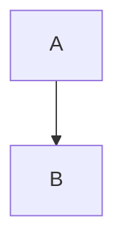

^am-anfang

Block-Anker in einer eigenen Zeile (4T-002048): Die Kennung erscheint nicht als Text.

```perspective-datatable
columns: Monat:text, Umsatz:number
| Januar  | 120 |
| Februar | 99  |
```
^umsatz

Ein Absatz mit Anker am Ende. ^absatz-ende

| Spalte | Wert |
|---|---|
| a | 1 |
^pipe-tabelle

```js
const a = 1;
```
^code

```js
const b = 2;
```

^code-nach-leerzeile

- eins
- zwei

^liste

Liste mit Anker-Zeile ohne Leerzeile:

- drei
- vier
^liste-direkt

Enge Liste:

- eng ^eng
- zweiter Eintrag

Aufgabe:

- [ ] Aufgabe ^aufgabe

> Zitat
> ^zitat

```perspective-chart
table: ^umsatz
type: bar
labels: Monat
values: Umsatz
```
^diagramm


^fluss

Zeile eins
^mitte
Zeile drei

```js
x
```
^erster
^zweiter

Ein Verweis [[#^code|zum Code]] und ein Anker direkt hinter einem Verweis [[Ziel]]^kein-anker.

Nachbesserung — zwei Anker in einem Absatz:

Zeile eins ^zwei-a
Zeile zwei ^zwei-b

> | Zitat | Wert |
> |---|---|
> | a | 1 |
> ^tabelle-im-zitat

> [!note] Hinweis
> | Hinweis | Wert |
> |---|---|
> | b | 2 |
> ^tabelle-im-hinweis

Maskiert bleibt Text: \^kein-anker-1 und &#94;kein-anker-2
